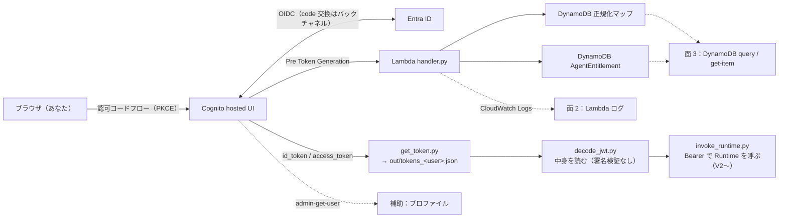

# ツール使い方と観測手順 v1.0

対象：`scripts/` の 4 本（`get_token.py`／`decode_jwt.py`／`decode_saml.py`／`invoke_runtime.py`）と、AWS 側で「Pre Token Gen Lambda が何を注入したか」を確かめる手順。検証ログに散在していた使い方をここに集約する（2026-08-30 時点。V2a 以降の `invoke_runtime.py` の実測は追記予定）。

前提：`cd CDK/agentcore-authchain` で実行。AWS CLI を使う手順は `export AWS_PROFILE="Y_admin"`（セッションごとに要確認）。スクリプトは標準ライブラリのみで動く（`boto3` 不要）。`out/` は gitignore（§6 の秘密置き場）。

---

## 0. 一枚で：どの道具が、どの区間を見るか

- **面 1（出口）**：発行されたトークンの中身 → `decode_jwt.py`
- **面 2（処理）**：Lambda が「何を受け取り、何を除外し、何を注入したか」→ CloudWatch Logs
- **面 3（根拠）**：Lambda が引いた DynamoDB の行 → `query`／`get-item`
- **補助（入力）**：Lambda に渡るユーザー属性の元 → `admin-get-user`

---

## 1. `get_token.py` — hosted UI から PKCE でトークンを取る（教育モード）

### 1-1 何をするか（6 ステップ）
| 手順 | 画面に出るもの | 見どころ |
|---|---|---|
| [1/6] 設定の読み込み | `out/identity-outputs.json` の `UserPoolId`／`ClientId`／`HostedUiBaseUrl` | `redirect_uri = http://localhost:8400/callback` はクライアントの `callbackUrls` と**完全一致**が必要 |
| [2/6] PKCE の準備 | `code_verifier`（秘密）／`code_challenge = BASE64URL(SHA256(verifier))`／`state` | 認可コードを盗まれても `code_verifier` が無ければ交換できない。`state` は callback で照合（CSRF） |
| [3/6] 認可 URL の表示 | `/oauth2/authorize?...` の URL とパラメータ | **これをブラウザで開く**。`--idp` を付けると `identity_provider=<IdP>` が付き、hosted UI の選択画面を飛ばして IdP へ直行 |
| [4/6] callback 待機 | `localhost:8400/callback` で 1 回だけ受信 | ブラウザに「callback を受け取りました」と出れば OK。`error` が返れば Cognito 側の失敗（`error_description` を読む） |
| [5/6] トークン交換 | `POST /oauth2/token` の生リクエスト／生レスポンス | 公開クライアントなので `Authorization: Basic` は無し。`code_verifier` が本人証明 |
| [6/6] 保存とデコード | `out/tokens_<user>.json`（0600）＋ 両トークンのクレーム表示 | `--mask` で表示だけマスク（保存はマスクしない） |

### 1-2 使い方
```bash
python3 scripts/get_token.py --user userA-oidc --idp EntraOIDC --mask   # Entra OIDC 経由（V1' 以降の標準）
python3 scripts/get_token.py --user local-a --mask                      # ローカルユーザー（hosted UI のフォーム。切り分け用）
python3 scripts/get_token.py --user userA-oidc --idp EntraOIDC --manual # localhost で待ち受けられない環境：callback URL を貼り付け
```
| オプション | 意味 |
|---|---|
| `--user <label>` | 保存ファイル名 `out/tokens_<label>.json` になるだけ（認証には使わない）。**同名は上書き**されるので、証跡を残したいときは先に `cp` で退避（例 `tokens_userA-oidc_v1c.json`） |
| `--idp EntraOIDC` | `identity_provider` パラメータ。無指定なら hosted UI の選択画面（IdP ボタン＋ローカルのフォーム） |
| `--manual` | ローカル待受をせず、ブラウザのアドレスバーに出た `http://localhost:8400/callback?code=...` を貼り付けて続行 |
| `--mask` | 表示クレームのマスク（`decode_jwt.py --mask` と同じ規則） |
| `--port`／`--scope`／`--outputs`／`--stack` | 既定 8400／`openid profile email`／`out/identity-outputs.json`／`AuthChainIdentityStack` |

### 1-3 落とし穴（本検証の実測）
- **hosted UI のセッション Cookie（V1'-c／V2-1 で実測）**：直前に同じブラウザでログインしていると、`identity_provider` 無しでもフォームが出ず、「Continue with EntraOIDC」画面か、**画面すら出ずに前のユーザーとして callback まで進む**。別ユーザーで試すときは**シークレットウィンドウ**か、先に `/logout` を開く：
  ```
  <HostedUiBaseUrl>/logout?client_id=<ClientId>&logout_uri=http://localhost:8400/logout
  ```
  （`logout_uri` はクライアントの `logoutUrls` と一致が必要。待機中の `get_token.py` は `/logout` に 404 を返すだけで害なし。Entra 側のセッションとは別物）
- **`--user` のラベルは信用しない**：上の理由で `--user local-a` なのに EntraOIDC ユーザーのトークンが保存されることがある。保存後は必ず `decode_jwt.py` で `username`／`cognito:username` を見る
- **バックグラウンド実行**：出力をファイルに向けると Python がバッファして URL が出ない → `python3 -u` を付ける。ポート 8400 は 1 プロセスしか使えない（`ss -ltnp | grep 8400` で確認。止めるときは `pkill -f` ではなく PID 指定で `kill`）
- **OIDC は途中が見えない**：Entra → Cognito の code 交換はバックチャネル。DevTools には `…/oauth2/idpresponse?code=…` の 302 しか出ない。Entra が何を送ったかは `admin-get-user`（マッピング結果）か、ランブック v2.0 §8 の jwt.ms で見る
- トークンの有効期限は 60 分（`exp`）。期限切れの `out/tokens_*.json` は `decode_jwt.py` の `[times]` で分かる。再取得は再ログイン

---

## 2. `decode_jwt.py` — トークンの中身を読む（署名は検証しない）

### 2-1 使い方
```bash
python3 scripts/decode_jwt.py out/tokens_userA-oidc.json --mask   # JSON 内の JWT（id_token / access_token）を全部
python3 scripts/decode_jwt.py "<JWT文字列>"                        # 1 本だけ
python3 scripts/decode_jwt.py out/tokens_local-a.json --raw        # {header, payload} の JSON だけ（jq 向け）
```
- 出力は `[header]`（`kid`／`alg`）、`[payload]`、`[times]`（`iat`／`exp`／`auth_time` を UTC・JST に変換、`exp まで N 秒`）、`[signature]`（長さのみ。**検証はしていない**＝検証は Runtime／Gateway の仕事）
- `refresh_token` は JWT ではない（不透明文字列）ので自動的に除外される
- `--mask` は `sub`／`email`／`username`／`cognito:username`／`preferred_username`／`name`／`jti`／`origin_jti` と `identities[].userId`、`issuer` 内の GUID を先頭数文字だけ残してマスク。**検証ログに貼るときは必ず `--mask`**。`upn`／`company_code`／`agents` 等の観測対象は触らない（`upn` は UPN＝メール形なので、貼るときは手でも `<user>@<tenant>.onmicrosoft.com` に直す）

### 2-2 見方：クレームの出所表（V2-1 時点の実物）
「誰がそのクレームを付けたか」で読むと、どこを直せば変わるかが分かる。

| 出所 | クレーム | ID トークン | アクセストークン | 変える場所 |
|---|---|---|---|---|
| **Cognito が自動** | `iss`／`sub`／`iat`／`exp`／`auth_time`／`jti`／`origin_jti`／`token_use` | ○ | ○ | 変えない（`sub` は Cognito のユーザー ID。Entra の `sub` とは別） |
| 〃 | `aud`（=ClientId）／`nonce`／`at_hash` | ○ | × | — |
| 〃 | `client_id`／`scope`／`version: 2`／`username` | × | ○ | **アクセストークンには `aud` が無い** → Runtime／Gateway は `allowedClients`（`client_id`）で照合 |
| 〃 | `cognito:username` | ○ | ×（`username` として） | ユーザー名は `EntraOIDC_<sub>`（不変）／`local-user-a` |
| 〃（フェデレーション時） | `identities`（providerName／providerType／userId＝IdP 側 `sub`） | ○ | × | — |
| 〃（フェデレーション時） | `cognito:groups = ["<PoolId>_EntraOIDC"]` | ○ | ○ | IdP 経由なら自動グループ。ローカルユーザーには無い |
| **IdP の属性マッピング**（プロファイルに保存された属性） | `custom:company_raw`／`custom:department_raw`／`preferred_username`／`name`（`email` は Entra に値が無く欠落） | ○ | **×** | `identity-stack.ts` の `attributeMapping`＋Entra の「属性とクレーム」。**標準属性もカスタム属性もアクセストークンには載らない** |
| **Pre Token Gen Lambda が注入** | `company_code`／`department_code`（V1c）、`agents`（V2-1、配列）、`upn`（V2-1。`preferred_username` の写し。ローカルユーザーには無い） | ○ | ○ | `lambda/pre_token_gen/handler.py`＋DynamoDB 2 テーブル。両トークンに同じものを入れている（仮決め #1：AgentCore へはアクセストークン） |

読み方の例（User-A のアクセストークン、V2-1）：
```
token_use=access, client_id=<ClientId>, username="EntraOIDC_…", scope="openid profile email",
cognito:groups=["<PoolId>_EntraOIDC"],                       ← Cognito 自動（IdP 経由の印）
company_code=TESTCO, department_code=SALES1,                 ← Lambda（正規化マップ）
agents=["inspect-headers"], upn="<user>@<tenant>.onmicrosoft.com"   ← Lambda（エンタイトルメント／UPN の写し）
```
- 「`agents` が無い」＝会社コード無しかエンタイトルメント 0 件（fail-closed）。Lambda ログの `[fail-closed]` 行で理由が分かる
- 「`company_code` が無い」＝生値が空か正規化マップ未登録。`admin-get-user` で生値を、`get-item` でマップを見る
- 「`custom:company_raw` がアクセストークンに無い」＝正常（載らない仕様）

---

## 3. AWS 側の確認（Lambda が何をしたか）
共通の前置き：
```bash
cd CDK/agentcore-authchain
export AWS_PROFILE="Y_admin"          # セッションごとに要確認
o() { python3 -c "import json;print(json.load(open('out/identity-outputs.json'))['AuthChainIdentityStack']['$1'])"; }
```

### 3-1 面 2：Pre Token Gen Lambda のログ
ロググループは CDK で明示作成した名前（`/aws/lambda/<関数名>` ではない）。関数設定から引く。
```bash
LG=$(aws lambda get-function-configuration --function-name "$(o PreTokenGenFunctionName)" --query 'LoggingConfig.LogGroup' --output text)
aws logs filter-log-events --log-group-name "$LG" \
  --start-time $(( ($(date +%s) - 1800) * 1000 )) \
  --query 'events[].message' --output text | grep -E "triggerSource|dept-filter|fail-closed|injectedClaims"
```
1 回のログインで出る行（V2-1）：
1. `{"version": "2", "triggerSource": "TokenGeneration_HostedAuth", "userName": ..., "userAttributeKeys": [...], "scopes": [...]}` — Cognito が渡した属性**キー**（値は出さない）。IdP 経由は 7 つ、ローカルは 4 つ
2. `[dept-filter] AGENT#admin-only は departments=['ADMIN1'] に SALES1 が無いため除外` — 部門制限が効いた証拠
3. `{"injectedClaims": {"company_code": ..., "department_code": ..., "agents": [...]}, "upnInjected": true|false}` — 注入結果（`upn` の値は出さない）
4. （異常時）`[fail-closed] ...` — 注入しなかった理由

コンソールなら CloudWatch → Log groups → `AuthChainIdentityStack-PreTokenGenLogs…`。`--filter-pattern '"local-user-a"'` でユーザー名絞り込みも可。

### 3-2 面 3：DynamoDB（Lambda が引いた根拠）
```bash
# エンタイトルメント（V2-1。Lambda と同じ Query。Scan は Lambda にも許可していない）
aws dynamodb query --table-name "$(o EntitlementTableName)" \
  --key-condition-expression "pk = :pk" --expression-attribute-values '{":pk":{"S":"COMPANY#TESTCO"}}' --output json
# 正規化マップ（V1）
aws dynamodb get-item --table-name "$(o AuthzTableName)" --key '{"pk":{"S":"COMPANY#株式会社テスト商事"}}'
aws dynamodb get-item --table-name "$(o AuthzTableName)" --key '{"pk":{"S":"DEPT#第一営業部"}}'
```
壊す実験（行の一時削除）は `delete-item` → 再ログイン → 復元は `cdk deploy`（シードの物理 ID はハッシュなので**内容が変わらない限り再実行されない**。復元は `put-item` で手動）。

### 3-3 補助：ユーザープロファイル（Lambda の入力の元）
```bash
POOL=$(o UserPoolId)
aws cognito-idp list-users --user-pool-id "$POOL" --query 'Users[].{u:Username,s:UserStatus}' --output table
aws cognito-idp admin-get-user --user-pool-id "$POOL" --username local-user-a --query 'UserAttributes'
aws cognito-idp admin-get-user --user-pool-id "$POOL" --username "$(aws cognito-idp list-users --user-pool-id "$POOL" --filter 'username ^= "EntraOIDC_"' --query 'Users[0].Username' --output text)" --query 'UserAttributes'
```
- IdP 由来の値は初回サインインで保存され、マッピングを増やすと**再サインインで追記**される（V1'-b）
- `UserStatus = EXTERNAL_PROVIDER` はフェデレーションユーザー。IdP を消しても残る（V1'-c）

### 3-4 Cognito の設定を辿る
```bash
aws cognito-idp list-identity-providers --user-pool-id "$POOL"
aws cognito-idp describe-identity-provider --user-pool-id "$POOL" --provider-name EntraOIDC --query 'IdentityProvider.{mapping:AttributeMapping,details:ProviderDetails}'   # client_secret が平文で含まれるので貼らない
aws cognito-idp describe-user-pool-client --user-pool-id "$POOL" --client-id "$(o ClientId)" --query 'UserPoolClient.{idps:SupportedIdentityProviders,cb:CallbackURLs,lo:LogoutURLs}'
```
構成の全体像は `整理_Cognito全体像_v1_0.md`。

---

## 4. `decode_saml.py`（履歴）と `invoke_runtime.py`（V2 以降）
- **`decode_saml.py`**：V1（SAML）で DevTools から取った `SAMLRequest`／`SAMLResponse` を復号・整形した道具。SAML IdP は V1'-c で撤去したので**履歴用**（`out/saml_*_v1b.txt` の再読に使える）。使い方は `検証ログ_V1_v1_0.md` V1b
- **`invoke_runtime.py`**：`AuthChainRuntimeStack` を Bearer で直接呼ぶ（JWT 設定の Runtime は SDK の `invoke_agent_runtime` では呼べないため HTTPS）。
  ```bash
  python3 scripts/invoke_runtime.py --token-file out/tokens_userA-oidc.json                 # inspect（既定）
  python3 scripts/invoke_runtime.py --token-file out/tokens_userA-oidc.json --use id        # ID トークンを送る（client_id 無し → 拒否のはず）
  python3 scripts/invoke_runtime.py --token-file out/tokens_userA-oidc.json --tamper        # 署名を 1 文字壊す
  python3 scripts/invoke_runtime.py --token-file out/tokens_userA_v1c_failclosed.json       # company_code 無しのトークン
  python3 scripts/invoke_runtime.py --token-file ... --action gateway --tool VerifyTarget___echo_profile --args '{"note":"hi"}'   # V3
  ```
  4 ステップ（設定 → 送るトークンの予習 → HTTPS 組み立て（URL エンコードした ARN、`X-Amzn-Bedrock-AgentCore-Runtime-Session-Id` は 33 文字以上）→ 応答（ステータス／`WWW-Authenticate`／本文））。`--save` で応答を `out/` に保存。**実測（HTTP コード等）は V2a/V2b で追記**

---

## 5. `out/` の棚卸し（gitignore。検証ログにはマスクして転記済み）
| ファイル | 何の証跡か | V |
|---|---|---|
| `identity-outputs.json` | `cdk deploy --outputs-file`（PoolId／ClientId／URL／テーブル名／関数名）。スクリプトの入力 | 毎回更新 |
| `entra-oidc.json` | Entra のテナント ID／クライアント ID／シークレット名（ランブック v2.0 §7）。`bin/authchain.ts` の入力 | V1' |
| `local-user-a.password`／`EntraUserPass.txt` | ローカルユーザー／Entra テストユーザーのパスワード | V1a／V1b |
| `tokens_local-a.json` | local-user-a の最新（V2-1：`agents` あり・`upn` 無し） | V2-1 |
| `tokens_local-a_v1b_before_trigger.json` | トリガー接続前のローカルユーザー（注入クレーム無し） | V1b |
| `tokens_userA-oidc.json` | User-A（OIDC）の最新（V2-1：`agents`／`upn` あり） | V2-1 |
| `tokens_userA-oidc_v1b.json`／`_v1c.json` | 標準属性マッピング後／SAML 撤去後の再ログイン | V1'-b／V1'-c |
| `tokens_userA-oidc_session-reuse_v2.json` | `--user local-a` で取ったが Cookie 再利用で EntraOIDC ユーザーになった例 | V2-1 |
| `tokens_userA.json`／`_v1b_before_trigger`／`_v1c_after_trigger`／`_v1c_failclosed` | SAML 時代の User-A（`_failclosed` は `company_code` 無し。V2 の壊す実験で再利用） | V1b／V1c |
| `saml-metadata-url.txt`／`saml_request_*`／`saml_response_*` | SAML の設定入力と往復の現物 | V1b（履歴） |
- 期限切れ（`exp` 超過）のトークンも「中身の証跡」としては有効。Runtime に送れば 401 になるはずで、それ自体が壊す実験の材料
- 撤収時（コスト表 §4）にまとめて削除

---

## 参照（公式）
- Cognito 認可エンドポイント（`identity_provider`）https://docs.aws.amazon.com/cognito/latest/developerguide/authorization-endpoint.html ／ トークンエンドポイント https://docs.aws.amazon.com/cognito/latest/developerguide/token-endpoint.html ／ ログアウトエンドポイント https://docs.aws.amazon.com/cognito/latest/developerguide/logout-endpoint.html
- アクセストークン（`aud` 無し、`client_id`）https://docs.aws.amazon.com/cognito/latest/developerguide/amazon-cognito-user-pools-using-the-access-token.html ／ ID トークン https://docs.aws.amazon.com/cognito/latest/developerguide/amazon-cognito-user-pools-using-the-id-token.html
- Pre token generation（V2_0）https://docs.aws.amazon.com/cognito/latest/developerguide/user-pool-lambda-pre-token-generation.html
- PKCE（RFC 7636）https://www.rfc-editor.org/rfc/rfc7636 ／ JWT（RFC 7519）https://www.rfc-editor.org/rfc/rfc7519
- InvokeAgentRuntime https://docs.aws.amazon.com/bedrock-agentcore/latest/APIReference/API_InvokeAgentRuntime.html

## 変更履歴
- v1.0（2026-08-30）起票。4 スクリプトの使い方、クレームの出所表、AWS 側の確認 3 面、`out/` 棚卸し
