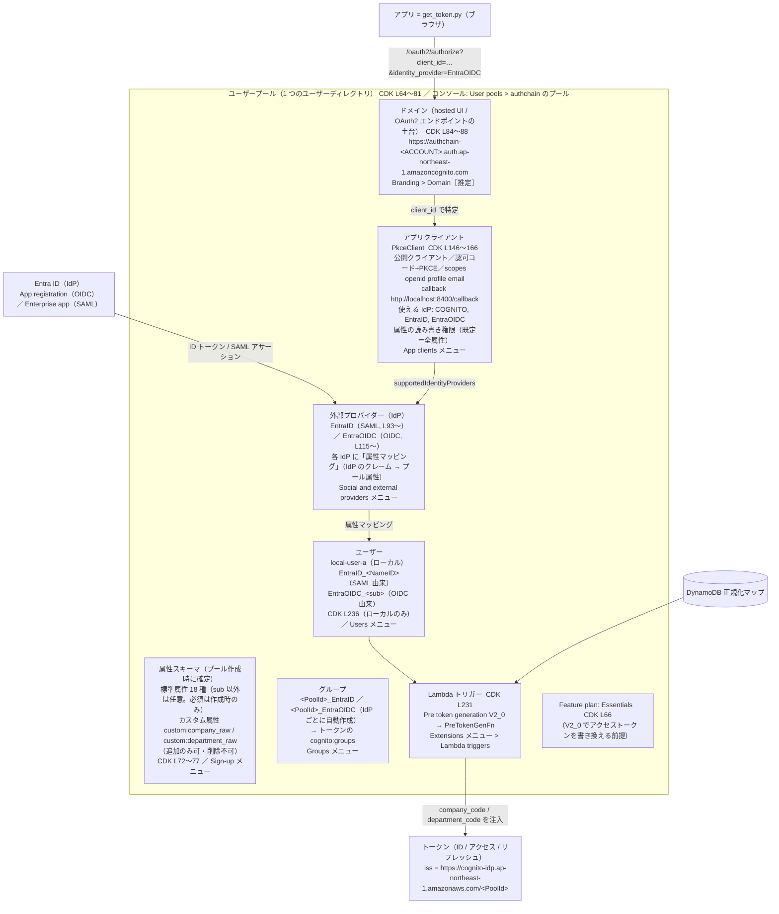

# 整理：Cognito ユーザープールの全体像（本検証の構成を例に、CDK の行 ⇄ コンソールの場所 ⇄ 実測を対応づける） v1.0

作成日：2026-08-29。対象：`cdk/lib/identity-stack.ts`（V1'-b 時点）。行番号は同ファイル。コンソールのメニュー名は公式手順書（2026-08 時点の新コンソール）から採り、公式に記載が見つからなかったものは **［推定］** を付けた。値の実物は `out/identity-outputs.json`（gitignore）にあり、本書では `<PoolId>`／`<ClientId>`／`<ACCOUNT>` にマスクする。

## 0. まず 1 枚で：何が何を持っているか

読み方：**プール**が器で、その中に**スキーマ・ユーザー・グループ・IdP・アプリクライアント・ドメイン・トリガー**がぶら下がる。アプリは「**ドメイン**のエンドポイント」を「**アプリクライアント**の ID」で叩き、クライアントに許可された **IdP** へ飛び、IdP から戻った属性が**マッピング**で**ユーザー**に書かれ、**トリガー**を通って**トークン**になる。

## 1. 構成要素ごとの対応表

### 1-1 ユーザープール本体
| 項目 | 本検証の値 | CDK | コンソール | 変更できる時期・注意 |
|---|---|---|---|---|
| プール（ディレクトリ） | `AuthChainIdentityStack-UserPool…`（ID `<PoolId>`） | `new cognito.UserPool(...)` L64 | User pools > 一覧 | 名前は後から変更可。**Pool ID は不変** |
| Feature plan | Essentials | `featurePlan` L66 | Settings メニュー > **Feature plans** タブ（Switch to Essentials/Plus） | 後から変更可（料金に影響）。Pre Token Gen **V2_0/V3_0 は Essentials/Plus が前提**（旧 Lite＋ASF プールは V2_0 可の例外あり、公式注記） |
| セルフサインアップ | 無効 | `selfSignUpEnabled: false` L68 | Sign-up > Self-service sign-up | 後から変更可 |
| サインイン識別子 | `username` のみ（email/phone のエイリアスなし） | `signInAliases: { username: true }` L70 | Sign-in（作成ウィザードの Options for sign-in identifiers） | **作成後は変更不可**（公式「After you create a user pool, you can't change this setting」）。大文字小文字の区別も同様 |
| 削除ポリシー | DESTROY（検証用） | `removalPolicy` L80 | — | 本番は RETAIN＋削除保護 |

### 1-2 属性（スキーマ）— 「必須にするかどうか」はここ
| 項目 | 本検証の値 | CDK | コンソール | 変更できる時期・注意 |
|---|---|---|---|---|
| 標準属性の**必須** | なし（`sub` 以外すべて任意） | `standardAttributes: {}` L72。必須にするなら例：`standardAttributes: { email: { required: true, mutable: true } }` | Sign-up > **Required attributes**（作成ウィザードでのみ選択。作成後は閲覧のみ） | **プール作成時のみ**。公式「You can't change required attributes after you create a user pool」。CDK で後から変えると更新に失敗するか作り直しになる。**カスタム属性は必須にできない**（公式） |
| 標準属性の mutable | 既定（CDK は `mutable` 既定 true） | 同上（`StandardAttribute.mutable`） | コンソールでは標準属性のプロパティは変更不可（API/CDK の Schema のみ） | 作成時に確定 |
| カスタム属性 | `custom:company_raw`／`custom:department_raw`（String, mutable, 本検証は `maxLen: 256`。Cognito 上限は 2048） | `customAttributes` L75〜77（`StringAttribute({ mutable: true })`。**CDK の StringAttribute は既定 mutable=false** なので明示） | Sign-up > **Custom attributes** > Add custom attributes | 追加は後から可（最大 50）。**追加後は削除・変更不可**。IdP マッピング先は mutable 必須。コードでは `custom:` プレフィックス |
| 必須属性とフェデレーションの関係 | — | — | — | 必須属性を作ると**すべての IdP でその属性をマッピングしないとログインが失敗**する（公式）。本検証は必須属性を作らない方針（V1a） |

### 1-3 アプリクライアント（「どのアプリが、どの IdP で、どの権限で」）
| 項目 | 本検証の値 | CDK | コンソール | 注意 |
|---|---|---|---|---|
| クライアント種別 | 公開クライアント（シークレットなし） | `generateSecret: false` L148 | App clients > PkceClient > App client information［推定］ | シークレットの有無は作成後に変更不可（CFN `GenerateSecret` は Replacement。公式「You can't change secrets after you create an app」。シークレット付きクライアントなら `AddUserPoolClientSecret` で 2 本目を追加してローテーション可） |
| OAuth フロー／スコープ | 認可コード＋PKCE、`openid profile email` | `oAuth.flows`／`scopes` L150〜151 | App clients > PkceClient > **Login pages** タブ > Managed login pages configuration | 後から変更可 |
| コールバック／ログアウト URL | `http://localhost:8400/callback` 等 | `callbackUrls`／`logoutUrls` L152〜153 | 同上 | `redirect_uri` は**完全一致**が必要 |
| 使える IdP | `COGNITO`, `EntraID`, `EntraOIDC` | `supportedIdentityProviders` L156〜160 | 同上 > **Identity providers** | 公式「users can only sign in with an IdP that you assigned to their app client」。IdP を先に作ってから割り当てる（CDK では `addDependency` L168〜169） |
| 属性の読み書き権限 | 既定（全属性 読み書き可） | `readAttributes`／`writeAttributes` 未指定 L163 | App clients > PkceClient > **Attribute permissions** タブ | 後から変更可。**IdP マッピング先が writable でないと値が黙って設定されない**（開発者ガイドの記述。CFN `WriteAttributes` の説明は "throws an error" と書かれており AWS 文書内で不一致。実測は前者）。ID トークンには readable な属性だけが載る |
| トークン有効期間 | 既定（ID/アクセス 60 分、リフレッシュ 30 日） | `accessTokenValidity` 等 未指定 | App clients > PkceClient > App client information > Edit［推定］ | 後から変更可（仮決め #7） |
| ユーザー存在エラーの秘匿 | 有効 | `preventUserExistenceErrors` L162 | 同上 | — |

### 1-4 ドメイン（hosted UI とエンドポイントの土台）
| 項目 | 本検証の値 | CDK | コンソール |
|---|---|---|---|
| ドメイン | `authchain-<ACCOUNT>.auth.ap-northeast-1.amazoncognito.com`（Cognito プレフィックスドメイン） | `addDomain` L84〜88 | Branding > Domain［推定］ |
| ログイン UI の世代 | classic hosted UI | `managedLoginVersion: CLASSIC_HOSTED_UI` L88 | Branding > Managed login［推定］ |

このドメイン配下に OAuth2／フェデレーションのエンドポイントが並ぶ（出力 L252〜259）：

| パス | 役割 | 誰が叩くか |
|---|---|---|
| `/login`、`/oauth2/authorize` | ログイン開始（`client_id`、`redirect_uri`、`identity_provider=<IdP名>` で IdP へ直行） | アプリ（ブラウザ） |
| `/oauth2/token` | 認可コード／リフレッシュトークン → トークン発行 | アプリ |
| `/oauth2/userInfo`、`/oauth2/revoke`、`/logout` | 属性取得／失効／ログアウト | アプリ |
| `/oauth2/idpresponse` | **OIDC／ソーシャル IdP のコールバック**（Entra の App registration に登録した Redirect URI） | Entra（ブラウザ経由） |
| `/saml2/idpresponse` | **SAML の ACS URL**（Entra のエンタープライズアプリに登録した応答 URL） | Entra（ブラウザ POST） |

ドメインとは別に、**発行者（iss）**は `https://cognito-idp.ap-northeast-1.amazonaws.com/<PoolId>` で、`/.well-known/openid-configuration` と `/.well-known/jwks.json` はこちら（AgentCore の `discoveryUrl` はこの iss ベース。現在は Updated issuer `https://issuer-cognito-idp.<region>.amazonaws.com/<PoolId>` も選べるが本検証は既定の Original）。

用語の注意：本検証は classic hosted UI（L88）だが、コンソールのタブ名は世代に関係なく **Login pages／Managed login** のまま（公式：`/passkeys/add` 以外のパスは両版共通）。本書の「hosted UI」はこの Login pages で開くログイン画面のこと。

### 1-5 外部プロバイダー（IdP）と属性マッピング
| 項目 | EntraID（SAML） | EntraOIDC（OIDC） | コンソール |
|---|---|---|---|
| CDK | `UserPoolIdentityProviderSaml` L93〜 | `UserPoolIdentityProviderOidc` L115〜 | Social and external providers > 各 IdP |
| Entra 側の登録物 | エンタープライズアプリ（非ギャラリー、SAML SSO） | App registration（Web, client secret） | — |
| Cognito が Entra に教える値 | Entity ID `urn:amazon:cognito:sp:<PoolId>`、ACS `/saml2/idpresponse` | Redirect URI `/oauth2/idpresponse` | 出力 L256〜259 |
| Entra が Cognito に教える値 | メタデータ URL（L98） | テナント ID→issuer（L125）、client_id（L119）、client_secret（L123、Secrets Manager 動的参照）、scopes（L127） | 各 IdP の Provider details |
| ユーザー名の元（自動） | `EntraID_<NameID>` | `EntraOIDC_`（`username ← sub` は Cognito が自動でマッピング。公式＋実測） | Attribute mapping（`username` 行） |
| **属性マッピング（手動）** | `custom:company_raw ← companyname` 等 L101〜105 | `preferred_username ← preferred_username`、`email ← email`、`name ← name`、`custom:*_raw ← companyname/department` L131〜141 | Social and external providers > IdP > **Attribute mapping** > Edit |
| 自動グループ | `<PoolId>_EntraID` | `<PoolId>_EntraOIDC` | Groups |

マッピングの性質（公式＋実測）：
- **標準クレームでも、マッピングしなければプロファイルに書かれない**（実測：初回 OIDC ログインで `name`/`preferred_username` は入らず、L135〜137 を追加した再ログインで入った）
- 1:1 のコピーのみ。変換・結合・参照はできない（→ Lambda）。多値は `[a,b]` 文字列に平坦化
- 値が変わったときだけ更新。IdP が送らなくなっても消えない（IdP が**空値**を送った場合は消える。公式）。**IdP 側に値が無いクレームは省略され、エラーにならない**（実測：`email`）
- マッピング先は mutable 必須（immutable に値が来るとサインイン失敗）、かつクライアントが writable（でないと黙って未設定）

### 1-6 ユーザーとグループ
| 項目 | 内容 |
|---|---|
| ローカルユーザー | `local-user-a`（CDK L236 `CfnUserPoolUser`、パスワードは CLI で設定）。`UserStatus = CONFIRMED` |
| フェデレーションユーザー | 初回サインインで自動作成。`UserStatus = EXTERNAL_PROVIDER`、`identities` 属性に IdP 名と IdP 側 ID。ユーザー名は `<IdP名>_<識別子>` で**後から変更不可**。IdP を変える（SAML→OIDC）と別ユーザーになる |
| グループ | 手動作成のほか、IdP ごとに自動作成。両トークンの `cognito:groups` に載る（Cedar/Runtime の条件にも使える） |
| 検索 | `list-users --filter 'username ^= "EntraOIDC_"'`、`admin-get-user` |

### 1-7 Lambda トリガー
| 項目 | 内容 |
|---|---|
| 接続 | `addTrigger(PRE_TOKEN_GENERATION_CONFIG, fn, LambdaVersion.V2_0)` L231（CFN `LambdaConfig.PreTokenGenerationConfig`） |
| 役割 | トークン発行の直前に呼ばれ、**ID／アクセス両方に任意クレームを追加・上書き・抑止**（V2_0。`claimsToAddOrOverride`／`claimsToSuppress`）、グループ上書き（`groupOverrideDetails`）、スコープ追加・抑止。プロファイルは変えない |
| 入力 | `request.userAttributes`（プロファイル属性一式＝マッピング済みの値）、`triggerSource`（`TokenGeneration_HostedAuth` 等）、`request.scopes` |
| 制約 | 同期・5 秒以内。`sub`/`iss`/`aud`/`exp`/`iat`/`identities`/`cognito:username`（およびその他の `cognito:` 接頭辞）は上書き不可。ただし `cognito:groups`／`cognito:roles`／`cognito:preferred_role` は `groupOverrideDetails` で上書き可（公式）。追加クレームは V2_0 で配列／JSON 可（ID トークンの `email_verified`/`phone_number_verified`/`updated_at`/`address` は複合型不可） |

### 1-8 トークン（どこに何が載るか）
| クレーム | ID トークン | アクセストークン | 出どころ |
|---|---|---|---|
| `sub`（Cognito の UUID）、`iss`、`exp`… | ○ | ○ | 自動 |
| `cognito:username`／`username` | ○（`cognito:username`） | ○（`username`） | 自動（`EntraOIDC_`） |
| `cognito:groups` | ○ | ○ | 自動（IdP グループ）＋手動グループ |
| `identities` | ○ | × | 自動 |
| `aud`／`client_id` | `aud` | `client_id` | 自動（AgentCore は `allowedClients` で `client_id` を照合） |
| 標準属性（`preferred_username`、`name`、`email`…） | ○（readable かつ要求スコープ `openid`＋`profile`/`email` の範囲。本検証は 3 スコープ要求） | **×** | マッピング |
| `custom:*` | ○ | **×** | マッピング |
| `company_code`／`department_code`（今後 `agents`、`upn` 等） | ○ | ○ | **Lambda** |

## 2. 「自動 vs 設定 vs Lambda」を CDK の場所で言い直す
| 欲しいこと | どこで | CDK |
|---|---|---|
| 本人の同一性（ユーザー名、`sub`、`identities`、IdP グループ） | 自動 | 設定不要（IdP を作れば付く） |
| Entra の属性（会社名・部署・UPN・氏名…）をプロファイルに持つ | ① Entra でクレームを出す（属性とクレーム／オプションクレーム）＋ ② Cognito の IdP に**属性マッピング** | ② = L131〜141（OIDC）／L101〜105（SAML）。カスタム属性は L75〜77 で先に定義 |
| その属性を ID トークンに載せる | マッピングすれば自動（クライアントが readable であること） | L163（既定で全属性 readable） |
| 属性を**アクセストークン**に載せる／正規化・参照して別クレームにする／トークンにだけ出す | **Lambda（Pre Token Gen V2_0）** | L231 ＋ `lambda/pre_token_gen/handler.py` |
| ある属性を**必須**にする | プール作成時のスキーマのみ | L72 `standardAttributes: { <attr>: { required: true, mutable: true } }`（作成後は変更不可。カスタム属性は不可） |
| クライアントごとに属性の読み書きを絞る | アプリクライアントの属性権限 | `readAttributes`／`writeAttributes`（L146 の `addClient` に追加。後から変更可） |

## 3. コンソールで今回の設定を辿る順路（GUI で「繋がり」を見る）
1. **User pools** → プール `AuthChainIdentityStack-UserPool…` を開く（Overview に Pool ID、Feature plan、ユーザー数）
2. **Sign-up** → Required attributes（空）と Custom attributes（`company_raw`／`department_raw`、Mutable）を確認 ＝ 1-2
3. **Social and external providers** → `EntraID`（SAML、メタデータ URL）と `EntraOIDC`（OIDC、issuer／scopes）→ 各 **Attribute mapping** ＝ 1-5
4. **App clients** → `PkceClient` → **Login pages** タブ（Identity providers に 3 つ、Callback URL、Scopes）／**Attribute permissions** タブ（読み書き）＝ 1-3
5. **Branding > Domain**［推定］→ `authchain-<ACCOUNT>` → Login pages タブの「View login page」で hosted UI が開く（`/login?client_id=…`）＝ 1-4
6. **Users** → `EntraOIDC_…` を開く → Attributes に `custom:*_raw`／`preferred_username`／`name`、Group memberships に `<PoolId>_EntraOIDC` ＝ 1-6
7. **Extensions** → Lambda triggers に Pre token generation（`PreTokenGenFn`。Trigger event version が「Basic features + access token customization」＝V2_0 と表示される）＝ 1-7

## 4. 実測から得た落とし穴（本検証）
- クレーム欠落は**静かに失敗**する：Entra に値が無い／クレーム未設定／マッピング漏れ／writable でない、のどれでもログインは成功し属性だけ無い。切り分けはトークン → `admin-get-user` → IdP 側の現物（SAML は SAMLResponse、OIDC は jwt.ms）の順
- **作成時にしか決められないもの**：サインイン識別子（エイリアス）、必須属性、標準属性のプロパティ、大文字小文字の区別、クライアントシークレットの有無。**追加はできるが消せないもの**：カスタム属性
- IdP を差し替えるとユーザーは別人になる（`<IdP名>_<識別子>`）。移行するなら旧ユーザーの棚卸しか `AdminLinkProviderForUser`（初回サインイン前）
- アクセストークンには属性が載らない。AgentCore／Cedar に属性を渡すなら Pre Token Gen で注入する（本検証の中核）
- `cdk diff` が「Omitted N changes … non-ASCII」と出すことがある（日本語を含むテンプレート）。`--strict` で表示できる

## 参照（公式）
- [Working with user attributes](https://docs.aws.amazon.com/cognito/latest/developerguide/user-pool-settings-attributes.html)（必須は作成時のみ、カスタム属性は必須不可・削除不可、属性権限は App clients > Attribute permissions）
- [Mapping IdP attributes to profiles and tokens](https://docs.aws.amazon.com/cognito/latest/developerguide/cognito-user-pools-specifying-attribute-mapping.html)（mutable／writable、ユーザー名の導出、値の更新規則）
- [Using OIDC identity providers with a user pool](https://docs.aws.amazon.com/cognito/latest/developerguide/cognito-user-pools-oidc-idp.html)（`sub → username` 自動、コンソール手順：Social and external providers／App clients > Login pages）
- [Pre token generation Lambda trigger](https://docs.aws.amazon.com/cognito/latest/developerguide/user-pool-lambda-pre-token-generation.html)
- [CDK aws-cognito README](https://docs.aws.amazon.com/cdk/api/v2/docs/aws-cdk-lib.aws_cognito-readme.html)

## 変更履歴
- v1.0（2026-08-29）起票。V1'-b（OIDC 化＋標準属性マッピング）時点の構成で作成
- v1.0 追記（2026-08-29）セルフレビュー（別エージェント）の指摘を反映：行番号 4 箇所、`cognito:groups` の上書き可否、Feature plans／Extensions のコンソール位置、CDK `maxLen` と Cognito 上限の書き分け、readable×スコープ、空値の扱い、図のエッジラベル
