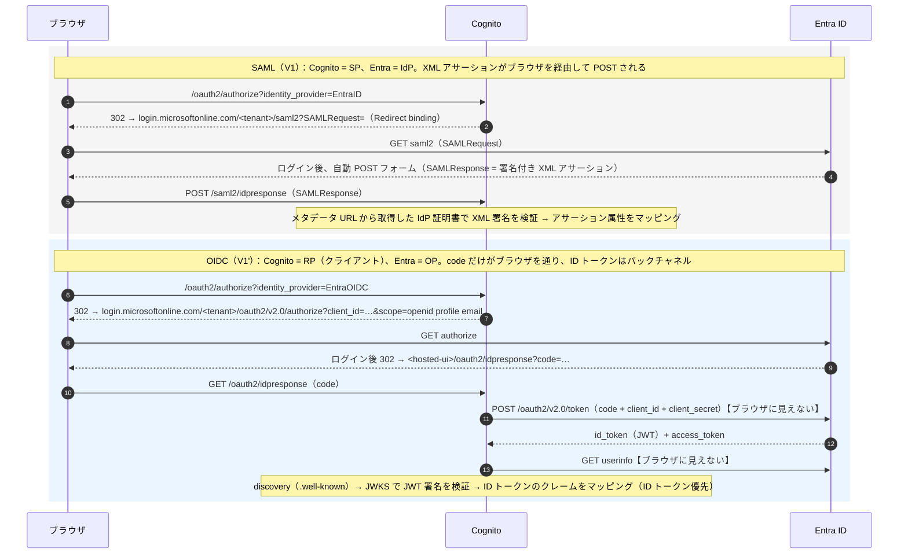

# 整理：SAML と OIDC — 本検証で両方を通した実測に基づく比較と、「OIDC が主流」の背景 v1.0

作成日：2026-08-30。対象：V1（SAML IdP `EntraID`、検証ログ V1）と V1'（OIDC IdP `EntraOIDC`、検証ログ V1'）。**事実**（公式資料・実測）と **推定**（私見）を分けて書く。参照 URL は末尾。

## 0. 一枚で：Cognito から見た 2 つの往復（実測ベース）
共通部分（アプリ ⇄ Cognito の PKCE、Pre Token Gen、トークン発行）は同じ。違うのは **Cognito ⇄ Entra の区間だけ**。

## 1. 相違点の表（本検証で実際に触った差）
| 観点 | SAML 2.0（V1：`EntraID`） | OIDC 1.0（V1'：`EntraOIDC`） | 本検証での実測・所感 |
|---|---|---|---|
| 規格の系譜 | OASIS 標準。**2005 年 3 月**に v2.0 承認［O-1］。XML 署名・XML アサーション | OpenID Foundation。**OAuth 2.0（2012 年、RFC 6749/6750）の上の「シンプルな ID 層」**［O-2］［O-3］。JSON／JWT／REST | OIDC の設計目標は「JWT を使って開発者にとって劇的に実装しやすく」（OpenID 2.0 の XML と独自署名が難しかった反省）［O-2］ |
| Cognito の役割名 | **SP**（Service Provider） | **RP**（Relying Party）＝ OAuth のクライアント | どちらでも Cognito は「Entra から受けた主張を自分のユーザーに写し、以後は自分が IdP として JWT を発行する」橋渡し役［A-1］ |
| 信頼の張り方 | **メタデータ URL**（Entra の署名証明書・エンドポイントを含む XML）を Cognito に渡す。Entra 側に SP Entity ID／ACS URL を登録 | Entra の **テナント固有 issuer** から **discovery**（`.well-known/openid-configuration`）で JWKS・各エンドポイントを自動取得。Entra 側にリダイレクト URI を登録し、**client_id + client_secret** を Cognito に渡す | SAML は「証明書」、OIDC は「シークレット（有効期限あり。本検証は 2027-02-25）」が運用の要。CDK は OIDC の `clientSecret` を Secrets Manager 動的参照で埋めた（V1'-a） |
| 主張（属性）の運び方 | **アサーションの属性**（Attribute Name → プール属性）。ブラウザを経由する POST | **ID トークンのクレーム**＋ userInfo（Cognito は ID トークン優先）。code だけがブラウザを通り、トークンは**バックチャネル** | 両方とも受け皿は同じ `custom:*_raw` → Pre Token Gen 以降は**無変更で成立**（V1'-b で `userAttributeKeys` が SAML 時と一致） |
| Entra 側の登録物 | エンタープライズアプリ（非ギャラリー、SAML SSO）＋「属性とクレーム」 | App registration（Web、client secret）＋「属性とクレーム」＋ **manifest `acceptMappedClaims: true`**（無いと `AADSTS50146`） | OIDC の方が Entra 側の前提が 1 つ多い（ランブック v2.0 §5） |
| ユーザー名（Cognito が自動導出） | `EntraID_<NameID>`（Entra の既定 NameID は UPN＝**可変**） | `EntraOIDC_`（Entra の `sub` は**アプリごとの pairwise・不変**［M-3］） | IdP を替えると別ユーザーになる（V1'-b で 4 人目が作られ、V1'-c で旧 2 名を削除）。可読名は `preferred_username`／`name` を標準属性に写す（V1'-b、Microsoft も UPN／メールを識別子に使うなと明記［M-3］） |
| 観測面（学習・切り分け） | **厚い**：SAMLRequest／SAMLResponse がブラウザに出る → DevTools で捕まえて `decode_saml.py` で中身を読める | **薄い**：`idpresponse?code=` の 302 しか見えない。Entra が何を送ったかは `admin-get-user` からの逆算か jwt.ms | 「見えないのが正常」なので、OIDC のトラブルシュートは IdP 側のトークン内容を別手段で見る前提になる |
| 欠落の挙動 | 値が空のクレームは Entra が省略 → Cognito は黙って未設定 | 同じ（`email` が Entra に無く未反映） | どちらも「静かに失敗」。必須属性にしない限りログインは成功する |
| 有効期限・失効の運用 | 証明書の期限（年単位）。メタデータ URL 方式なら Cognito が最長 6 時間キャッシュして追従 | シークレットの期限（最長 2 年）。ローテーション時は Cognito の IdP 設定更新が要る | 運用の「切れ方」が違う。本番はカレンダー管理が要る |
| 下流（AgentCore）との相性 | AgentCore は SAML を受けない | AgentCore の入口認証は **JWT ＋ OIDC discovery** 前提［A-2］ | ただし下流に渡すのは **Cognito の JWT** なので、Entra が SAML でも OIDC でも AgentCore からは同じに見える。差し替えの動機は「Entra 側の登録物・観測・識別子」の整理 |

## 2. 「OIDC が主流」という認識について（裏取りの結果）
結論（**訂正を含む**）：**「新規開発・モバイル／SPA／API・エージェント連携では OIDC が既定」は正しい。一方で「SAML はもう使われない」は誤りで、企業向け SSO（ISV が企業に売るアプリ、既存の企業 ID 基盤）では SAML が依然として現役**。「主流」は**用途で分かれる**、が正確な言い方。

根拠（公式）：
- Microsoft（Entra の SSO 解説、2026-06 更新）［M-1］：SAML は「成熟した XML ベースの標準で**企業で広く使われている**。従来型 Web アプリや詳細なユーザー属性が要る場面向き」、OIDC は「OAuth 2.0 上のモダンなプロトコルで JSON トークン。**モダン Web・モバイル・API** で認証と認可の両方が要る場面向き」。ISV 向けには「**OIDC はモダンなフレームワークで作るのが通常は簡単。SAML はより広い企業互換性**」、管理者向けには「**SAML は確立された企業システムに合うことがある**」
- Microsoft（identity platform）［M-2］：プラットフォームの認可サーバは「OAuth 2.0 と OIDC 1.0 の標準準拠実装」で、トークンは JWT。SAML は別系統として「SAML 2.0 **と他のプロトコル**で SSO を提供」［M-4］
- OpenID Foundation［O-2］：OIDC は OAuth 2.0 上に「ID トークン・JWT・discovery」を足したもので、**モバイル／デスクトップのシステムブラウザからも使える**こと、XML と独自署名の難しさを JWT で解消したことが設計目標
- AWS Cognito［A-1］：外部 IdP として **SAML と OIDC の両方**を受け、どちらでも自分は「OIDC ＋ OAuth 2.0 の IdP」として JWT を発行する。＝クラウド側の共通語は JWT
- AWS AgentCore［A-2］：Runtime／Gateway の入口認証は「**OAuth 2.0 互換の任意の IdP**」で、discovery URL（`.well-known/openid-configuration`）から鍵を取る JWT 検証。SAML の受け口は無い

背景の整理（**推定**を含む）：
1. **時系列**：SAML 2.0（2005）は「企業間のブラウザ SSO」を XML で解いた。OAuth 2.0（2012）が「API アクセスの委任」を JSON/HTTP で標準化し、その上に OIDC（Core 1.0 Final は 2014 年。現行テキストは 2023-12-15 の errata 版［O-3］）が「認証」を薄く載せた。**モバイルアプリ・SPA・REST API の時代に、XML 署名の実装負荷とブラウザ POST 前提の SAML は合わなかった**
2. **API・マイクロサービス・エージェント**：呼び出し側がブラウザでない（サーバ→サーバ、エージェント→ゲートウェイ）とき、必要なのは「HTTP ヘッダに載せて検証できる短い署名付きトークン」＝ JWT。AgentCore の入口が OIDC discovery 前提なのはその典型
3. **SAML が残る理由**：企業の既存 ID 基盤（AD FS 由来）と SaaS の「エンタープライズ SSO」機能は SAML で整備済みで、置き換えるコストに見合う利得が薄い。Microsoft が「SAML＝広い企業互換性」と書くのはこのため
4. **本検証への含意**：Cognito が両方を受けて JWT に正規化してくれるので、**「上流は組織の事情（SAML でも OIDC でも）、下流は JWT」**という分離ができる。OIDC を選んだのは下流のためではなく、Entra 側の登録物（App registration）・識別子（pairwise `sub`）・シークレット運用を、これから作る本番設計に近づけるため

## 3. 本プロジェクトで OIDC に切り替えて得たもの／失ったもの（実測）
| 得たもの | 失ったもの／増えたもの |
|---|---|
| Entra 側が App registration 1 つに統一（Cognito 以外のクライアントからも同じ登録を使える） | manifest `acceptMappedClaims` の前提が増えた |
| 不変の `sub` ベースのユーザー名 | 観測面（SAMLResponse の可視性）。切り分けは `admin-get-user`／jwt.ms |
| discovery による自動設定（エンドポイント・鍵の手入力なし） | シークレットの期限管理（2027-02-25）と Secrets Manager $0.40/月 |
| 下流（Pre Token Gen 以降）は**無変更** | 旧 SAML ユーザーの棚卸し（V1'-c で 2 名削除） |

## 参照（公式）
- [O-1] OASIS SAML（v2.0 承認 2005-03-01）https://www.oasis-open.org/standard/saml/
- [O-2] OpenID Foundation「How OpenID Connect Works」https://openid.net/developers/how-connect-works/
- [O-3] OpenID Connect Core 1.0（Final。現行テキスト 2023-12-15 errata 版）https://openid.net/specs/openid-connect-core-1_0.html
- [M-1] Microsoft「What is single sign-on in Microsoft Entra ID?」（SAML／OIDC の使い分け）https://learn.microsoft.com/en-us/entra/identity/enterprise-apps/what-is-single-sign-on
- [M-2] Microsoft「OAuth 2.0 and OpenID Connect protocols」https://learn.microsoft.com/en-us/entra/identity-platform/v2-protocols
- [M-3] Microsoft「ID token claims reference」（`sub` pairwise・不変、`preferred_username`／`email` は可変で認可に使わない）https://learn.microsoft.com/en-us/entra/identity-platform/id-token-claims-reference
- [M-4] Microsoft「How the Microsoft identity platform uses the SAML protocol」https://learn.microsoft.com/en-us/entra/identity-platform/saml-protocol-reference
- [A-1] AWS「User pool sign-in with third party identity providers」https://docs.aws.amazon.com/cognito/latest/developerguide/cognito-user-pools-identity-federation.html
- [A-2] AWS「Configure inbound JWT authorizer」（AgentCore）https://docs.aws.amazon.com/bedrock-agentcore/latest/devguide/inbound-jwt-authorizer.html
- 本プロジェクト：`検証ログ_V1_v1_0.md`（SAML の実測）、`検証ログ_V1-OIDC_v1_0.md`（OIDC の実測）、`計画_追加要件_v1_0.md` §1

## 変更履歴
- v1.0（2026-08-30）起票。実測ベースの比較表、「OIDC が主流」の裏取りと訂正、切り替えの損益
