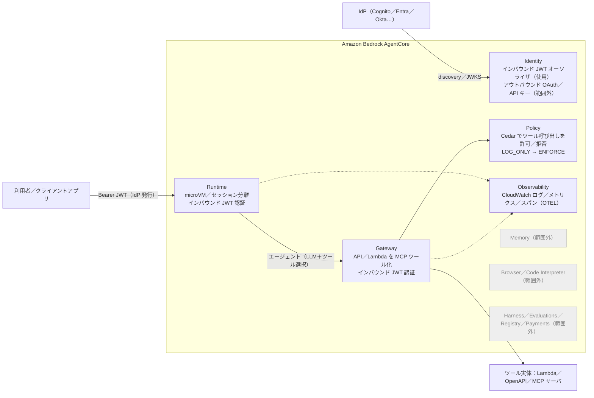
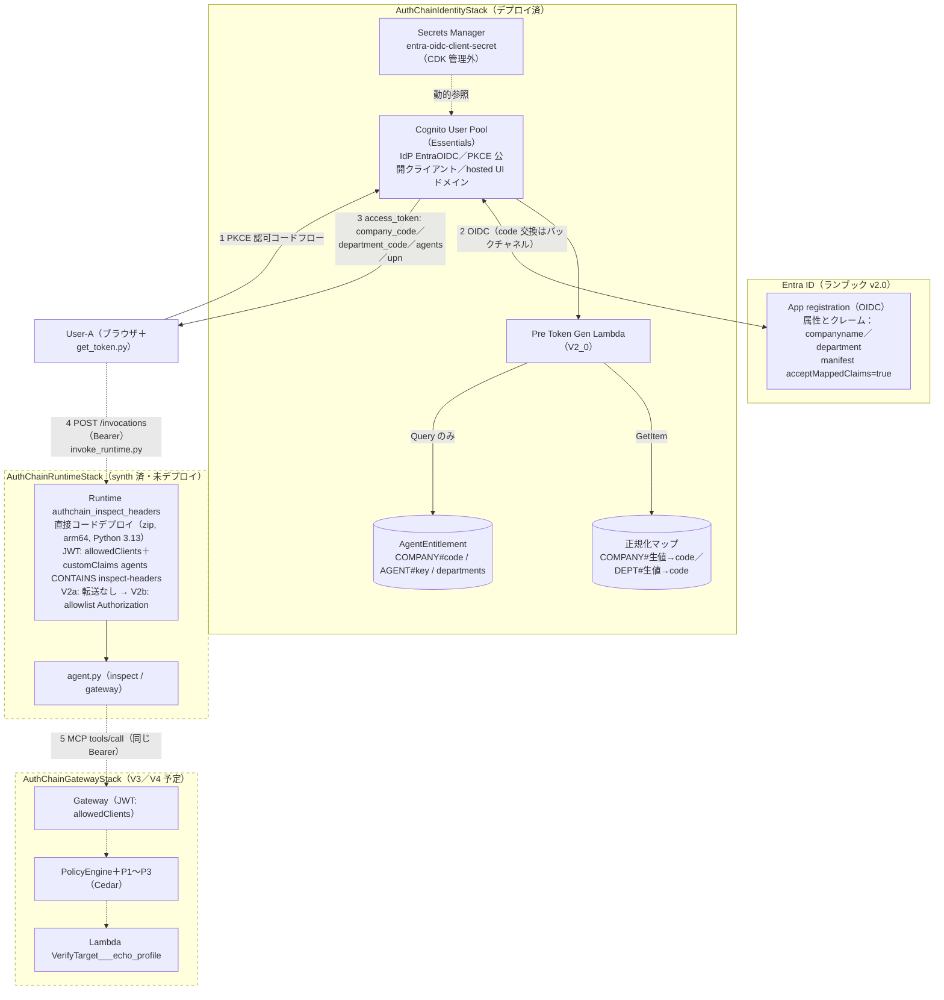
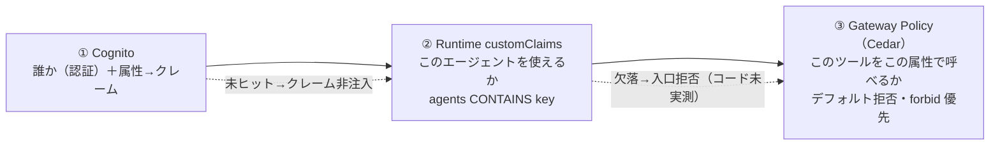

# 整理：システム全体像 — AgentCore を使った AI エージェントシステムの構成・処理・認可・ベストプラクティス対応 v1.0

作成日：2026-08-30（V2-1 完了時点。Runtime 以降は未デプロイ＝「方針」）。**本書が「現在の構成」の正本**。`計画_追加要件_v1_0.md` §0 の図は計画時点の履歴、`整理_Cognito全体像` は Cognito の内側、`ツール使い方_観測手順` は手順。各 V 完了時に §1 の点線→実線、§4 の拒否の実測、§5 (b) の「現状」列を更新する。

想定読者：**本番設計をする人が最初に読む文書**。検証手順ではなく「何を・なぜ・どう組んだか」を書く。各項目に ［要件固有］／［汎用］／［簡略化］ を付ける（`仮決め事項表` §0 の分類）。事実（公式・実測）と推定を分け、公式 URL は末尾の参照番号で示す。

## 0. 目的と信頼境界
目的は 2 軸（`索引_v1_0.md` §0）：
1. ［要件固有］組織属性の正規化 → エージェント認可マスタ → `agents` クレーム → Runtime 入口認証 → 同一 Bearer の透過 → Gateway Policy（Cedar）という**認証・認可の連鎖**を実測で確かめる
2. ［汎用］**AgentCore（Runtime／Gateway／Identity／Policy／Observability）で AI エージェントシステムを組む型**を、公式ベストプラクティスに沿って作りながら理解する

信頼境界と「誰が何を検証するか」（V2-1 時点の実測＋計画）：
| 層 | 付けるもの | 検証するもの | 根拠データ | 分類 |
|---|---|---|---|---|
| Entra ID（OP） | ID トークンの `companyname`／`department`／`preferred_username`／`name` | ユーザー認証（MFA 等は Entra 側の責任） | ディレクトリ属性 | 汎用 |
| Cognito（RP → 自らが IdP） | プロファイル `custom:*_raw`／標準属性。以後は Cognito 発行の JWT が共通語 | Entra トークンの署名・iss・aud・exp（discovery／JWKS） | Entra の discovery | 汎用 |
| Pre Token Gen Lambda | 両トークンに `company_code`／`department_code`／`agents[]`／`upn` | （未ヒットは非注入＝fail-closed） | DynamoDB 2 テーブル | **要件固有** |
| AgentCore Runtime（V2a〜） | `Authorization` をエージェントへ転送（allowlist 時） | JWT 署名・iss・`client_id`・`agents CONTAINS <agent_key>` | Cognito discovery＋Runtime 設定 | 汎用（customClaims は要件固有） |
| エージェント（agent.py） | Gateway 呼び出しに同じ Bearer（透過） | （署名は Runtime 検証済み。表示用 decode のみ） | — | 要件固有（透過方式）／簡略化（LLM なし） |
| AgentCore Gateway（V3〜） | — | JWT 署名・iss・`client_id` | Cognito discovery | 汎用 |
| AgentCore Policy（V4〜） | — | ツール／引数単位の認可（`company_code` 等の tag） | Cedar（デフォルト拒否） | 汎用（条件は要件固有） |

## 1. システム構成
### 1-1 ［汎用］AgentCore で組むエージェントシステムの型（本検証の範囲を色分け）
公式［A-1］の構成要素を「一般的なエージェントシステム」に置いたもの。灰色は本検証の**範囲外**（学んでいないことを明示）。

- 本検証のエージェントは **LLM を呼ばない最小構成**（［簡略化］）。一般的な型では Runtime 上のエージェント（Strands 等）がモデルにツール選択をさせ、Gateway の MCP ツールを呼ぶ
- 「Identity」は本検証ではインバウンド（JWT オーソライザ）だけを使う。アウトバウンド（エージェントが第三者 API のトークンを取る）は範囲外

### 1-2 本検証の構成（現在＝V2-1。点線は未デプロイ）

## 2. 処理の流れ（各段を同じ型で）
| # | 段 | 入力 | 判断の根拠 | 出力 | 失敗時の挙動（実測／予想） | 分類 |
|---|---|---|---|---|---|---|
| ① | ログイン（PKCE → Entra OIDC → 属性マッピング） | `/oauth2/authorize?identity_provider=EntraOIDC`＋`code_challenge` | Entra の認証、Cognito の JWKS 検証、`attributeMapping` | プロファイル `custom:*_raw`／`preferred_username`／`name`、認可コード | クレーム欠落は**静かに未設定**（ログインは成功）。`acceptMappedClaims` 無しは AADSTS50146（未実測） | 汎用（マッピング先は要件固有） |
| ② | Pre Token Gen（正規化 → エンタイトルメント → 注入） | `userAttributes`（`custom:*_raw`、`preferred_username`） | 正規化マップ GetItem×2、`AgentEntitlement` Query＋`departments` フィルタ | 両トークンに `company_code`／`department_code`／`agents[]`／`upn` | 未ヒットは**該当クレームのみ非注入**（fail-closed）、WARNING ログ。認証自体は成功 | **要件固有** |
| ③ | Runtime 入口（JWT オーソライザ） | `Authorization: Bearer <access_token>`、Session-Id | discovery の JWKS、`client_id ∈ allowedClients`、`agents CONTAINS inspect-headers` | microVM 起動、`/invocations` へ（allowlist 時は `Authorization` も） | 署名不正／期限切れ／`client_id` 不一致／`agents` 欠落 → **401 か 403（V2a で実測。公式は「トークン無しは 401＋WWW-Authenticate」）** | 汎用（customClaims の値は要件固有） |
| ④ | エージェント（inspect／gateway） | `payload.action`、`context.request_headers` | （検証しない。Runtime 済み） | 受信ヘッダ名、JWT の要点、Gateway 応答 | `Authorization` 不達（V2a）→ `received_header_names` に無い。Gateway 未設定 → エラー応答 | 要件固有（透過）／簡略化（LLM なし） |
| ⑤ | Gateway＋Policy | MCP `tools/list`／`tools/call`＋同じ Bearer | JWT 検証 → Cedar（principal=OAuthUser、tag=JWT クレーム） | ツール実行結果 | JWT 不正 401／スコープ不足 403（公式）。Policy 拒否は `isError: true`＋`AuthorizeActionException`。LOG_ONLY では通してメトリクスのみ | 汎用（Cedar 条件は要件固有） |

## 3. データとクレーム（どこで作られ、どこで**使われる**か）
クレームの出所（誰が付けたか）は `ツール使い方_観測手順` §2-2 を正とし、ここは**消費側**だけを足す。
| 項目 | 作る場所 | 使う場所 | 分類 |
|---|---|---|---|
| 正規化マップ `COMPANY#<生値>`／`DEPT#<生値>` → `code` | CDK シード（`identity-stack.ts`） | Pre Token Gen（GetItem） | 要件固有 |
| `AgentEntitlement` `COMPANY#<code>` / `AGENT#<key>` / `departments`(SS) | CDK シード | Pre Token Gen（Query＋部門フィルタ） | 要件固有 |
| `custom:company_raw`／`custom:department_raw` | IdP 属性マッピング | Pre Token Gen の入力 | 要件固有 |
| `company_code`／`department_code` | Pre Token Gen | Cedar の tag（V4）。Runtime `customClaims` の候補（余力枠） | 要件固有 |
| `agents[]` | Pre Token Gen | Runtime `customClaims`（V2）、Cedar の tag（V4。配列の表現は未確認） | 要件固有 |
| `upn` | Pre Token Gen（`preferred_username` の写し） | 監査・Cedar の表示用（V4 で検討）。認可の主キーには使わない（可変） | 要件固有 |
| `client_id`／`iss`／`sub` | Cognito | Runtime／Gateway の `allowedClients`・discovery、Cedar の principal id（`sub`。CloudTrail にも記録される［A-6］） | 汎用 |
| `AGENT_KEY = 'inspect-headers'` | `bin/authchain.ts` の定数 | シード sk／`customClaims` 一致値／Runtime 環境変数 | 要件固有（結び方は汎用の作法） |

## 4. 認可の 3 層と fail-closed の連鎖

| 層 | 拒否の条件 | 拒否の見え方 | 状態 |
|---|---|---|---|
| ① Cognito | IdP 認証失敗／クライアントに許可されていない IdP | hosted UI のエラー、`/callback?error=` | 実測済（V1） |
| ② Runtime | 署名・iss・`client_id`・`customClaims` のいずれか不一致、トークン無し | HTTP 401（`WWW-Authenticate: Bearer resource_metadata=…`）または 403 — **V2a/V2b で実測** | 未 |
| ③ Policy | permit 無し／forbid 一致 | MCP `result.isError=true`＋`AuthorizeActionException`。`tools/list` は呼べるツールだけ | V4 |

fail-closed の連鎖（要件固有の設計の核）：マスタに無い会社は `agents` が**存在しない**トークンになり、Runtime は customClaims の欠落で入口拒否、万一通っても Cedar はデフォルト拒否。「許可を書かない限り何も通らない」を 3 層で重ねる。

## 5. ベストプラクティス対応表（1 行 1 出典。無い行は［推定］）
### 5-(a) 構築済み部分（V2-1 時点の現状と照合）
| 項目 | 公式推奨 | 本検証の現状 | 判定・本番案 | 出典 |
|---|---|---|---|---|
| 公開クライアントの保護 | 公開クライアントにシークレットを埋めない。PKCE の `code_verifier` は毎回ランダム生成 | `generateSecret: false`＋`get_token.py` が毎回 `secrets.token_bytes(48)` | **一致** | ［C-1］ |
| 公開サインアップ | 不要なら閉じる。ユーザー存在エラーを隠す | `selfSignUpEnabled: false`、`preventUserExistenceErrors: true` | **一致** | ［C-1］ |
| 信頼する IdP を限定 | クライアントの `SupportedIdentityProviders` で限定 | `COGNITO`＋`EntraOIDC` のみ（SAML は撤去） | **一致** | ［C-1］ |
| マッピングする IdP 属性 | 「安全で予測可能な属性だけをマッピング」 | `companyname`／`department`／`preferred_username`／`name`（Entra の「属性とクレーム」で管理者が制御） | **一致**。`email` は値が無く未反映 | ［C-1］ |
| スコープ最小化 | 必要最小のスコープ | `openid profile email` | ［推定］`email` は標準属性の `email` 用。不要なら外せる | ［C-1］ |
| トークンの検証と保管 | アクセストークンは「独立に検証するシステム」にだけ渡す。ID/アクセストークンをローカルに保存しない | 検証は Runtime／Gateway。`out/tokens_*.json` に保存（0600、gitignore） | 検証は一致。**保存は［簡略化］**（証跡のため。撤収時に削除） | ［C-1］ |
| MFA／脅威防御 | ローカルユーザーに MFA・threat protection。フェデレーションユーザーは IdP の責任 | `local-user-a` は MFA なし。User-A は Entra 側 | ［簡略化］切り分け用ローカルユーザーのため。本番はローカルユーザーを持たないか MFA 必須 | ［C-2］ |
| WAF／削除保護 | WAF web ACL、`deletionProtection` | なし、`RemovalPolicy.DESTROY` | ［簡略化］本番は両方 | ［C-2］ |
| IdP のクライアントシークレット | Secrets Manager に置き、公開しない | Secrets Manager＋CFN 動的参照（テンプレートに平文なし） | **一致**。ローテーション手順は未整備（期限 2027-02-25） | ［C-1］［A-13 計画書］ |
| Lambda の最小権限 | 必要なアクションだけ | `AgentEntitlement` は `dynamodb:Query` のみ。正規化マップは `grantReadData`（8 アクション、Scan 含む） | 部分一致。本番は正規化マップも `GetItem` のみ（［推定］） | ［B-4 計画書］ |
| DynamoDB（認可根拠） | PITR・削除保護・RETAIN | いずれも無し（コメントで本番案を併記） | ［簡略化］ | ［B-6 計画書］ |
| CDK・依存 | 安定版 L2、バージョン固定 | `aws-cdk-lib/aws-bedrockagentcore` 安定版、全依存 exact 固定、Policy のみ alpha | **一致**（仮決め #10） | ［D-13 計画書］ |
| 秘密の非コミット | アカウント ID・GUID・トークンをリポジトリに置かない | context／`out/`／環境変数で注入、コミット前スキャン | **一致** | ［C-1］（AWS 認証情報の扱い） |

### 5-(b) 未デプロイ部分（方針。V2a／V3／V4 の完了時に「現状」列を実測で埋める）
| 項目 | 公式推奨 | 方針（現在の CDK） | 判定・本番案 | 出典 |
|---|---|---|---|---|
| **MMDSv2（必須）** | 2026-06-30 以降、`metadataConfiguration.requireMMDSV2=true` でない Runtime は**呼び出しが `ValidationException`** | CFN スキーマ（`AWS::BedrockAgentCore::Runtime`）に `MetadataConfiguration` が**無い**（2026-08-30 確認）→ CDK では設定不可。デプロイ後に `aws bedrock-agentcore-control update-agent-runtime --metadata-configuration requireMMDSV2=true` | **V2a の予想：最初の invoke が MMDSv2 の ValidationException**。CLI で有効化して再実測。CFN 対応後に CDK へ戻す | ［A-2］［A-7］ |
| JWT オーソライザを完全に設定 | discovery／audience／clients／scopes／customClaims を**すべて**設定 | discovery＋`allowedClients`＋`customClaims`。`allowedAudience` なし（Cognito アクセストークンに `aud` 無し）、`allowedScopes` なし | 部分一致。本番案：Cognito リソースサーバで `aud`／カスタムスコープを付け `allowedAudience`／`allowedScopes` も設定（計画書 §6-7 余力枠） | ［A-2］［C-4 計画書］ |
| 実行ロールの最小権限・confused deputy | CLI 生成ポリシーは本番不可。trust policy に `aws:SourceAccount`／`aws:SourceArn` | CDK L2 が生成：trust に `SourceAccount`＋`SourceArn=…:runtime/authchain_inspect_headers*`、権限は logs／xray／metrics（namespace 条件）／workload identity／CDK アセット S3 読み取り | **一致**（trust）。S3 はアセットバケット全体 `/*` → 本番は zip キーに絞る（［推定］） | ［A-2］ |
| `InvokeAgentRuntimeForUser` の拒否 | JWT が常にあるなら `ForUser` と `GetWorkloadAccessTokenForUserId` を明示 Deny | L2 既定で `GetWorkloadAccessTokenForUserId` を Allow | 本番案：Deny 文を追加（V2 余力枠で試す） | ［A-2］ |
| ネットワーク | 私設リソースに触るなら VPC＋PrivateLink、SG 最小 | `PUBLIC`（仮決め #8） | ［簡略化］本検証は外部 API を呼ばない。本番は VPC | ［A-2］ |
| Gateway を前置し Runtime 直呼びを塞ぐ | Gateway を単一入口にし、JWT Runtime は `allowedWorkloadConfiguration` で Gateway 以外を拒否 | Runtime を**直接**呼ぶ（要件固有の観測のため）。Runtime → Gateway の順 | ［要件固有］本番案：Gateway 前置＋`allowedWorkloadConfiguration`（L2 に無く CfnRuntime 上書き） | ［A-2］［A-3］ |
| ヘッダ転送（`Authorization` allowlist） | 公式手順（Step 7）どおり allowlist に入れ、エージェントは署名検証せず decode | V2b で `allowlistedHeaders: ['Authorization']`、`PyJWT verify_signature=False` | **一致** | ［A-3］ |
| 同一トークンの透過 | 「本番推奨ではない。`aud` を絞るか OBO 交換」 | エージェントが同じ Bearer を Gateway へ（仮決め #16） | ［要件固有＋簡略化］本番案：`aud` 絞り、Cognito が OBO 非対応なら別 IdP か Gateway 側の JWT 検証＋Policy で補う（計画書 §3-5） | ［A-4］ |
| 入力検証 | `prompt` は文字列を強制、`toolUse` ブロックを拒否、スキーマ検証 | `payload.action` を文字列で分岐。LLM 無しなので `prompt` 無し | 本番で LLM を載せるとき必須（V5 検討時） | ［A-2］ |
| セッションとユーザーの対応 | AgentCore は session→user を強制しない。バックエンドで管理 | `invoke_runtime.py` が毎回新しい Session-Id | ［簡略化］本番はクライアント側で user↔session を管理 | ［A-2］ |
| Observability | Transaction Search 有効化、Runtime はログ群自動、Gateway は vended logs 設定、ADOT で計装 | L2 `tracingEnabled`／`loggingConfigs` は未使用。ADOT 未導入 | V2a で「Runtime 既定のログ群」を確認、Transaction Search の要否を判断。Gateway ログは V3 冒頭で判断 | ［A-5］ |
| Gateway インバウンド | JWT＋`allowedClients`。CloudTrail に `sub` が載るので PII を `sub` にしない | `usingCognito({userPool, allowedClients})`。Cognito の `sub` は UUID | **一致（予定）** | ［A-6］ |
| Policy の導入 | LOG_ONLY で観測 → ENFORCE（typical lifecycle）。エンジン単位とポリシー単位の LOG_ONLY がある。`UpdateGateway` 権限を絞る | V4a エンジン LOG_ONLY → V4b ENFORCE | **一致（予定）**。ポリシー単位 `enforcementMode` は新知見（V4 で試す） | ［A-8］［A-9］ |
| エージェント実装 | フレームワーク（Strands 等）＋ADOT 計装、非 root、依存更新 | LLM 無しの最小 `BedrockAgentCoreApp`、直接コードデプロイ（OS パッチは AWS） | ［簡略化］V4 後に V5（Strands＋モデル）を検討 | ［A-1］［A-2］ |
| Identity アウトバウンド | 第三者 API は AgentCore Identity（トークン保管庫） | 未使用 | 範囲外 | ［A-2］ |

## 6. コード地図
| パス | 役割 | 分類 |
|---|---|---|
| `cdk/bin/authchain.ts` | アプリ入口。`out/entra-oidc.json`／context の読み込み、**`AGENT_KEY` の定義**、2 スタックの配線 | 汎用 |
| `cdk/lib/identity-stack.ts` | UserPool／OIDC IdP／PKCE クライアント／ドメイン／正規化マップ＋`AgentEntitlement`（シード）／Pre Token Gen Lambda／ローカルユーザー／出力 | 汎用＋要件固有（テーブル・マッピング） |
| `cdk/lib/runtime-stack.ts` | Runtime（直接コードデプロイ、JWT＋customClaims、`-c forwardAuth` で allowlist）／出力 | 汎用（customClaims 要件固有） |
| `lambda/pre_token_gen/handler.py` | 正規化・エンタイトルメント・注入（fail-closed） | **要件固有** |
| `runtime-code/agent.py`／`requirements.txt`／`build.sh` | 最小エージェント（inspect／gateway）と arm64 バンドル（uv） | 簡略化 |
| `scripts/get_token.py`／`decode_jwt.py`／`invoke_runtime.py`／`decode_saml.py` | 観測用ツール（`ツール使い方_観測手順`） | 汎用（教育用） |
| `out/`（gitignore） | 出力・秘密・証跡 | — |
| 入力の流れ | Entra の値 → `out/entra-oidc.json` → `bin` → identity props。デプロイ出力 → `out/identity-outputs.json` → scripts | — |

## 7. 本番に向けた差分チェックリスト（§5 の［簡略化］を集約）
- [ ] `RemovalPolicy.RETAIN`＋DynamoDB PITR／削除保護、UserPool `deletionProtection`
- [ ] Runtime を VPC＋PrivateLink に、実行ロールの S3 権限を zip キーに限定、`ForUser` 系を明示 Deny
- [ ] MMDSv2 を CDK で設定できるようになったら CFN に戻す（それまでは post-deploy の `update-agent-runtime`）
- [ ] Gateway を前置し `allowedWorkloadConfiguration` で Runtime 直呼びを塞ぐ
- [ ] 同一トークン透過をやめる：`aud` 絞り（Cognito リソースサーバ）／OBO 対応 IdP／Policy で補完
- [ ] Cognito：ローカルユーザーを廃止または MFA、WAF、`allowedScopes`／`allowedAudience` を Runtime／Gateway に設定
- [ ] Observability：Transaction Search、Gateway vended logs、ADOT 計装、アラーム
- [ ] エージェント：Strands＋モデル、入力検証（`prompt` の型・`toolUse` 拒否）、session↔user 管理
- [ ] シークレットのローテーション手順（Entra クライアントシークレット、期限 2027-02-25）
- [ ] トークンをローカルに保存しない（`out/` は検証用）

## 参照（公式）
- ［A-1］AgentCore 概要（サービス一覧）https://docs.aws.amazon.com/bedrock-agentcore/latest/devguide/what-is-bedrock-agentcore.html
- ［A-2］Runtime セキュリティベストプラクティス https://docs.aws.amazon.com/bedrock-agentcore/latest/devguide/runtime-security-best-practices.html
- ［A-3］Runtime のインバウンド／アウトバウンド認証（`allowedWorkloadConfiguration`、ヘッダ転送 Step 7、401 応答）https://docs.aws.amazon.com/bedrock-agentcore/latest/devguide/runtime-oauth.html
- ［A-4］Gateway インバウンド認証（401/403、トークンパススルーは本番非推奨・OBO 推奨）https://docs.aws.amazon.com/bedrock-agentcore/latest/devguide/gateway-inbound-auth.html
- ［A-5］Observability の設定（Transaction Search、ログ配信、ADOT）https://docs.aws.amazon.com/bedrock-agentcore/latest/devguide/observability-configure.html
- ［A-6］インバウンド JWT オーソライザ https://docs.aws.amazon.com/bedrock-agentcore/latest/devguide/inbound-jwt-authorizer.html
- ［A-7］Runtime トラブルシュート（MMDSv2 ValidationException）https://docs.aws.amazon.com/bedrock-agentcore/latest/devguide/runtime-troubleshooting.html
- ［A-8］Policy のエンフォースモード https://docs.aws.amazon.com/bedrock-agentcore/latest/devguide/policy-enforcement-modes.html
- ［A-9］Policy を LOG_ONLY でテスト https://docs.aws.amazon.com/bedrock-agentcore/latest/devguide/policy-test-a-policy.html
- ［A-10］Runtime の仕組み（microVM、セッション、認証）https://docs.aws.amazon.com/bedrock-agentcore/latest/devguide/runtime-how-it-works.html
- ［C-1］Cognito ユーザープールのセキュリティベストプラクティス https://docs.aws.amazon.com/cognito/latest/developerguide/user-pool-security-best-practices.html
- ［C-2］Cognito のセキュリティ機能 https://docs.aws.amazon.com/cognito/latest/developerguide/managing-security.html
- 計画書 `計画_追加要件_v1_0.md` 付録 A の［B-*］［C-*］［D-*］

## 変更履歴
- v1.0（2026-08-30）起票（V2-1 時点）。目的の 2 軸、汎用／本検証の構成図、処理 5 段、データと消費側、認可 3 層、ベストプラクティス対応表 (a)(b)、コード地図、本番差分チェックリスト。MMDSv2 必須（CFN 未対応）を V2a の予想として記載
