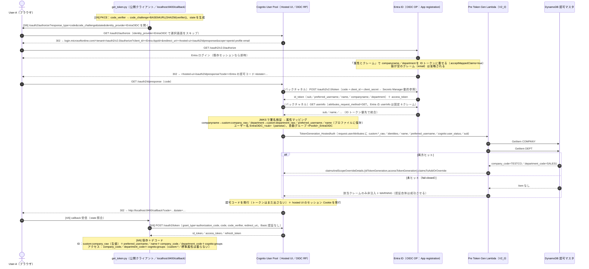

# 検証ログ V1'：Entra ID フェデレーションの OIDC 化（SAML → OIDC 置換） v1.0

対象：計画書 `計画_追加要件_v1_0.md` 要件 1（§1）、ランブック `ランブック_EntraID設定_v2_0.md`。仮決め #2 を SAML → OIDC に変更（2026-08-29 ユーザー承認）。

## V1' 合格条件チェックリスト
| # | 条件 | 状態 | 出典 |
|---|---|---|---|
| 1 | OIDC IdP `EntraOIDC` 経由のログインで `custom:company_raw` / `custom:department_raw` が保存される（`admin-get-user`） | **完了** | V1'-b |
| 2 | 同じ Pre Token Gen で `company_code` / `department_code` が両トークンに注入される（IdP 差し替えで下流不変） | **完了** | V1'-b |
| 3 | `acceptMappedClaims` 未設定時の `AADSTS50146` を実測（壊す実験）または理由を記録 | 省略（ユーザーが事前に true 設定済み） | V1'-b |
| 4 | SAML IdP 削除後も OIDC ログイン可、旧ユーザーの棚卸し完了 | **完了** | V1'-c |
| 5 | シーケンス図（OIDC 版）、仮決め #2/#4 の実測列、コスト表 §3 の更新 | **完了** | V1' 完了サマリ |

---

## V1'-a：OIDC IdP 追加（SAML と併存）— CDK 差分と synth（2026-08-29）

### 目的
Entra ID を OIDC IdP として Cognito に追加し、SAML と併存させる。Entra 側（ランブック v2.0 §2〜§7）はユーザー作業のため、先に CDK 差分を作って synth で形を確認し、値が揃い次第デプロイする。

### 設計の要点（公式確認 → 反映。参照 URL は計画書 付録 A）
- `UserPoolIdentityProviderOidc`：`issuerUrl = https://login.microsoftonline.com/<tenant>/v2.0`（末尾スラッシュ不可、`common` 不可）、`endpoints` 省略（discovery 自動検出）、`scopes: openid profile email`、`attributeRequestMethod: GET`
- `clientSecret` は string 型のみ → `SecretValue.secretsManager(<name>).unsafeUnwrap()` で CFN 動的参照 `{{resolve:secretsmanager:<name>:SecretString:::}}` を埋め込む（**シークレットは平文文字列で保存**。JSON にすると `SecretString` 全体＝JSON がシークレット値として渡ってしまう）
- 属性マッピングは SAML と同じ受け皿（`custom:company_raw ← companyname`、`custom:department_raw ← department`）。Pre Token Gen 以降は無変更
- クライアント `supportedIdentityProviders` に `EntraOIDC` を併記、`addDependency(entraOidc)`
- 入力は `out/entra-oidc.json`（gitignore）を既定、`-c` で上書き。未指定は synth で停止（IdP 削除差分の事故防止。SAML の `samlMetadataUrl` と同じ流儀）
- 出力 `OidcRedirectUri = <HostedUiBaseUrl>/oauth2/idpresponse`（SAML の `/saml2/idpresponse` とは別パス）

### 予想（Claude が代行。実測と照合）
- (a) `cdk synth`：OIDC IdP のテンプレートは `ProviderType: OIDC`、`ProviderDetails` に `client_id` / `client_secret`（動的参照の文字列）/ `authorize_scopes: "openid profile email"` / `attributes_request_method: GET` / `oidc_issuer`。`authorize_url` 等 4 エンドポイントは**出ない**（discovery に任せる）
- (b) `cdk diff`（デプロイ前）：`[+] AWS::Cognito::UserPoolIdentityProvider EntraOidcIdp`、`[~] UserPoolClient` の `SupportedIdentityProviders` に 1 要素追加、`[+] Output OidcRedirectUri`、さらに **V2 の Runtime スタックを同じ app に配線したことによるクロススタック参照の出力 2 件**（`PublishOutputRefUserPool…` / `PublishOutputRefUserPoolPkceClient…`。synth で確認済み。Runtime 側は `Fn::GetStackOutput` で参照）の計 **5 点**。UserPool・テーブル・Lambda は不変
- (c) デプロイ：CFN が Secrets Manager を解決できないと IdP 作成で失敗（シークレット名の誤り／未作成／リージョン違い）。成功時、Cognito は IdP 作成時点で discovery を取りに行く（issuer 誤りはここで `InvalidParameterException`）

### 実行コマンド
```bash
# synth(ダミー値。AWS 認証情報不要)
npx cdk synth AuthChainIdentityStack --quiet \
  -c samlMetadataUrl="$(cat ../out/saml-metadata-url.txt)" \
  -c entraTenantId=<dummy GUID> -c entraClientId=<dummy GUID> -c entraClientSecretName=authchain/entra-oidc-client-secret
# デプロイ(out/entra-oidc.json が揃ってから)
npx cdk diff  -c samlMetadataUrl="$(cat ../out/saml-metadata-url.txt)"
npx cdk deploy -c samlMetadataUrl="$(cat ../out/saml-metadata-url.txt)" --outputs-file ../out/identity-outputs.json
```

### 出力（現物）：synth（2026-08-29、ダミー値）
```json
"EntraOidcIdp...": {
  "AttributeMapping": { "custom:company_raw": "companyname", "custom:department_raw": "department" },
  "ProviderDetails": {
    "client_id": "<dummy>",
    "client_secret": "{{resolve:secretsmanager:authchain/entra-oidc-client-secret:SecretString:::}}",
    "authorize_scopes": "openid profile email",
    "attributes_request_method": "GET",
    "oidc_issuer": "https://login.microsoftonline.com/<dummy>/v2.0"
  },
  "ProviderName": "EntraOIDC", "ProviderType": "OIDC"
}
Client.SupportedIdentityProviders = ["COGNITO", {"Ref": "EntraIdp..."}, {"Ref": "EntraOidcIdp..."}]
Outputs: OidcRedirectUri
```

### 実測と解釈
- **［実測］(a) 一致**：4 エンドポイントは出力されず discovery 任せ。`client_secret` は動的参照の文字列として埋め込まれ、`cdk.out` に平文なし
- **［実測］** クライアントの `SupportedIdentityProviders` は `Ref` で IdP を参照するため、CFN 上も IdP → クライアントの順序が保証される（`addDependency` は二重の安全）
- **［実測］(b) 一致（2026-08-29 `cdk diff`、変更セット方式）**：`[+] UserPoolIdentityProvider EntraOidcIdp`、`[~] UserPoolClient`（`SupportedIdentityProviders` に `Ref` 追加、`DependsOn` に IdP 追加）、`[+] Output` 3 件（`OidcRedirectUri`／`PublishOutputRefUserPool…`／`PublishOutputRefUserPoolPkceClient…`）。UserPool・テーブル・Lambda・ドメインは差分なし
- **［実測］(c) 一致（`cdk deploy`、16 秒）**：`EntraOidcIdp CREATE_COMPLETE`（2 秒）→ `PkceClient UPDATE_COMPLETE`。Secrets Manager の動的参照は CFN が解決し、Cognito は issuer から discovery を取得できた（失敗すれば IdP 作成で止まるはず）。事前に `describe-secret` で存在確認（値は取得しない）、`get-caller-identity` で `user/Y_admin` を確認
- **［実測］`describe-identity-provider EntraOIDC`**：`ProviderType = OIDC`、`AttributeMapping` は CDK で書いた 2 件に加えて **`username: sub` が自動追加**（OIDC の `sub` → ユーザー名。公式どおり）。`ProviderDetails` は `client_id`／`oidc_issuer = https://login.microsoftonline.com/<tenant>/v2.0`／`authorize_scopes = openid profile email`／`attributes_request_method = GET`／`attributes_url_add_attributes = false` の 5 項目で、**discovery で解決される `authorize_url`／`token_url`／`attributes_url`／`jwks_uri` は保存・表示されない**（予想 (a) の「出ない」はテンプレートだけでなく API 応答でも同じ。Cognito は実行時に discovery を引く）。`client_secret` は API 応答に平文で含まれる（計画書 §1-1 のとおり。上の抽出では除外）
- **［実測］** クライアントの `SupportedIdentityProviders` は `Ref` で IdP を参照するため、CFN 上も IdP → クライアントの順序が保証される（`addDependency` は二重の安全）
- **［実測］(b) 一致（2026-08-29 `cdk diff`、変更セット方式）**：`[+] UserPoolIdentityProvider EntraOidcIdp`、`[~] UserPoolClient`（`SupportedIdentityProviders` に `Ref` 追加、`DependsOn` に IdP 追加）、`[+] Output` 3 件（`OidcRedirectUri`／`PublishOutputRefUserPool…`／`PublishOutputRefUserPoolPkceClient…`）。UserPool・テーブル・Lambda・ドメインは差分なし
- **［実測］(c) 一致（`cdk deploy`、16 秒）**：`EntraOidcIdp CREATE_COMPLETE`（2 秒）→ `PkceClient UPDATE_COMPLETE`。Secrets Manager の動的参照は CFN が解決し、Cognito は issuer から discovery を取得できた（失敗すれば IdP 作成で止まるはず）。事前に `describe-secret` で存在確認（値は取得しない）、`get-caller-identity` で `user/Y_admin` を確認
- **［実測］`describe-identity-provider EntraOIDC`**：`ProviderType = OIDC`、`AttributeMapping = {custom:company_raw: companyname, custom:department_raw: department}`、`ProviderDetails` は `client_id`／`oidc_issuer = https://login.microsoftonline.com/<tenant>/v2.0`／`authorize_scopes = openid profile email`／`attributes_request_method = GET` に加え、**Cognito が discovery から補完した `authorize_url`／`token_url`／`attributes_url`／`jwks_uri`**（下記の現物）と `attributes_url_add_attributes = false`。`client_secret` は API 応答に平文で含まれる（計画書 §1-1 のとおり。ログには載せない）
- **［実測］** クライアントの `SupportedIdentityProviders = [COGNITO, EntraID, EntraOIDC]`（併存）

### 出力（現物）：describe-identity-provider（2026-08-29、GUID マスク、client_secret 除外）
```json
{
 "ProviderName": "EntraOIDC", "ProviderType": "OIDC",
 "AttributeMapping": { "custom:company_raw": "companyname", "custom:department_raw": "department", "username": "sub" },
 "ProviderDetails": {
  "attributes_request_method": "GET", "attributes_url_add_attributes": "false",
  "authorize_scopes": "openid profile email", "client_id": "<GUID>",
  "oidc_issuer": "https://login.microsoftonline.com/<GUID>/v2.0"
 },
 "IdpIdentifiers": []
}
SupportedIdentityProviders = ["COGNITO", "EntraID", "EntraOIDC"]
```


---

## V1'-b：OIDC ログインの観測（2026-08-29）

### 目的
`get_token.py --user userA-oidc --idp EntraOIDC` で User-A が Entra（OIDC）経由でログインし、属性マッピング → Pre Token Gen → トークンの連鎖が SAML 時と同じ結果になることを確認する。Entra 側は `acceptMappedClaims: true` 設定済み（壊す実験 (a) は省略）。

### 予想 → 実測
| # | 予想 | 実測 |
|---|---|---|
| (b) | 初回ログインで `custom:company_raw = 株式会社テスト商事` / `custom:department_raw = 第一営業部` が保存される | **一致**。`list-users` で新ユーザーに両属性あり（Entra の「属性とクレーム」で追加した短名クレームが ID トークンに載り、マッピングされた） |
| (c) | 新ユーザー `EntraOIDC_<sub>`（4 人目）、`identities.providerName = EntraOIDC`、自動グループ `<PoolId>_EntraOIDC` | **一致**。ユーザー名は `EntraOIDC_` + 43 文字の不透明文字列（計 53 文字、GUID 形ではない＝pairwise `sub`）、`UserStatus = EXTERNAL_PROVIDER`、`identities[0] = {providerName: EntraOIDC, providerType: OIDC, userId: <sub>, primary: true}`、両トークンの `cognito:groups = ["<PoolId>_EntraOIDC"]` |
| (d) | `triggerSource = TokenGeneration_HostedAuth`、両トークンに `company_code = TESTCO` / `department_code = SALES1` | **一致**。Lambda ログ：`{"triggerSource": "TokenGeneration_HostedAuth", "userAttributeKeys": ["cognito:user_status", "custom:company_raw", "custom:department_raw", "identities", "sub"], "scopes": ["openid", "profile", "email"]}` → `{"injectedClaims": {"company_code": "TESTCO", "department_code": "SALES1"}}`（329 ms） |
| (e) | 旧 SAML ユーザー `EntraID_…` は残り二重になる | **一致**。プールは 4 名（local-user-a／EntraID_<User-A>／EntraID_<管理者>#EXT#／EntraOIDC_<User-A>） |

### 出力（現物）：トークン（`decode_jwt.py --mask`、抜粋）
```
access_token: token_use=access, client_id=<ClientId>, scope="openid profile email", username="EntraOIDC_…",
              cognito:groups=["<PoolId>_EntraOIDC"], company_code=TESTCO, department_code=SALES1, exp=iat+3600
id_token    : aud=<ClientId>, cognito:username="EntraOIDC_…", custom:company_raw=株式会社テスト商事, custom:department_raw=第一営業部,
              identities=[{providerName: EntraOIDC, providerType: OIDC, userId: <sub>, issuer: null, primary: true}],
              cognito:groups=[…], company_code=TESTCO, department_code=SALES1
```

### 実測と解釈
- **［実測］IdP を差し替えても下流は無変更で成立**：Pre Token Gen に渡る `userAttributeKeys` は SAML 時と同じ 5 つ。「認可の根拠はプロファイルの `custom:*_raw` を経由してトークンで運ぶ」設計が IdP 方式に依存しないことの実証
- **［実測］ID トークンに `email`／`name`／`preferred_username` は無い**：`profile`/`email` スコープを要求しても、Cognito は**マッピングした属性しかプロファイルに書かない**（Entra の ID トークンには来ているはず）。人が読める識別子が欲しければ標準属性へのマッピングを足す（下記 Q&A）
- **［実測］OIDC の観測面は SAML より薄い**：ブラウザには `…/oauth2/idpresponse?code=…` のリダイレクトだけ。Entra が何を送ったかは `admin-get-user` の結果からの逆算（または ランブック v2.0 §8 の jwt.ms）
- **［実測］ユーザー名は pairwise `sub` 由来**：App registration を作り直すと別ユーザーになる（計画書 §1-5）

### 追加観測：標準属性マッピング（A 案、2026-08-29 17:03 deploy → 17:04 再ログイン）
CDK 差分は `EntraOidcIdp.AttributeMapping` に `preferred_username`／`email`／`name` の 3 件追加のみ（`cdk diff` は「Omitted 2 changes because they are likely mangled non-ASCII characters」を出したが、デプロイで更新されたリソースは IdP 1 つだけ＝表示上の注意で実害なし）。

| # | 予想 | 実測 |
|---|---|---|
| (f) | `admin-get-user` に `preferred_username`（UPN）／`email`／`name` が追加、ユーザー名不変・新ユーザーなし | **一部一致**：`preferred_username = <user>@<tenant>.onmicrosoft.com`、`name = User A` は追加。**`email` は追加されなかった**。EntraOIDC ユーザーは 1 名のまま（`UserLastModifiedDate` が再ログイン時刻に更新＝既存プロファイルの更新） |
| (g) | ID トークンに 3 クレーム、アクセストークンには載らない | **一部一致**：ID トークンに `preferred_username`／`name` あり、`email` なし。アクセストークンは `username = EntraOIDC_…` のみで属性なし |
| (h) | Lambda の `userAttributeKeys` に 3 つ増える | **一部一致**：`["cognito:user_status", "custom:company_raw", "custom:department_raw", "identities", "name", "preferred_username", "sub"]`（`email` なし）。注入結果は変わらず `TESTCO`/`SALES1` |

- **［実測→推定］`email` が来ない理由**：Entra の `email` クレームはユーザーの `mail` 属性が源で、テストユーザー（ライセンスなし・メールボックスなし）は `mail` が空 → Entra は**値の無いクレームを省略**する（SAML の V1b 初回と同じ挙動）。`email` スコープを要求しても値が無ければ出ない。確認するなら Entra でユーザーの「メール」を設定して再ログイン（任意）
- **［実測］マッピングは「無ければ黙って未設定」**：Cognito はエラーにせずログイン成功。必須属性にしていない限り、欠落は下流で気づくしかない（V1b と同じ教訓）
- **［実測］既存フェデレーションユーザーへの反映**：マッピング追加後の再サインインで、同じプロファイルに属性が追記された（ユーザー削除・再作成は不要）

### Q&A（ユーザー質問 2026-08-29）
1. **Cognito のユーザー名を Entra 側と合わせて読みやすくできるか**：公式「Amazon Cognito automatically maps the OIDC claim `sub` to `username`」「外部ディレクトリの属性と一致する属性が欲しければ、**`preferred_username` のようなサインイン属性にマッピングする**」（参照 A-15／A-3）。Microsoft も「UPN／メールは可変・再利用され得るため識別子に使わず `sub`/`oid` を使う」（A-16）。→ 推奨は **ユーザー名は `EntraOIDC_<sub>` のまま、UPN を `preferred_username` に写す**。`AttributeMapping` の `username` キーを `preferred_username` に上書きできるかは公式に明記なし（API はキーを受け付ける形。試すなら既存ユーザー削除が必要で、UPN 変更時に別ユーザー化するリスクを負う）
2. **Entra の UserPrincipalName を連携できるか**：できる。Entra の ID トークンは `profile` スコープで `preferred_username`（職場アカウントでは通常 UPN。可変）・`name`・`oid`（アプリ横断で不変）を、`email` スコープで `email` を返す。`upn` そのものは Token configuration の**オプションクレーム**（または属性とクレームで `user.userprincipalname`）で追加できる。Cognito 側は標準属性 `preferred_username`／`email`／`name`（CDK の標準属性は既定 mutable=true）にマッピングすれば ID トークンと `admin-get-user` に載る。**アクセストークンには属性が載らない**ので、Gateway/Cedar で使うなら Pre Token Gen で `upn` 等を注入する（V2 の `agents` 注入と同時に実装可）

---

## V1'-c：SAML IdP の撤去（2026-08-30）

### 目的
V1'-b で OIDC 経由の連鎖が成立したので、V1b で作った SAML IdP `EntraID` を CDK から削除し、孤児になる旧ユーザー 2 名を棚卸しする。削除後も OIDC ログインが変わらず成立することを確認して V1' を閉じる（計画書 §8-2 #6、仮決め #2）。

### CDK 差分（コード）
- `cdk/lib/identity-stack.ts`：props `samlMetadataUrl`／`samlCompanyClaim`／`samlDepartmentClaim` を削除、`UserPoolIdentityProviderSaml`（`EntraIdp`）ブロックを削除、クライアントの `custom(entraIdp.providerName)`／`addDependency(entraIdp)` を削除、出力 `SamlSpEntityId`／`SamlAcsUrl` を削除（−57／+13 行）
- `cdk/bin/authchain.ts`：`samlMetadataUrl` の必須チェック（未指定で synth 停止）と 3 つの props を撤去（−18／+1 行）。以後 `-c samlMetadataUrl=…` は不要
- `scripts/get_token.py` の `--idp EntraID` 用ヒント分岐と `decode_saml.py` は V1 の履歴として残置

### 予想（Claude が代行）→ 実測
| # | 予想 | 実測 |
|---|---|---|
| 1 | `cdk diff` は 4 点のみ：`[-] UserPoolIdentityProvider EntraIdp`（destroy）、`[~] PkceClient`（`SupportedIdentityProviders` から `Ref` 1 つ削除、`DependsOn` 1 つ削除）、`[-] Output SamlSpEntityId`／`SamlAcsUrl`。UserPool・ドメイン・`EntraOidcIdp`・テーブル・Lambda は差分なし | **一致**（変更セット方式、置換なし）。認証情報なしの `synth` では Lambda の `S3Bucket` やドメイン名が `<ACCOUNT>` → `${AWS::AccountId}` に変わる差が見えたが、プロファイル付き `cdk diff` では出ない（見かけ上の差） |
| 2 | CFN はクライアント更新（参照除去）を先に、IdP 削除はクリーンアップ段階で最後に行う → 「IdP が使用中」エラーは出ない | **一致**：`PkceClient UPDATE_COMPLETE`（17:09:28）→ `UPDATE_COMPLETE_CLEANUP` → `EntraIdp DELETE_IN_PROGRESS`（17:09:30）→ `DELETE_COMPLETE`（17:09:32）。デプロイ 11 秒 |
| 3 | IdP 削除でユーザーは連鎖削除されない → `EntraID_<User-A>`／`EntraID_<管理者>#EXT#…` は `EXTERNAL_PROVIDER` のまま残り、サインイン不能な孤児になる（`list-users --filter 'username ^= "EntraID_"'` で 2 名） | **一致**：deploy 直後の `list-users` は 4 名のまま、`EntraID_` 2 名（`identities` は `providerName: EntraID, providerType: SAML`）。`admin-delete-user` ×2（rc=0）で **2 名**（`local-user-a`／`EntraOIDC_<sub>`）に |
| 4 | 削除後の `get_token.py --user userA-oidc --idp EntraOIDC` は成功。トークンの `cognito:groups=[<PoolId>_EntraOIDC]`、`company_code=TESTCO`／`department_code=SALES1`、`preferred_username`／`name` は V1'-b と同じ。ユーザー数は 2 名のまま（既存 `EntraOIDC_<sub>` に再ログイン） | **一致**（17:15）：トークン交換 HTTP 200。両トークンに `company_code=TESTCO`／`department_code=SALES1`／`cognito:groups=[<PoolId>_EntraOIDC]`、ID トークンに `preferred_username`／`name`（`email` は引き続き無し）。プールは 2 名のまま（`EntraOIDC_<sub>` の `UserLastModifiedDate` が 17:15:46 に更新）。Lambda ログ：`triggerSource=TokenGeneration_HostedAuth`、`userAttributeKeys` 7 つ（V1'-b と同じ）、`injectedClaims={TESTCO, SALES1}` |
| 5 | `/login`（`identity_provider` 未指定）の hosted UI は EntraID ボタンが消え、EntraOIDC ボタン＋ローカルフォームだけになる | **一部一致**：IdP ボタンは「Continue with EntraOIDC」の **1 つだけ**（EntraID は消えた）。ただし**ローカルフォームは出ず**、代わりに「Sign in as a different user?」リンク。直前のログインで hosted UI のセッション Cookie が残っていたため、Cognito が「同じ IdP で続行」の画面を出した（フォームはリンクの先） |

### 出力（現物）：`cdk diff`（2026-08-30）
```
[-] AWS::Cognito::UserPoolIdentityProvider EntraIdp EntraIdp89067AD1 destroy
[~] AWS::Cognito::UserPoolClient UserPool/PkceClient UserPoolPkceClient7E180382
 ├─ [~] SupportedIdentityProviders: ["COGNITO", {Ref EntraIdp}, {Ref EntraOidcIdp}] -> ["COGNITO", {Ref EntraOidcIdp}]
 └─ [~] DependsOn: ["EntraIdp…", "EntraOidcIdp…"] -> ["EntraOidcIdp…"]
Outputs
[-] Output SamlSpEntityId
[-] Output SamlAcsUrl
```

### 出力（現物）：削除後（2026-08-30）
```
list-identity-providers        : EntraOIDC (OIDC) のみ
client SupportedIdentityProviders: ["COGNITO", "EntraOIDC"]
list-users                     : local-user-a (CONFIRMED) / EntraOIDC_<sub> (EXTERNAL_PROVIDER)   ← 2 名
out/identity-outputs.json      : SamlSpEntityId / SamlAcsUrl が消え 10 キー（get_token.py が使う ClientId / HostedUiBaseUrl / UserPoolId は健在）
```

### 実測と解釈
- **［実測］IdP を消してもユーザーは残る**：Cognito の IdP 削除はユーザーを連鎖削除しない。残ったユーザーは `identities` に存在しない `providerName` を指す孤児で、hosted UI からは到達不能。本番で IdP を差し替える場合は「旧 IdP のユーザーの棚卸し（削除 or リンク）」が手順として要る
- **［実測］CFN の順序は参照グラフが決める**：`SupportedIdentityProviders` が `Ref` で IdP を参照していたため、更新（参照除去）→ クリーンアップ削除の順になった。`addDependency` が無くても同じ順序になるはず（`Ref` があるため）
- **［実測］hosted UI はセッション Cookie を持つ**：`/login` は「誰でも初期画面」ではなく、直前に認証したブラウザには「Continue with <IdP>」を返す。SSO 的な使い勝手の裏返しで、**共有端末ではログアウト（`/logout`）が要る**ことの実証。ローカルフォームの有無を見たければシークレットウィンドウか「Sign in as a different user?」
- **［実測］削除の後始末は AWS 側のみ**：Entra 側の SAML エンタープライズアプリ、`out/saml-metadata-url.txt`、`out/saml_*`／`tokens_userA*.json`（SAML 時代）は AWS の撤去と独立。撤収チェックリスト（コスト表 §4-3）に載せて残置

---

## V1' 完了サマリ

### 合格条件
チェックリスト 5 項目すべて完了（V1'-a：IdP 追加、V1'-b：OIDC ログインと注入、V1'-c：SAML 撤去と再ログイン）。壊す実験 `AADSTS50146` は省略（ユーザーが事前に `acceptMappedClaims: true` を設定済み）。

### 口頭試問
- **IdP を SAML から OIDC に替えて、下流で変えたものは？** → 何も無い。受け皿 `custom:company_raw`／`department_raw` が同じなので Pre Token Gen・認可マスタ・トークン形は不変（V1'-b の `userAttributeKeys` が SAML 時と一致）
- **OIDC で観測面が薄くなった箇所は？** → Entra → Cognito のバックチャネル（code → ID トークン）。SAML は SAMLResponse がブラウザを通るが、OIDC は `/oauth2/idpresponse?code=` しか見えない。切り分けは `admin-get-user`（マッピング結果）と jwt.ms（Entra の ID トークン）
- **ユーザー名が `EntraOIDC_<sub>` で人に読めない問題は？** → Entra の `sub` は pairwise（アプリごと）かつ不変なので識別子としては正しい。可読名は `preferred_username`（UPN）／`name` を標準属性に写して ID トークンで運ぶ（アクセストークンには載らない → 必要なら Pre Token Gen で注入。V2 で検討）
- **IdP を消したらユーザーはどうなる？** → 残る（孤児）。IdP 差し替えは「ユーザーの棚卸し」までが手順

### シーケンス図（V1' 完成形。V1'-b/V1'-c の実測に基づき Claude が作図、2026-08-30）
V1（SAML 版）との差分は Cognito ↔ Entra の区間だけ（認可コードフロー、バックチャネルでの code 交換、ID トークンからの属性マッピング）。Cognito → Pre Token Gen → DynamoDB → トークン発行は V1 と同一。



### 仮決め事項表への反映
#2（フェデレーション方式＝OIDC、SAML 撤去完了）、#4（OIDC マッピングも同じ受け皿で成立、標準属性の追加マッピング）を実測列に記入。

### 稼働リソース／コスト（V1' 終了時）
コスト表 §3 の V1' 行を参照。SAML IdP 削除で AWS 側の課金要素は変わらず（フェデレーション 1 MAU・ローカル 1 MAU、≈ $0）。Entra 側に SAML エンタープライズアプリが残置（撤収時に削除）。

---

## 変更履歴
- v1.0（2026-08-29）起票。V1'-a：OIDC IdP の CDK 差分と synth を記録（デプロイは Entra 側の値待ち）
- v1.0 追記（2026-08-29）V1'-a：diff／deploy の実測、describe-identity-provider の現物を記録
- v1.0 追記（2026-08-29）V1'-b：OIDC ログインの観測（予想 (b)〜(e) 全一致、トークン・Lambda ログの現物、ユーザー名／UPN の Q&A）を記録
- v1.0 追記（2026-08-29）V1'-b 追加観測：標準属性マッピング（preferred_username/name は反映、email は Entra 側に値が無く未反映）
- v1.0 追記（2026-08-30）V1'-c：SAML IdP 撤去の CDK 差分・deploy 順序・旧ユーザー 2 名の削除を記録（OIDC 再ログインは実測待ち）
- v1.0 追記（2026-08-30）V1'-c：OIDC 再ログイン（予想 4 一致）、hosted UI のセッション Cookie（予想 5 一部一致）を記録。V1' 完了サマリ（口頭試問・OIDC 版シーケンス図）を追加
