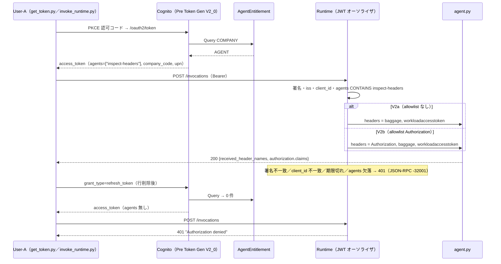

# 検証ログ V2：エージェント認可マスタ → `agents` クレーム → Runtime 入口認証 v1.0

対象：計画書 `計画_追加要件_v1_0.md` 要件 2（§2）・要件 3 の Runtime 部分（§3-3）、仮決め #13〜#16。V2-1（identity 側）→ V2a（Runtime、`Authorization` 転送なし）→ V2b（転送あり）→ 壊す実験の順。

## V2 合格条件チェックリスト
| # | 条件 | 状態 | 出典 |
|---|---|---|---|
| 1 | `AgentEntitlement` テーブル＋シードが存在し、Pre Token Gen は `dynamodb:Query` の 1 アクションだけで引ける | **完了** | V2-1 |
| 2 | 両トークンに `agents` 配列が注入され、部門制限（`departments`）で行が除外される | **完了** | V2-1 |
| 3 | `AuthChainRuntimeStack` が Cognito JWT＋`customClaims: agents CONTAINS inspect-headers` で入口認証する | **完了**（200／`agents` 欠落で 401） | V2a／V2b |
| 4 | V2a（allowlist なし）で `Authorization` がエージェントに届かず、V2b（`['Authorization']`）で届く | **完了** | V2a→V2b |
| 5 | 壊す実験：改ざん／ID トークン（`client_id` なし）／fail-closed トークン／マスタ行削除 → Runtime の HTTP コード（401 か 403 か。計画 §6-2）を記録 | **完了**（すべて 401） | V2b 後 |
| 6 | 検証ログ・仮決め #13/#15・コスト表・シーケンス図の更新 | **完了**（2026-09-06） | 完了時 |
| 7 | **MMDSv2**：CFN で作った Runtime が `requireMMDSV2` 未設定のまま呼べるか（予想：`ValidationException`）→ `update-agent-runtime` で有効化して再実測 | **完了**（予想外れ：サービス既定が `true`、更新不要） | V2a |

---

## V2-1：identity 側（AgentEntitlement＋`agents`／`upn` 注入）（2026-08-30）

### 目的
Runtime を出す前に「エンタイトルメント → トークン」の半分を単独で成立させる（一度に 1 変更）。Runtime 側の `customClaims` 一致値と同じ定数 `AGENT_KEY = 'inspect-headers'` を `bin/authchain.ts` で 1 か所定義し、identity（シード行の sk）と Runtime（customClaims）の両方に渡す。

### CDK 差分（コード）
- `cdk/lib/identity-stack.ts`：`AgentEntitlement`（TableV2、pk `pk`／sk `sk`、オンデマンド、DESTROY。本番向けの PITR／削除保護／RETAIN はコメント）＋シード 2 行（`AwsCustomResource`、既存と同方式。`departments` は DynamoDB の String Set `{"SS": [...]}`）＋ `entitlementTable.grant(preTokenGenFn, 'dynamodb:Query')`（**1 アクションのみ**）＋ Lambda 環境変数 `ENTITLEMENT_TABLE_NAME` ＋ 出力 `EntitlementTableName`。props に `agentKey` を追加
- `cdk/bin/authchain.ts`：`AGENT_KEY` を identity より前に定義して両スタックへ
- `lambda/pre_token_gen/handler.py`：`resolve_agents(company_code, department_code)`（Query → `departments` 無し＝全部門許可／有り＝含まれるときだけ → ソート済み配列。`company_code` 無し・0 件は `agents` 自体を注入しない＝fail-closed の連鎖）。加えて `preferred_username` があれば `upn` として両トークンに注入（標準属性は ID トークンにしか出ないため。値はログに出さず `upnInjected` の真偽のみ）
- 型の注意：`dynamodb.AttributeValue` は aws-cdk-lib に無い（tsc で停止）。シード配列は素の `Record<string, unknown>[]`

### 予想（Claude が代行）→ 実測
| # | 予想 | 実測 |
|---|---|---|
| diff | 新規 4（テーブル／シード CR／CR 用 IAM Policy／LogGroup）、IAM 変更 2 文（Lambda ロールに `dynamodb:Query`、CR ロールに `BatchWriteItem`）、Lambda 更新（コード＋環境変数）、出力 1。UserPool・IdP・クライアント・正規化マップは不変 | **一致**。deploy 58 秒（テーブル＋LogGroup → IAM → シード CR＋Lambda 更新）。`query COMPANY#TESTCO` = 2 行、`COMPANY#OTHERCO` = 0 件 |
| (a) | User-A の両トークンに `agents: ["inspect-headers"]`（`admin-only` は SALES1 ≠ ADMIN1 で除外）、`upn` がアクセストークンにも載る | **一致**（17:36）。access／id とも `agents=["inspect-headers"]`、`upn=<user>@<tenant>.onmicrosoft.com`。`company_code`／`department_code`／`cognito:groups` は不変 |
| (b) | Lambda ログに `[dept-filter] AGENT#admin-only … 除外` と `agents` 入りの `injectedClaims` | **一致**：`[dept-filter] AGENT#admin-only は departments=['ADMIN1'] に SALES1 が無いため除外` → `{"injectedClaims": {"company_code": "TESTCO", "department_code": "SALES1", "agents": ["inspect-headers"]}, "upnInjected": true}`（391 ms） |
| (c) | `local-user-a` は同じ生値なので `agents` は同じ、`preferred_username` が無いので `upn` は非注入、`cognito:groups` 無し | **一致**（17:43）。`userAttributeKeys` は 4 つ（`cognito:user_status`／`custom:company_raw`／`custom:department_raw`／`sub`）、`upnInjected: false`、`triggerSource=TokenGeneration_HostedAuth`（ローカルでも hosted UI 経由なら同じ） |
| (d) | 既存クレーム・標準属性・ユーザー数は不変 | **一致**：プール 2 名、ID トークンの `preferred_username`／`name` 健在、`email` なし |

### 出力（現物）：アクセストークン（User-A、`decode_jwt.py --mask` 相当の抜粋）
```
token_use=access, client_id=<ClientId>, username="EntraOIDC_…", scope="openid profile email",
cognito:groups=["<PoolId>_EntraOIDC"], company_code=TESTCO, department_code=SALES1,
agents=["inspect-headers"], upn="<user>@<tenant>.onmicrosoft.com"
```
local-user-a：`username="local-user-a"`、`agents=["inspect-headers"]`、`company_code`／`department_code` 同じ、`upn`／`cognito:groups` なし。

### 追加観測：hosted UI のセッション Cookie による無言の再サインイン
`local-user-a` の対照ログインで、`identity_provider` 無しの `/oauth2/authorize` を**直前に Entra でログインした通常ウィンドウ**で開いたところ、**フォームが出ずに EntraOIDC ユーザーとして callback まで進み**、トークン（`username=EntraOIDC_…`、`upn` あり）が発行された（`out/tokens_userA-oidc_session-reuse_v2.json` に退避）。V1'-c の「Continue with EntraOIDC」画面すら出ない場合がある（Cognito 側セッションの有効期間内は無言で再利用）。対処はシークレットウィンドウ、または `/logout?client_id=…&logout_uri=…`（クライアントの `logoutUrls` と一致が必要）で Cognito 側セッションを切る。**Entra 側のセッションとは別物**。

### 実測と解釈
- **［実測］エンタイトルメントは「注入するかしないか」で表現される**：許可がある会社は `agents` 配列、無い会社（OTHERCO）は配列自体が無い。Runtime の `customClaims` は「クレーム欠落」も不一致として扱う（はず。V2a で実測）ので、fail-closed が Cognito → Runtime へ連鎖する
- **［実測］部門制限は Lambda 側のフィルタ**：DynamoDB の Query は会社単位で、部門は `departments`（String Set）を Python の `set` として受け取り `in` で判定。ログに除外理由が残る
- **［実測］`upn` の注入で「人が読める識別子」がアクセストークンに載った**：`preferred_username`（Entra の UPN、可変）を Lambda が写す。Cedar で `principal.getTag("upn")` として参照できる余地（V4）。ローカルユーザーには無い＝IdP 由来の属性に依存する注入は「無ければ入れない」で統一
- **［実測］CDK の型**：`dynamodb.AttributeValue` は存在しない。DynamoDB JSON は素のオブジェクトで書く

### 出力（現物）：`cdk diff` の IAM 表（2026-08-30）
```
│ + │ ${AgentEntitlement.Arn} │ Allow │ dynamodb:Query          │ AWS:${PreTokenGenFn/ServiceRole}       │
│ + │ ${AgentEntitlement.Arn} │ Allow │ dynamodb:BatchWriteItem │ AWS:${AWS679f53fac…/ServiceRole}（シード CR） │
```

---

## V2a／V2b：Runtime デプロイ・`Authorization` 転送・壊す実験（2026-09-06）

### 目的
V2-1 で作ったトークン（`agents: ["inspect-headers"]`）を Runtime の JWT オーソライザ（`customClaims: agents CONTAINS inspect-headers`）に通し、(a) 入口認証が通る／落ちる条件と HTTP コード、(b) `requestHeaderAllowlist` の有無で `Authorization` がエージェントに届くか、(c) MMDSv2 の既定値、を実測する。差分は「V2a → V2b で `RequestHeaderConfiguration` の 1 点」に絞る（一度に 1 変更）。

### V2a：`cdk diff`／deploy（予想 → 実測）
| # | 予想 | 実測 |
|---|---|---|
| diff | Identity 変更なし（弱参照 `Fn::GetStackOutput` の出力は deploy 済み）。Runtime 側は Role／Policy／Runtime の新規 3、出力 4。trust に `aws:SourceAccount`＋`aws:SourceArn ArnLike …:runtime/authchain_inspect_headers*`、権限は logs 3 文・xray・metrics（namespace 条件）・`GetWorkloadAccessToken*` 3 アクション・CDK アセット S3 | **一致**。`cdk diff` は既定で読み取り専用チェンジセットを作る方式（テンプレートをアセットバケットへ発行するだけ） |
| deploy | Role → Policy → Runtime | **一致**。Runtime 作成 20 秒、スタック 63 秒。CloudTrail に CFN 起点の `CreateWorkloadIdentity` → `CreateAgentRuntime`（Workload Identity が先に作られる） |
| **MMDSv2 既定値**（チェックリスト #7、計画 §6-8） | CFN に項目が無く未設定 → 最初の invoke が `ValidationException` | **外れ（良い方向）**。`get-agent-runtime` で deploy 直後から `metadataConfiguration: {"requireMMDSV2": true}`。CFN スキーマ（2026-09-06 `describe-type` で再確認、`MetadataConfiguration` 無し）が未対応でも**サービス既定が true**。`update-agent-runtime` は不要 |
| ログ群 | 初回 invoke 時に自動生成 | **deploy 時点で生成**。`/aws/bedrock-agentcore/runtimes/<id>-DEFAULT`（保持期間 無期限）。ストリームは `runtime-logs-<sessionId>`（セッション単位）／`otel-rt-logs`／`spans`（後 2 つは ADOT 未導入のため空） |
| その他 | ― | `lifecycleConfiguration` 既定：idle 900 秒／最大 28,800 秒。`agentRuntimeVersion: "1"` |

### V2a：invoke（`Authorization` 転送なし）
| 予想 | 実測 |
|---|---|
| 200、`received_header_names` に `Authorization` が無い | **一致**（3.7 秒）。`received_header_names = ["baggage", "workloadaccesstoken"]`。`baggage` は W3C Baggage（トレース伝播）、`workloadaccesstoken` は Runtime が付与する Workload Identity のトークン（エージェントが AgentCore Identity のアウトバウンド認証に使う入口。本検証では未使用） |

Runtime のログには `Invocation completed successfully (0.001s)`（`bedrock_agentcore.app`、requestId／sessionId 付き）の 1 行だけ。エージェントの標準出力は出していないので、観測はすべて HTTP 応答側で行う。

### V2b：`-c forwardAuth=true`（予想 → 実測）
| # | 予想 | 実測 |
|---|---|---|
| diff | `RequestHeaderConfiguration: {"RequestHeaderAllowlist": ["Authorization"]}` の追加と出力 `ForwardAuthorizationHeader` の 1 点ずつ | **一致** |
| deploy | in-place 更新（`createOnlyProperties` は `AgentRuntimeName` のみ）、Runtime ID 不変、`agentRuntimeVersion` が 2 に | **一致**。27 秒、`version: "2"`、`requestHeaderAllowlist: ["Authorization"]` |
| invoke | 200、`received_header_names` に `Authorization`、`agent_key_in_agents: true`、`agents`／`company_code`／`department_code` が見える | **一致**。`["Authorization", "baggage", "workloadaccesstoken"]`。`upn` は `other_claim_names` に落ちた（`agent.py` の表示対象に無かった。V3 の build で `SHOW_CLAIMS` に追加） |

### 壊す実験（チェックリスト #5、計画 §6-2）。すべて **HTTP 401**、403 は出ない
| 実験 | 予想 | 実測（`x-amzn-ErrorType: UnrecognizedClientException`、本文は JSON-RPC） |
|---|---|---|
| `--tamper`（末尾 1 文字を書き換える旧実装） | 401 | **200 で通った**。原因は改ざん方法：RS256 の署名 256 バイトは base64url で 342 文字になり、末尾の文字は上位 2 ビットしか署名に寄与しない（残りは捨てられるパディング）。`A`(000000)→`B`(000001) はデコード後のバイト列が同一で、Runtime は正しく「有効な署名」と判定した（base64 の可鍛性）。`tamper()` を「署名バイトの先頭 1 ビット反転→再エンコード」に修正 |
| `--tamper`（修正版：1 ビット反転） | 401 | **401** `{"jsonrpc":"2.0","error":{"code":-32001,"message":"Invalid Signature for bearerToken"}}` |
| `--use id`（ID トークン。`client_id` 無し・`aud` あり） | 401（`allowedClients` 照合不能） | **401** `"Claim 'client_id' value mismatch with configuration."` |
| `tokens_userA_v1c_failclosed.json`（期限切れ＋`company_code`／`agents` 無し） | 401（期限切れが先） | **401** `"Token has expired"`。期限が先に評価され、クレーム欠落までは見られない |
| **`agents` 欠落の正規トークン**（`AgentEntitlement` の `COMPANY#TESTCO / AGENT#inspect-headers` を退避→削除→**refresh_token グラント**で再発行） | 401、本文に `agents` のクレーム名 | **401** `"Authorization denied"`。**クレーム名を伏せた汎用文言**（`client_id` 不一致とは別扱い＝customClaims の不一致は情報を漏らさない）。refresh 応答のトークンは `agents` 無し・`company_code`／`upn` あり |
| 復元（`put-item` で退避行を戻す → 再 refresh） | `agents` 復活、200 | **一致**。`agents: ["inspect-headers"]`、200、`agent_key_in_agents: true` |

すべての 401 に `WWW-Authenticate: Bearer resource_metadata="…/invocations/.well-known/oauth-protected-resource?qualifier=DEFAULT"` が付く。この URL は認証なしで取れ（RFC 9728 保護リソースメタデータ）、`authorization_servers` に Cognito プールの issuer、`resource` に invocations URL が載る。MCP クライアントが「どこでトークンを取ればよいか」を自動発見する経路で、Runtime は MCP 流儀の保護リソースとして振る舞う（エラー本文が JSON-RPC `-32001` なのも同じ理由）。

### 副産物：refresh_token でも Pre Token Gen が走り `agents` が再計算される（計画 §6-4）
Lambda ログ：`triggerSource: "TokenGeneration_RefreshTokens"`（フェデレーションユーザーでも同じ V2_0 イベント）→ `[dept-filter] AGENT#admin-only … 除外` → `[fail-closed] COMPANY#TESTCO のエンタイトルメントが 0 件のため agents を注入しません` → `injectedClaims: {company_code, department_code}`（`agents` 無し）。**マスタの変更は次の refresh（最長 60 分）で効く**＝仮決め #15「失効はトークン寿命単位」の実測。Cognito の refresh 応答には `refresh_token` が含まれない（ローテーション無し。元の refresh_token を使い続ける）。

### Observability の現状（計画 §5-(b) 対応）
- Runtime のログ群は自動。`spans`／`otel-rt-logs` ストリームは ADOT 未導入で空。Transaction Search は未有効化（V3 で Gateway のログと合わせて要否判断）
- CloudTrail：証跡 `Main-Trail` は**管理イベントのみ**（データイベント未設定）。`CreateAgentRuntime`／`UpdateAgentRuntime`／`GetAgentRuntime` は履歴に出るが、データプレーンの **`InvokeAgentRuntime` は出ない**。誰がいつ invoke したかを証跡に残すにはデータイベント（課金）を有効化する必要がある（本番案。［推定］AgentCore のデータイベント対応要確認）

### 完了サマリ（V2 の実測シーケンス）


### 実測と解釈
- **［実測］fail-closed が Cognito → Runtime へ連鎖した**：マスタに行が無い → `agents` 非注入 → Runtime は customClaims の欠落を 401 で拒否。エージェントのコードにも IAM にも依存しない（仮決め #15）
- **［実測］Runtime 入口の拒否はすべて 401**。403 は出ない。文言は「署名」「client_id」「期限切れ」は具体的、customClaims だけ「Authorization denied」と汎用。設計上、エンタイトルメントの有無を外部に漏らさない挙動として妥当
- **［実測］`Authorization` の転送は allowlist の 1 点で決まる**。転送されない場合でもエージェントは `workloadaccesstoken` で自分の Workload Identity を持つ（アウトバウンド用。同じ Bearer を透過する仮決め #16 とは別経路）
- **［実測］MMDSv2 はサービス既定で有効**。CFN 未対応でも運用手順は不要。ただし CDK で明示できないため「既定に依存」している状態（整理 §5-(b) に記録）
- **［実測］改ざん実験は「改ざんになっているか」を先に確かめる**。base64url の末尾文字の書き換えは無効な改ざん。修正版はバイト列の差を assert してから送る
- **［実測］refresh でもトリガーが走る**ので、マスタ変更の反映遅延は最長 60 分（アクセストークン寿命）。即時失効が要件なら実行時照会（計画 §2-3 B 案）を併用
- **［汎用］ベストプラクティスとの差**：`GetWorkloadAccessTokenForUserId` の Deny、CloudTrail データイベント、Transaction Search、ログ保持期間の設定は未実施（本番案。整理 §5-(b)）

---

## 変更履歴
- v1.0（2026-08-30）起票。V2-1（AgentEntitlement＋`agents`／`upn` 注入）の予想 (a)〜(d) 全一致、セッション Cookie の再サインインを記録。V2a 以降は次回
- v1.0 追記（2026-08-30）チェックリストに MMDSv2（V2a の予想）を追加
- v1.0 追記（2026-09-06）V2a／V2b／壊す実験を追記。MMDSv2 の予想外れ（既定 true）、全拒否 401、base64 可鍛性による改ざん実験の修正、refresh 時の `agents` 再計算、RFC 9728 メタデータ、Observability の現状、完了サマリ（シーケンス図）
