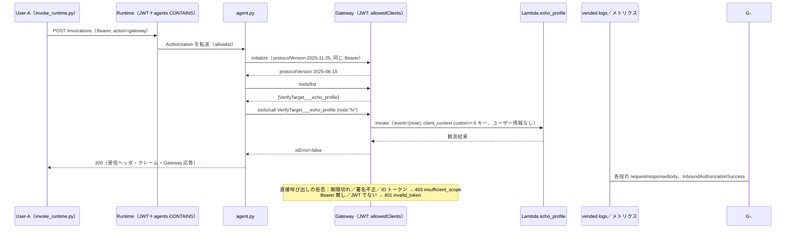

# 検証ログ V3：Runtime → Gateway への同一 Bearer 透過と Lambda ターゲット v1.0

対象：計画書 `計画_追加要件_v1_0.md` 要件 3 の Gateway 部分（§3-4、Policy は未接続）、§5 V3 行、§6-6。仮決め #6／#16。V3 設計 → Gateway スタック deploy → Runtime 更新（`GATEWAY_URL`・`upn` 表示）→ 透過の実測 → 壊す実験 → Observability の順。

## V3 合格条件チェックリスト
| # | 条件 | 状態 | 出典 |
|---|---|---|---|
| 1 | `AuthChainGatewayStack`（Gateway JWT `usingCognito`＋`allowedClients`、Lambda ターゲット `VerifyTarget`）が deploy され READY | **完了** | V3-1 |
| 2 | エージェントが受け取った `Authorization` を**そのまま**付けて Gateway の `tools/list`／`tools/call` が成功する（仮決め #16） | **完了**（HTTP 200、`isError=false`） | V3-2 |
| 3 | `tools/list` でツール名の実物を確認（`<Target>___<tool>`、仮決め #6） | **完了**（`VerifyTarget___echo_profile` の 1 件のみ） | V3-2 |
| 4 | Lambda ターゲットに渡るユーザー情報（計画 §6-6） | **確定：渡らない**（`client_context.custom` は公式の 6 キーのみ） | V3-2 |
| 5 | 壊す実験：期限切れトークンで Gateway の HTTP コードと文言 | **完了（予想外れ：401 ではなく 403 `insufficient_scope`）** | V3-3 |
| 6 | Gateway の vended logs／traces（Observability）を CDK で有効化し、何が見えるか記録 | **完了**（logs は全量、traces は W3C `traceparent` 付きの呼び出しのみ） | V3-4 |
| 7 | 検証ログ・仮決め #6/#16・コスト表・`整理_システム全体像`・再開プロンプトの更新 | **完了**（2026-10-04） | 完了時 |

---

## V3-1：設計と deploy（2026-10-04）

### 設計判断（分類つき）
| 項目 | 決定 | 分類 | 理由 |
|---|---|---|---|
| インバウンド認証 | `GatewayAuthorizer.usingCognito({ userPool, allowedClients: [PKCE クライアント] })`。customClaims は付けない | 汎用（一致） | Runtime と同じ信頼元・同じクライアント＝透過トークンをそのまま受ける。粗い検証（`agents`）は Runtime 入口、細かい認可は V4 の Cedar（二層を見せる） |
| 実行ロール | **自前のロール**（trust は `aws:SourceAccount`＋`aws:SourceArn=…:gateway/authchain-gateway*` の条件付き 1 文のみ） | 汎用（ベストプラクティスに寄せた逸脱） | L2 既定のロールは「条件なしの Allow」＋「条件付きの Allow」の 2 文で、Allow は OR 評価のため confused deputy 対策が実質無効（兄弟 `agentcore-gateway` の合成結果で確認）。2026-10-04 ユーザー承認 |
| プロトコル | `McpProtocolConfiguration({ supportedVersions: [2025-06-18, 2025-03-26] })`、**検索なし** | 汎用 | L2 既定は `SearchType: SEMANTIC`＋`2025-03-26`。検索を有効にすると `tools/list` に `x_amz_bedrock_agentcore_search` が混ざり、V4 の「`tools/list` は呼べるツールだけ」の観測が濁る |
| `exceptionLevel` | `DEBUG` | ［簡略化］ | 壊す実験で文言を見るため。本番は既定（サニタイズ） |
| Observability | vended logs（APPLICATION_LOGS → CWL、`/aws/vendedlogs/bedrock-agentcore/gateway/APPLICATION_LOGS/<gatewayId>`、1 週間保持）＋ traces（TRACES → XRAY） | 汎用（一致） | 公式：Gateway はログ配信先を**自動作成しない**（Runtime と違う）。traces も TRACES 配信が要る。L2 に設定項目が無いため、Runtime 用に公開されている `configureLoggingDelivery`／`configureTracingDelivery`（送信元 ARN を取る汎用関数）を Gateway ARN で使用 |
| ツール | Lambda `echo_profile`（Python 3.13）。`event` と `client_context` を丸ごとログと応答に返す（JWT らしき値はマスク） | 要件固有（観測用） | 計画 §6-6 の確定 |
| Runtime との結線 | 従来どおり `-c gatewayUrl=<出力>`（コンテキスト） | — | スタック間を疎結合に保つ。**`-c forwardAuth=true` も毎回付ける**（外すと V2a に戻る） |

### CDK 差分（コード）
- `cdk/lib/gateway-stack.ts`（新規）：上表のとおり。出力 `GatewayUrl`／`GatewayId`／`GatewayArn`／`EchoFunctionName`／`GatewayLogGroupName`
- `lambda/echo_profile/handler.py`（新規）
- `cdk/bin/authchain.ts`：`AuthChainGatewayStack` を Identity の後・Runtime の前に追加

### 予想（Claude が代行）→ 実測：`cdk diff AuthChainGatewayStack AuthChainIdentityStack`
| 予想 | 実測 |
|---|---|
| Identity は差分なし（Runtime と同じ `PublishOutputRef…` 出力 2 本を `Fn::GetStackOutput` で再利用） | **一致**（"There were no differences"） |
| 新規：Lambda＋ロール＋LogGroup、Gateway ロール（条件付き 1 文）＋DefaultPolicy（`lambda:InvokeFunction` を `fnArn`／`fnArn:*`）、Gateway、GatewayTarget、vended logs 用 LogGroup、Delivery 系 6 | **一致**。加えてヘルパーが作る **`AWS::Logs::ResourcePolicy`**（`delivery.logs` → このロググループのストリームに CreateLogStream／PutLogEvents）と **`AWS::XRay::ResourcePolicy`**（`delivery.logs` → `xray:PutTraceSegments`、`logs:LogGeneratingResourceArns` = この Gateway ARN の条件付き）。どちらもアカウント単位の枠を 1 つずつ消費（Logs は 2/10、X-Ray は 1 つ目）、スタック削除で消える |
| Gateway：CUSTOM_JWT／DEBUG／MCP 2 版／検索なし | **一致**（`SupportedVersions: ["2025-06-18","2025-03-26"]`、`SearchType` なし） |

deploy：**64 秒**（18 リソース）。`get-gateway` → `READY`、`policyEngineConfiguration: null`、ターゲット `VerifyTarget` → `READY`、`describe-deliveries` で CWL／XRAY の 2 本。配信サービスが X-Ray に `AWSLogDeliveryWrite20150319` ポリシーを**自動追加**していた（CDK 管理外。撤収時の消し忘れ候補）。

### 予想 → 実測：`cdk diff AuthChainRuntimeStack -c forwardAuth=true -c gatewayUrl=<URL>`
`runtime-code/build.sh` を再実行（65 MB、`build/agent.py` に `upn` を反映）してから diff。
| 予想 | 実測 |
|---|---|
| コードの S3 キー（zip ハッシュ）と環境変数 `GATEWAY_URL` の追加の 2 点のみ、IAM 変更なし、in-place（version 3、ID 不変） | **一致**。deploy 27 秒、`agentRuntimeVersion` 3、`requestHeaderAllowlist: ["Authorization"]` 維持、環境変数 `AGENT_KEY`／`GATEWAY_URL` |

---

## V3-2：同一 Bearer の透過（2026-10-04）
トークン：9/6 の refresh_token で refresh グラント（28 日目でも有効。ブラウザ不要）→ `out/tokens_userA-oidc_v3.json`（`agents=["inspect-headers"]`、60 分）。
```bash
python3 scripts/invoke_runtime.py --token-file out/tokens_userA-oidc_v3.json \
  --action gateway --tool VerifyTarget___echo_profile --args '{"note":"hi"}' --save out/runtime_v3_userA.json
```

### 予想（Claude が代行）→ 実測
| # | 予想 | 実測 |
|---|---|---|
| (a) | Runtime 200。MCP 交渉は `protocol_version = "2025-06-18"`（クライアント mcp 1.29.1 は 2025-11-25 を提示 → Gateway が自分の最新を返す） | **一致**。HTTP 200（4.0 s）。vended logs で `initialize` の `protocolVersion=2025-11-25` → 応答 `2025-06-18`、`serverInfo.name=authchain-gateway` |
| (b) | `tools` は `["VerifyTarget___echo_profile"]` の 1 件のみ（検索ツールなし） | **一致**（アンダースコア 3 本の実物。仮決め #6 確定） |
| (c) | `call.isError=false`。Lambda の `client_context.custom` は公式の 6 キーだけで、`sub`／クレーム／トークンは無い | **一致**（下記の現物）。`client_context.env`／`client` も空 |
| (d) | エージェントが受け取った `Authorization` の `upn` が表示される（`build/` 再生成の効果） | **一致**：`claims.upn = <user>@<tenant>.onmicrosoft.com` |

### 出力（現物、マスク済み）：Lambda の応答（Gateway 経由でエージェントに返った `content[0]`）
```json
{"tool_name_received": "VerifyTarget___echo_profile", "tool_name_stripped": "echo_profile",
 "event": {"note": "hi"},
 "client_context_custom": {"bedrockAgentCoreTargetId": "<targetId>", "bedrockAgentCoreGatewayId": "authchain-gateway-<id>",
   "bedrockAgentCoreMessageVersion": "1.0", "bedrockAgentCoreMcpMessageId": "2",
   "bedrockAgentCoreAwsRequestId": "<uuid>", "bedrockAgentCoreToolName": "VerifyTarget___echo_profile"},
 "client_context_env": null, "client_context_client": null}
```

### 実測と解釈
- **［実測］同一 Bearer の透過が成立した**（仮決め #16）：Runtime 入口（署名・iss・`client_id`・`agents` CONTAINS）を通ったトークンを、エージェントが `streamablehttp_client(url, headers={"Authorization": …})` でそのまま付け、Gateway の JWT オーソライザ（同じプール・同じクライアント）も通った。Runtime → Gateway の間で IAM は使っていない
- **［実測］Lambda ターゲットにはユーザーが誰かが届かない**（計画 §6-6 確定）：届くのは Gateway／ターゲット／リクエスト ID とツール名だけ。**ユーザー単位の判断は Gateway 側（V4 の Cedar）でしかできない**。ツール実装側でユーザーを知りたい場合は、Gateway の interceptor（L2 `interceptorConfigurations`）でヘッダ／クレームを渡す設計が要る［推定。未実測。余力枠］
- **［実測］Gateway は MCP セッションを要求しない**：`initialize` 無しの `tools/list` 単発でも 200（V3-4 の traceparent 実験）

---

## V3-3：壊す実験（Gateway を手元から直接呼ぶ）（2026-10-04）
期限切れトークンを Runtime 経由で送ると **Runtime が先に 401 で止める**ため、Gateway の拒否は直接呼んで観測した（`POST <GatewayUrl>`、本文は JSON-RPC `initialize`、`Accept: application/json, text/event-stream`。使い捨てスクリプトで実施。V4 で再利用するなら `scripts/` に昇格する）。

予想（Claude が代行）：期限切れ → **401**、`WWW-Authenticate: Bearer … resource_metadata=…`、JSON-RPC `-32001`、文言は Runtime と同じ系統の "Token has expired"（DEBUG なので具体的）。

| # | 送ったもの | HTTP | `WWW-Authenticate` の `error` | JSON-RPC | 文言 |
|---|---|---|---|---|---|
| 1 | 期限切れアクセストークン（9/6 発行） | **403** | `insufficient_scope` | `-32002` | "insufficient_scope - The request requires higher privileges than provided by the access token." |
| 2 | 有効トークンの署名バイトを 1 ビット反転 | **403** | `insufficient_scope` | `-32002` | 同上 |
| 3 | ID トークン（`client_id` 無し、`aud` あり） | **403** | `insufficient_scope` | `-32002` | 同上 |
| 4 | JWT でない文字列（`not-a-jwt`） | **401** | `invalid_token` | `-32001` | "Invalid Bearer token" |
| 5 | `Authorization` 無し | **401** | `invalid_token` | `-32001` | "Missing Bearer token" |
| 対照 | 有効なアクセストークン | 200 | — | — | `initialize` 成功 |
- 全件で `WWW-Authenticate` に `resource_metadata="https://<gatewayId>.gateway.bedrock-agentcore.ap-northeast-1.amazonaws.com/.well-known/oauth-protected-resource"`（RFC 9728。Runtime と同じ作法）

### 実測と解釈
- **［実測・予想外れ］Gateway は「JWT の形をしているが検証に通らない」トークンを一律 403 `insufficient_scope` で返す**。期限切れ／署名不正／`client_id` 不一致を区別しない汎用文言で、`exceptionLevel: DEBUG` でも変わらない。401 になるのは「Bearer が無い／JWT として読めない」場合だけ
- **［実測］Runtime との違い**：Runtime は 5 種すべて 401 で、署名・`client_id`・期限は具体的な文言（customClaims だけ汎用）。**同じ JWT オーソライザ設定型でも、拒否の HTTP コードと文言は Runtime と Gateway で異なる**。クライアント（エージェント）が「401 なら再取得」と実装すると、Gateway の期限切れ（403）を取りこぼす → エージェントは **401／403 の両方を「トークン再取得を促す」扱い**にする必要がある（計画 §3-5 のトークン寿命の注意を更新）
- **［実測］拒否理由はログにも出ない**：vended logs には `severityText=ERROR`、`body.log` に応答と同じ文言だけ（"insufficient_scope - …"／"Invalid Bearer token"／"Missing Bearer token"）。理由の手がかりはメトリクスにだけある（V3-4）
- 公式［A-4］の「JWT 不正 401／スコープ不足 403」という記述とは食い違う（不正 JWT も 403）。`allowedScopes` は未設定なので、文字どおりの「スコープ不足」ではない［推定：検証失敗をまとめて 403 に寄せている］

---

## V3-4：Observability（2026-10-04）
| 面 | 見えたもの | 見えないもの |
|---|---|---|
| **vended logs**（`/aws/vendedlogs/…/APPLICATION_LOGS/<gatewayId>`） | MCP の全リクエストについて "Started processing request" → "Received request for <method> method" → （`tools/call` は "Executing tool VerifyTarget___echo_profile from target <targetId>"）→ "Successfully processed request"。**`requestBody`／`responseBody` に本文全量**（`tools/call` の引数、Lambda の戻り値、`tools/list` のスキーマ）。認証失敗は ERROR 1 行。`trace_id`／`span_id`、`resource.attributes.service.name=<gatewayId>` | **ユーザー情報**（`sub`／クレーム）は attributes にも無い（`aws.request.id`／`aws.account.id`／`aws.resource.type` のみ）。拒否理由の詳細 |
| **メトリクス**（`AWS/Bedrock-AgentCore`） | `Invocations`／`Latency`／`Duration`／`TargetExecutionTime`／`TargetType.LAMBDA`／`UserErrors`（`Method`／`Name` 次元つき）／`SystemErrors`／`Throttles`。**公式一覧に無い `InboundAuthorizationSuccess`／`InboundAuthorizationFailure`**（`ExceptionType` 次元 = `UnauthorizedInboundTokenException`〈403 の系統〉／`InvalidInboundTokenException`〈401 の系統〉） | 期限切れと署名不正の区別（どちらも Unauthorized の系統） |
| **traces**（`aws/spans`、Transaction Search はアカウントで有効・インデックス 100%） | **W3C `traceparent`（sampled フラグ 01）付きで直接呼んだ 1 件だけ**、スパン `AgentCore.Gateway.ListTools`（kind SERVER、`traceId` が送った値と一致、`url.path=tools/list`、`gateway.name`、`latency_ms` 等） | エージェント経由の呼び出し（トレースヘッダ無し）と、`X-Amzn-Trace-Id: Root=…;Sampled=1` 付きの直接呼び出しはスパンが出なかった（数分〜十数分待って 0 件）。X-Ray の `get-trace-summaries` も 0 件 |

### 実測と解釈
- **［実測］Gateway のスパンは呼び出し元のサンプリング判定（W3C `traceparent`）に従って出る**。TRACES 配信を設定しただけでは、トレース文脈を持たない呼び出しのスパンは出ない。本検証のエージェントは ADOT 無しの最小構成なので、Runtime → Gateway の呼び出しには `traceparent` が付かない
- **V4 への影響**：計画 §3-4／§8-4 は Policy の判定を `aws/spans` の `aws.agentcore.policy.*` 属性で観測する前提だった。**エージェントが `traceparent`（sampled）を付けて Gateway を呼ぶ**（最小なら agent.py で生成して `headers` に追加、本格的には ADOT 計装）か、Policy のメトリクス（`AllowDecisions`／`DenyDecisions` 等）と vended logs の応答本文で観測する。どちらにするかは V4 設計時に判断
- ［推定］`X-Amzn-Trace-Id` が効かなかったのは、Gateway が W3C 形式だけを入力文脈として読むため。1 回の観測なので断定しない
- 兄弟の `ObservabilityStack` が 2026-08-01 に作った `aws/spans` は今回まで **0 バイト**だった（Transaction Search を有効にしても、計装もトレース文脈も無ければ何も入らない）

---

### 完了サマリ（V3 の実測シーケンス）


### 本番に向けた含意（`整理_システム全体像` §5-(b)／§7 に反映）
- Gateway の実行ロールは **L2 既定を使わず条件付き trust の自前ロール**を渡す（L2 の既定は confused deputy 対策が実質無効）
- Gateway の vended logs は**本文全量**（ツール引数・戻り値）を記録する。PII／機密を扱うツールではログの保持期間・KMS・閲覧権限を設計する
- エージェントは Gateway の 401／403 をどちらも「トークンの再取得を促す」扱いにする
- トレースを繋ぐにはエージェントの計装（ADOT）か、少なくとも `traceparent` の伝搬が要る

---

## 変更履歴
- v1.0（2026-10-04）起票。V3-1（設計・Gateway スタック deploy 64 秒・Runtime version 3）、V3-2（透過成功、ツール名 `___` 実物、Lambda にユーザー情報は届かない）、V3-3（壊す実験：検証失敗は一律 403 `insufficient_scope`、予想外れ）、V3-4（vended logs は本文全量、traces は `traceparent` 付きのみ、公式一覧外の `InboundAuthorization*` メトリクス）、完了サマリ
