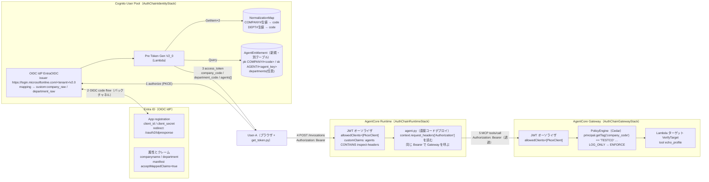
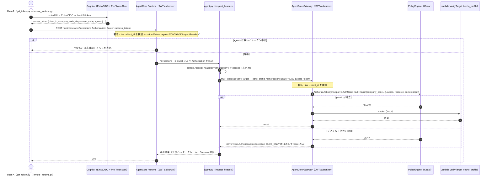

# 計画：追加要件（Entra OIDC 化／エージェント認可マスタ／Runtime カスタムクレーム認証 → Gateway Policy 透過） v1.0

作成日：2026-08-23（Claude 作成、**ユーザー承認待ち**）。対象：`CDK/agentcore-authchain/`（V1 完了時点＝コミット 056a3f2 + シーケンス図追記）。
本計画はプロンプト「AgentCore認証チェーン検証実装 v1.1」の V2〜V4 を、以下の追加要件 3 点で改訂するもの。**仮決め事項表からの逸脱（#2 SAML など）を含むため、§7 の承認ポイントに回答をもらってから実装に入る**（§0-1 規約 7）。

| # | 追加要件（ユーザー指示 2026-08-23） | 本計画での答え（要約） |
|---|---|---|
| 1 | Entra ID とのフェデレーションを **OIDC** に修正 | `UserPoolIdentityProviderOidc`（名前 `EntraOIDC`）へ置換。Entra 側は App registration＋「属性とクレーム」で `companyname`/`department` を ID トークンに載せ、manifest `acceptMappedClaims: true`。client secret は Secrets Manager 動的参照（§1） |
| 2 | DynamoDB に「利用可能なエージェント」の認可マスタを追加し、Runtime インバウンド認証に利用 | **別テーブル** `AgentEntitlement`（運用境界・IAM・バックアップ方針が正規化マップと異なる）。Pre Token Gen が引いて `agents` **配列クレーム**を注入し、Runtime の JWT オーソライザ `customClaims`（`agents CONTAINS <agent_key>`）で入口拒否（§2） |
| 3 | Runtime でカスタムクレームの JWT 認証を行い、以降へ認証を透過。Gateway Policy を使った透過アーキテクチャ | Runtime `customClaims` ＋ `requestHeaderAllowlist: ['Authorization']` → エージェントが**同じ Bearer を Gateway（MCP）へ透過**（公式サンプル方式）→ Gateway JWT オーソライザ → **AgentCore Policy（Cedar）が JWT クレームを tag として評価**。LOG_ONLY → ENFORCE の段階導入（§3） |

根拠はすべて公式ドキュメント／API リファレンス／CDK 実物（`node_modules`）で確認した（付録 A に URL）。確認できなかった点は **［未確認］** と明記し、§6 に実測で確定する項目として集約した。

---

## 0. 全体像



「誰が何を付け、誰が何を検証するか」の責任分担：

| 層 | 付けるもの | 検証するもの | 根拠データ |
|---|---|---|---|
| Entra ID | ID トークンの `companyname` / `department` | ユーザー認証（MFA 等） | ディレクトリのユーザー属性 |
| Cognito（IdP マッピング） | プロファイル `custom:company_raw` / `custom:department_raw` | Entra ID トークンの署名・iss・aud・exp | Entra の discovery / JWKS |
| Pre Token Gen Lambda | 両トークンに `company_code` / `department_code`（既存）＋ **`agents`（新規・配列）** | （マスタ未ヒットはクレーム非注入＝fail-closed） | NormalizationMap ＋ **AgentEntitlement** |
| AgentCore Runtime | （なし。`Authorization` をエージェントへ転送） | JWT 署名・iss・`client_id` ＋ **`agents` に自分の agent_key が含まれるか**（入口で拒否） | Cognito discovery ＋ Runtime 設定 |
| エージェント（agent.py） | Gateway 呼び出しに同じ Bearer を付与（透過） | （署名は Runtime 検証済み。クレームは表示用に decode） | — |
| AgentCore Gateway | — | JWT 署名・iss・`client_id` | Cognito discovery |
| AgentCore Policy（Cedar） | — | ツール単位・引数単位の認可（`company_code` / `department_code` / `agents` の tag） | Cedar ポリシー（デフォルト拒否） |

---

## 1. 要件 1：Entra ID フェデレーションを SAML → OIDC に変更

### 1-1 設計判断の根拠（公式事実）
- Cognito は OIDC IdP の **ID トークンと userInfo 応答の両方**を属性マッピングに使い、ID トークンを優先する［A-1］［A-2］。一方 Entra の userInfo（`https://graph.microsoft.com/oidc/userinfo`）は `sub, name, family_name, given_name, picture, email` のみで**カスタマイズ不可**［A-6］→ `companyname`/`department` は **ID トークンに載せるしかない**。
- Entra で OIDC アプリのクレームを追加するのは Enterprise applications > Single sign-on > **Attributes & Claims**（JWT の場合 ID トークンに入る）［A-7］。クレームソース `user.companyname` / `user.department` は有効で、制限クレーム集合に含まれない［A-9］。Token configuration の Optional claims には company/department は**無い**［A-10］。
- クレームを改変したアプリは **custom signing key** か manifest **`acceptMappedClaims: true`**（単一テナント限定）でないと `AADSTS50146` になる［A-8］。custom signing key は discovery に `?appid=` を付ける必要があり、Cognito は issuer から `/.well-known/openid-configuration` を組み立てるだけなので**非互換の可能性が高い**［A-8］［未確認］→ **`acceptMappedClaims: true` を採用**。
- issuer は `https://login.microsoftonline.com/<tenant GUID>/v2.0`（末尾スラッシュ不可）。`common`/`organizations` の discovery は `"issuer": ".../{tenantid}/v2.0"` というリテラルを返すため Cognito の iss 照合が成立しない［A-4］［A-5］。Entra は `client_secret_post`・RS256・`kid` を満たし Cognito の前提条件に適合［A-3］［A-5］。
- Cognito 側コールバック `https://<domain>/oauth2/idpresponse` を Entra の Web リダイレクト URI に登録（完全一致、大文字小文字区別）［A-3］［A-11］。
- CDK `UserPoolIdentityProviderOidc` の `clientSecret` は **`string` のみ**（`SecretValue` 版は未実装で Issue #34110 はクローズ）［A-12］。`SecretValue.secretsManager(...).unsafeUnwrap()` で `{{resolve:secretsmanager:...}}` 動的参照を埋め込めば、テンプレートにも `cdk.out` にも平文は残らない（CFN の動的参照は全リソースプロパティで利用可）［A-13］。ただし `DescribeIdentityProvider` は平文で返す（Cognito 内部保持は不可避）［A-14］。
- フェデレーションユーザー名は `<IdP名>_<sub>`（OIDC）／`<IdP名>_<NameID>`（SAML）。プロバイダ名も識別子も変わるため、**既存の SAML ユーザーは OIDC で別プロファイルとして新規作成**される（in-place 変換機能なし。`AdminLinkProviderForUser` は初回サインイン前のみ）［A-15］。Entra の `sub` は **pairwise**（App registration を作り直すと変わる）［A-16］。

### 1-2 CDK 差分（identity-stack.ts）
```ts
// 追加: props に entraTenantId / entraClientId / entraClientSecretName（値は out/ と context で渡し、リポジトリには置かない）
const entraOidc = new cognito.UserPoolIdentityProviderOidc(this, 'EntraOidcIdp', {
  userPool: this.userPool,
  name: 'EntraOIDC',                       // ユーザー名プレフィックス EntraOIDC_<sub>。3〜32 文字
  clientId: props.entraClientId,
  // clientSecret は string 型のみ → Secrets Manager 動的参照(デプロイ時に CFN が解決。テンプレートに平文を残さない)
  clientSecret: cdk.SecretValue.secretsManager(props.entraClientSecretName).unsafeUnwrap(),
  issuerUrl: `https://login.microsoftonline.com/${props.entraTenantId}/v2.0`,  // 末尾スラッシュ不可
  scopes: ['openid', 'profile', 'email'],  // profile: name/oid、email: email。カスタムクレームのスコープ依存は［未確認］
  attributeRequestMethod: cognito.OidcAttributeRequestMethod.GET,
  // endpoints は省略 → discovery から自動検出(authorize/token/userinfo/jwks)
  attributeMapping: {
    custom: {
      'custom:company_raw': cognito.ProviderAttribute.other(props.oidcCompanyClaim),      // 'companyname'
      'custom:department_raw': cognito.ProviderAttribute.other(props.oidcDepartmentClaim), // 'department'
    },
  },
});
// クライアント: 移行期間は SAML と OIDC を併記 → SAML 撤去時に EntraOIDC のみ
supportedIdentityProviders: [COGNITO, custom('EntraID'), custom('EntraOIDC')]
this.userPoolClient.node.addDependency(entraOidc);
new cdk.CfnOutput(this, 'OidcRedirectUri', { value: `${baseUrl}/oauth2/idpresponse` });  // Entra に登録する値
```
- 秘密の扱い：`aws secretsmanager create-secret --name authchain/entra-oidc-client-secret` を**手動**で 1 回（CDK 管理外。値をテンプレートやログに出さないため）。ローテーション時は値を更新しても CFN は再取得しないので、IdP リソースの何か（description 等）を変えて再デプロイする［A-13］。
- テナント ID／クライアント ID は GUID のため `out/entra-oidc.json`（gitignore）に保存し `-c` で渡す。docs では `<tenant>`/`<ClientId>` にマスク（公開リポジトリ方針）。
- 既存の `samlMetadataUrl` 必須チェック（bin/authchain.ts）は、SAML 撤去のタイミングで OIDC 用（`entraTenantId`/`entraClientId` 未指定なら synth 停止）に置換。

### 1-3 Entra 側手順（ランブック v2.0 の骨子。作業者＝ユーザー）
1. **App registration** を新規作成（単一テナント）。Platform = **Web**、Redirect URI = `OidcRedirectUri` の出力値。**Certificates & secrets** で client secret を発行（有効期限を記録。無期限は不可）→ 値は Secrets Manager へ（Claude Code に渡すのは secret 名だけ）。
2. 自動生成された **Enterprise application** 側で Single sign-on > **Attributes & Claims** > Add new claim：`companyname` ← `user.companyname`、`department` ← `user.department`（Namespace 空）。
3. App registration > **Manifest** で `acceptMappedClaims` を `true`（Graph 形式マニフェストでは `api.acceptMappedClaims`）。
4. Users and groups でテストユーザー 2 名を割り当て（SAML 時と同じ）。
5. Overview の **Directory (tenant) ID** と **Application (client) ID** を `out/entra-oidc.json` へ。
6. 観測の違い（重要）：OIDC の code 交換は **Cognito ↔ Entra のバックチャネル**で行われ、ブラウザには認可コードのリダイレクトしか見えない（SAML の SAMLResponse のように ID トークンの現物を DevTools で捕まえられない）。Entra が何を出したかは (a) `admin-get-user` の `custom:*_raw`、(b) 任意：同じ App registration に `https://jwt.ms` をリダイレクト URI として一時追加し implicit の ID トークンを表示して確認（検証後に削除）、で切り分ける。

### 1-4 予想 → 実測（V1' で行う核心ステップ）
| # | 予想 | 確認手段 |
|---|---|---|
| (a) | `acceptMappedClaims` 未設定のまま Attributes & Claims を追加すると hosted UI → Entra で `AADSTS50146` が出る（**壊す実験**として先にわざと観測） | ブラウザのエラー画面 |
| (b) | `acceptMappedClaims: true` 後、初回ログインで `custom:company_raw = 株式会社テスト商事` が保存される | `admin-get-user` |
| (c) | ユーザー名は `EntraOIDC_<sub>`（sub は GUID 風ではなく pairwise の不透明文字列）、自動グループ `<PoolId>_EntraOIDC`、`identities` の `providerName = EntraOIDC` | `admin-get-user`／`decode_jwt.py` |
| (d) | Pre Token Gen の `triggerSource` は SAML 時と同じ `TokenGeneration_HostedAuth`、注入結果（`company_code=TESTCO`）も同じ | CloudWatch Logs／トークン diff |
| (e) | 旧 SAML ユーザー `EntraID_<NameID>` は残り、OIDC ユーザーと**二重**になる | `list-users` |

### 1-5 撤去順序とリスク
- 順序：OIDC IdP 追加 → クライアントに併記 → OIDC ログイン実測 → **SAML IdP 削除**（CFN は別リソースの削除。`get_token.py --idp EntraOIDC`）→ 旧 SAML ユーザー 2 名＋管理者副産物ユーザーを `admin-delete-user` → Entra 側の SAML エンタープライズアプリは削除（任意）。
- リスク：テナント設定で OIDC アプリの Attributes & Claims 編集が出ない場合 → Graph の Custom Claims Policy（`PUT /servicePrincipals/{id}/claimsPolicy`, `tokenFormat: ["jwt"]`）で同等設定［A-7］。それも不可なら SAML 継続を相談。
- 任意：相関キーとして Entra `oid`（アプリ横断で不変）を `custom:idp_oid` に追加マッピングする案（カスタム属性は追加のみ可・削除不可なので、要るときだけ）。

---

## 2. 要件 2：エージェント認可マスタ（DynamoDB）

### 2-1 「同じテーブルか別テーブルか」の判断
公式ガイダンス：テーブル数は少なくが原則だが、**「運用要件が独立し、明確な運用境界が必要なエンティティにはマルチテーブルが望ましい」**［B-2］［B-3］。シングルテーブルの短所として「データ要件が全エンティティで一致している必要」「バックアップが all-or-nothing」［B-2］、マルチテーブルの短所は「テーブルごとの IAM 管理」「横断クエリ不可」［B-2］。

| 観点 | NormalizationMap（既存） | AgentEntitlement（新規） | 判定 |
|---|---|---|---|
| 読む主体 | Pre Token Gen Lambda のみ | Pre Token Gen Lambda（今回）。将来はエージェント内の再照会・管理 UI・Gateway インターセプター | 読み手が増える側を分離 |
| 所有者／更新頻度 | IdP 連携チーム・表記ゆれ追加時 | 認可（契約）管理側・契約変更時 | 運用境界が異なる |
| 一緒に引くか | ログイン時に「正規化 → エンタイトルメント」と**直列**（正規化結果がキー）。1 回の Query でまとめて取る利点がない | | シングルテーブルの利点（1 回読み）が効かない |
| バックアップ／削除保護 | 参照データ（再投入容易） | **認可根拠**（PITR・削除保護を掛けたい） | 方針が異なる |
| IAM 最小権限 | Lambda に GetItem | Lambda に Query（将来 Runtime ロールに Query）。1 テーブルなら `dynamodb:LeadingKeys` の `ForAllValues:StringLike` プレフィックス制限が必要で、`grantReadData` が付ける Scan は LeadingKeys が効かないため使えない［B-4］［B-5］ | 分けた方が素直 |

**結論：別テーブル（`AgentEntitlement`）**。既存テーブルは現状のキー設計（pk のみ）のまま触らない（名前も `AuthzMaster` のままで可。混乱するなら論理 ID はそのままで説明文だけ「正規化マップ」に改める）。

### 2-2 テーブル設計
```
AgentEntitlement（TableV2、オンデマンド）
  pk : "COMPANY#<company_code>"         例 COMPANY#TESTCO
  sk : "AGENT#<agent_key>"              例 AGENT#inspect-headers
  departments : String Set（任意）      例 {"SALES1"}。無ければ会社内の全部門に許可
  note : String（任意）                 人が読む説明
```
- `agent_key` は Runtime の `customClaims` 一致値のパターン **`[A-Za-z0-9_.-]+`**（1〜255 文字）に収める［C-3］→ `inspect-headers` は可、`agent:inspect-headers` は**不可**（コロン）。Runtime 名（`^[a-zA-Z][a-zA-Z0-9_]{0,47}$`）とは別物なので、環境変数 `AGENT_KEY` で Runtime に渡し、CDK 側で customClaims の値と同じ定数を使う。
- アクセスパターン：(1) ログイン時 `Query pk = COMPANY#<code>` → `departments` を `department_code` でフィルタ → `agents` 配列（1 回・1 RRU 未満・5 秒制約内）。(2) 将来の単体確認 `GetItem(pk, sk)`。
- シード（`AwsCustomResource`、既存と同方式）：
  - `COMPANY#TESTCO` / `AGENT#inspect-headers`（departments なし）→ User-A が通る
  - `COMPANY#TESTCO` / `AGENT#admin-only`（departments {ADMIN1}）→ SALES1 の User-A は通らない（部門制限の実証）
  - `COMPANY#OTHERCO`：行なし → User-B は `agents` 自体が注入されない（fail-closed）
- 検証用は `removalPolicy: DESTROY` のまま。本番向けの書き方（`pointInTimeRecoverySpecification: { pointInTimeRecoveryEnabled: true }`、`deletionProtection: true`、`RETAIN`）はコメントで残す［B-6］。
- IAM：Pre Token Gen ロールに `dynamodb:Query`（AgentEntitlement）を **1 アクションだけ**追加（`grantReadData` の 8 アクションは使わない）。Runtime ロールには DynamoDB 権限を付けない（入口で完結するため）。

### 2-3 評価点の選択（トークン埋め込み vs 実行時照会）
| 方式 | 仕組み | 長所 | 短所 | 採否 |
|---|---|---|---|---|
| **A. トークン埋め込み（採用）** | Pre Token Gen が `agents: ["inspect-headers", ...]` を両トークンに注入 → Runtime の `customClaims`（`agents` / STRING_ARRAY / CONTAINS `<agent_key>`）で**サービス側が拒否** | エージェントのコード・権限に依存しない／Runtime 入口で止まる（コンテナも起動しない）／「DynamoDB マスタが Runtime 認証の根拠」が宣言的に見える | 反映はトークン寿命（既定 60 分）単位／`agents` が増えるとトークン肥大（Runtime ヘッダ値 4KB［C-6］） | 本検証の主軸 |
| B. 実行時照会 | エージェントが毎回 `GetItem(pk, sk)` | 即時失効 | 各エージェントに実装と IAM が要る／Runtime 入口では止まらない | 余力枠（A との二層で「即時失効」を見せる） |
| C. scope 方式 | `scopesToAdd: ["agent/inspect-headers"]` → Runtime `allowedScopes` | 標準的な OAuth の見た目 | 任意文字列のスコープが通るかは公式に未明文化（ブログ例のみ）［B-1］。Gateway 側の scope 設計と混ざる | 不採用（余力枠の実験候補） |
| D. グループ方式 | `groupOverrideDetails` で `cognito:groups` に載せる | 既存の配列クレーム | グループ名の制約・Cedar 側は `like` の文字列一致例しかない | 不採用 |

Cognito V2_0 の `claimsToAddOrOverride` は **配列／JSON 値を公式にサポート**（V1_0 は文字列のみ）［B-1］。クォータは「1 トランザクションの既存＋追加クレーム＋スコープ合計 5,000」で、JWT のバイト上限は未記載［B-1］。

### 2-4 Pre Token Gen（handler.py）の変更
```
normalize_claims(user_attributes) → {company_code, department_code}          # 既存
resolve_agents(company_code, department_code) → ["inspect-headers", ...]      # 新規: Query + departments フィルタ
  - company_code が無い → agents を注入しない（WARNING）     ← fail-closed の連鎖: Runtime は customClaims 欠落で拒否
  - ヒット 0 件     → agents を注入しない（WARNING）
両トークンの claimsToAddOrOverride に {"company_code", "department_code", "agents": [...]}
```
- ログに `agents` の件数と `triggerSource` を出す（refresh 時の再計算を V2 で観測：フェデレーションユーザーの refresh 時 `triggerSource` は公式表に未記載［B-1］［未確認］）。

### 2-5 予想 → 実測（V2 の核心）
| # | 予想 | 確認手段 |
|---|---|---|
| (a) | User-A の両トークンに `agents: ["inspect-headers"]`（配列のまま、`admin-only` は部門不一致で含まれない） | `decode_jwt.py` |
| (b) | `agents` を持つトークンで Runtime 呼び出し成功、`admin-only` 用 Runtime（または customClaims の値を変えた再デプロイ）では拒否 | `invoke_runtime.py` |
| (c) | **壊す実験**：`COMPANY#TESTCO / AGENT#inspect-headers` を一時削除 → 再ログイン → `agents` 非注入 → Runtime が拒否。HTTP コードは 401 か 403 か［未確認］→ 実測して記録 | 同上 |
| (d) | refresh_token で再発行すると Lambda が再実行され、復元後のマスタが反映される | `scripts/get_token.py --refresh`（追加） |

---

## 3. 要件 3：Runtime カスタムクレーム認証 → 透過 → Gateway Policy

### 3-1 公式事実（設計を決めた根拠）
- Runtime／Gateway の JWT オーソライザは**同じ設定型**（`discoveryUrl` + `allowedAudience`/`allowedClients`/`allowedScopes`/`customClaims`）。「少なくとも 1 つ必須。複数指定はすべて検証（AND）」［C-1］［C-2］。
- `customClaims` = `inboundTokenClaimName`（`[A-Za-z0-9_.-:]+`）＋ `STRING|STRING_ARRAY` ＋ `EQUALS|CONTAINS|CONTAINS_ANY` ＋ 一致値（`[A-Za-z0-9_.-]+`）［C-3］。CDK 安定版：`RuntimeCustomClaim.withStringArrayValue('agents', ['inspect-headers'])`（CONTAINS 既定）／`withStringValue('company_code', 'TESTCO')`（EQUALS）。
- Cognito アクセストークンは `aud` を持たない（resource binding 時のみ）ので `allowedClients`（`client_id`）で照合［C-4］。
- `Authorization` ヘッダは **allowlist に入れたときだけ**エージェントへ転送される（既定は転送なし）。2026-05 から任意ヘッダ名を allowlist 可、20 個・各 4KB［C-5］［C-6］。SDK は `context.request_headers['Authorization']` に正規化して渡す（ローカルの 1.19.0 で実装確認）。
- **Policy（Cedar）がアタッチできるのは Gateway のみ**（`CreateAgentRuntime` にフィールドなし）［D-1］。Policy は 2026-03 GA、東京対応［D-2］。
- Cedar のプリンシパルは `AgentCore::OAuthUser`（`id` = JWT `sub`、**JWT クレームは tag**）。参照は `principal.hasTag("x") && principal.getTag("x") == "..."`／`like "*x*"`。「OAuthUser にカスタム属性は使えない（tag を使う）」「context は `context.input` のみ」［D-3］［D-4］［D-5］。**配列クレームの tag 表現は公式に未記載**（サンプルは `cognito:groups` を `like "*policyholders*"` で部分一致）［D-6］［未確認］。
- IAM（SigV4）で Gateway を呼ぶとプリンシパルは `AgentCore::IamEntity` になり **tag 非対応** → ユーザークレームで分岐できない［D-3］。つまり「ユーザー単位の Cedar」には**ユーザー JWT の透過が必須**。
- 透過の公式サンプル：E2E ワークショップ lab-04（`request_headers["Authorization"]` → `MCPClient(streamablehttp_client(url, headers={"Authorization": ...}))`）［C-7］、customer-support ブループリント CDK（`requestHeaderAllowlist: ['Authorization']`、Gateway は `allowedClients`＋リソースサーバー scope）［C-8］。同ブループリントのコメント：「Gateway は自組織の信頼境界内なので impersonation（ユーザートークン転送）が成立。サードパーティ API には AgentCore Identity の delegation を使う」。
- 公式の注意：「トークンのパススルーは本番推奨ではない。同一トークンが Gateway と下流の両方で受理されるため `aud` を対象リソースに絞るべき。推奨は OBO トークン交換」［C-9］。OBO は RFC 8693/7523 対応 IdP が必要（プリセットは `MicrosoftOauth2` のみ）で、**Cognito のトークンエンドポイントは OBO 非対応**（grant_type は authorization_code／refresh_token／client_credentials のみ）［C-10］［C-11］。
- ツール名は `<TargetName>___<tool>`（**アンダースコア 3 本**）［D-7］（仮決め #6 の `VerifyTarget___echo_profile` が公式表記と一致。README の 2 本表記は旧例）。特定アクションを書くときは `resource == AgentCore::Gateway::"<具体 ARN>"` が必須、ワイルドカードアクション不可［D-8］。
- 拒否時の MCP 応答は `result.isError: true` ＋ `AuthorizeActionException - Tool Execution Denied ... [No policy applies to the request (denied by default).]`。`tools/list` は「呼べる可能性のあるツールだけ見せる」meta action［D-9］。
- mode は `LOG_ONLY`（評価とトレースのみ）／`ENFORCE`。メトリクス `AWS/Bedrock-AgentCore`（`AllowDecisions`/`DenyDecisions`/`PolicyMismatch`/`LogOnlyDecisionFlips` 等）、スパン属性 `aws.agentcore.policy.authorization_decision` / `mismatched_policies`（`aws/spans`）［D-10］［D-11］。
- Gateway ロールに `GetPolicyEngine`（engine ARN）＋ `AuthorizeAction`/`PartiallyAuthorizeActions`（engine ARN **と** gateway ARN）。欠けると InternalServerException で全拒否。**`CreatePolicy` を実行するロール（CDK デプロイ＝CFN 実行ロール）に `bedrock-agentcore:InvokeGateway`（gateway ARN）が必要**［D-12］。
- CDK：Runtime／Gateway は `aws-cdk-lib/aws-bedrockagentcore`（安定版、2.255.0 で昇格。alpha 側は `@deprecated`）、**Policy のみ alpha** に残る。安定版 `Gateway` L2 に `policyEngineConfiguration` は無く、README「Using Policy with Stable Gateway」の L1 エスケープハッチ＋ role grant が公式手順［D-13］。alpha の `PolicyStatement` ビルダーは `principalAttribute('x')` を `principal.x` に展開し tag 制約と矛盾するため、**JWT クレーム条件は raw Cedar（`definition:` 文字列）で書く**。

### 3-2 シーケンス（V4 完成形）


### 3-3 Runtime（AuthChainRuntimeStack、新規）
```ts
const AGENT_KEY = 'inspect-headers';   // AgentEntitlement の sk / customClaims の一致値と同一定数
const runtime = new agentcore.Runtime(this, 'InspectHeadersRuntime', {
  runtimeName: 'authchain_inspect_headers',            // ハイフン不可
  agentRuntimeArtifact: agentcore.AgentRuntimeArtifact.fromCodeAsset({
    path: runtimeCodePath,                               // runtime-code/build（兄弟の build.sh を流用。仮決め #13）
    runtime: agentcore.AgentCoreRuntime.PYTHON_3_13,
    entrypoint: ['agent.py'],
  }),
  authorizerConfiguration: agentcore.RuntimeAuthorizerConfiguration.usingCognito(
    props.userPool, [props.userPoolClient],
    undefined,                                           // allowedAudience: Cognito アクセストークンに aud は無い
    undefined,                                           // allowedScopes: 使わない（§2-3 C 案は不採用）
    [agentcore.RuntimeCustomClaim.withStringArrayValue('agents', [AGENT_KEY])],   // CONTAINS
  ),
  // V2a: 設定なし → Authorization は届かない / V2b: ['Authorization'] → 届く（差分を観測）
  requestHeaderConfiguration: { allowlistedHeaders: ['Authorization'] },
  environmentVariables: { AGENT_KEY, GATEWAY_URL: props.gatewayUrl ?? '' },
});
```
- `agent.py`（`bedrock-agentcore` SDK、LLM は使わない最小エージェント）：`@app.entrypoint def invoke(payload, context)` で (1) `context.request_headers` のキー一覧、(2) `Authorization` の JWT を `verify_signature=False` で decode（署名は Runtime 検証済み［C-6］）し `sub`/`company_code`/`department_code`/`agents` を返す、(3) `payload["action"] == "gateway"` のとき同じ Bearer で Gateway の `tools/list` と `tools/call`（`mcp` SDK の `streamablehttp_client`）を実行して応答をそのまま返す。
- `scripts/invoke_runtime.py`（教育モード）：`POST https://bedrock-agentcore.ap-northeast-1.amazonaws.com/runtimes/<urlencoded ARN>/invocations?qualifier=DEFAULT`、`Authorization: Bearer`、`X-Amzn-Bedrock-AgentCore-Runtime-Session-Id`（**33 文字以上**）［C-12］。JWT 設定の Runtime は AWS SDK の `invoke_agent_runtime` では呼べない（HTTPS 直接）［C-12］。`--tamper` で署名部を改変／`--token <file>` で fail-closed トークン（V1c の退避分）を送る壊す実験。
- 依存（`runtime-code/requirements.txt`）：`bedrock-agentcore==1.19.0`（兄弟と同版）、`PyJWT`（decode 用）、`mcp`（Gateway 呼び出し用。`strands-agents` は V3 で LLM を載せる場合のみ）。**バージョンは実装直前に最新を確認して固定**（`^` 禁止）。
- 余力枠：`allowedWorkloadConfiguration.hostingEnvironments`（Gateway 経由の呼び出しだけ許可）は L2 に無く `CfnRuntime` 上書きが必要［C-1］。本検証は Runtime を直接呼ぶ構成なので対象外。

### 3-4 Gateway ＋ Policy（AuthChainGatewayStack、新規）
```ts
const gateway = new agentcore.Gateway(this, 'Gateway', {
  gatewayName: 'authchain-gateway',
  authorizerConfiguration: agentcore.GatewayAuthorizer.usingCognito({
    userPool: props.userPool,
    allowedClients: [props.userPoolClient],   // Runtime と同じ client_id を照合（透過トークンをそのまま受ける）
    // customClaims は Gateway では付けない: 粗い検証は Runtime 入口、細かい認可は Cedar（二層を見せる）
  }),
  exceptionLevel: agentcore.GatewayExceptionLevel.DEBUG,
});
gateway.addLambdaTarget('VerifyTarget', { gatewayTargetName: 'VerifyTarget', lambdaFunction: echoFn,
  toolSchema: agentcore.ToolSchema.fromInline([{ name: 'echo_profile', ... inputSchema: { properties: { note: string } } }]) });

const engine = new agentcoreAlpha.PolicyEngine(this, 'PolicyEngine', { policyEngineName: 'authchain_engine' });
(gateway.node.defaultChild as agentcore.CfnGateway).policyEngineConfiguration = {
  arn: engine.policyEngineArn, mode: agentcoreAlpha.PolicyEngineMode.LOG_ONLY.value,   // V4a LOG_ONLY → V4b ENFORCE
};
gateway.role.addToPrincipalPolicy(new iam.PolicyStatement({ actions: ['bedrock-agentcore:GetPolicyEngine'], resources: [engine.policyEngineArn] }));
gateway.role.addToPrincipalPolicy(new iam.PolicyStatement({ actions: ['bedrock-agentcore:AuthorizeAction', 'bedrock-agentcore:PartiallyAuthorizeActions'], resources: [engine.policyEngineArn, gateway.gatewayArn] }));
```
Cedar（raw 文字列。`validationMode` は既定 `FAIL_ON_ANY_FINDINGS`。ポリシー作成は Gateway より後に依存付け）：
```cedar
// P1: TESTCO のユーザーだけ echo_profile を呼べる
permit(
  principal is AgentCore::OAuthUser,
  action == AgentCore::Action::"VerifyTarget___echo_profile",
  resource == AgentCore::Gateway::"<gateway ARN>"
) when {
  principal.hasTag("company_code") && principal.getTag("company_code") == "TESTCO"
};
// P2: 管理部は入力 note に "delete" を含む呼び出しを禁止（context.input と forbid 優先の実証）
forbid(
  principal is AgentCore::OAuthUser,
  action == AgentCore::Action::"VerifyTarget___echo_profile",
  resource == AgentCore::Gateway::"<gateway ARN>"
) when {
  principal.hasTag("department_code") && principal.getTag("department_code") == "ADMIN1" &&
  context.input has note && context.input.note like "*delete*"
};
// P3（実験）: agents 配列クレームの tag 表現を確定する。まず LOG_ONLY で PolicyMismatch / mismatched_policies を観測
permit(principal is AgentCore::OAuthUser, action == AgentCore::Action::"VerifyTarget___echo_profile",
       resource == AgentCore::Gateway::"<gateway ARN>")
when { principal.hasTag("agents") && principal.getTag("agents") like "*inspect-headers*" };
```
- P3 の書き方は配列 tag の表現が確定するまで仮（`like` が通らなければ、Pre Token Gen で `agents_csv: "inspect-headers admin-only"` のような**文字列版クレームも併せて注入**する代替を用意）。
- ポリシー単位の `enforcementMode: LOG_ONLY` は alpha L2 に無く `(policy.node.defaultChild as CfnPolicy).enforcementMode` で設定可（デプロイ動作は［未確認］）。
- 観測：`aws/spans` の `aws.agentcore.policy.authorization_decision` / `determining_policies` / `mismatched_policies`、メトリクス `AllowDecisions`/`DenyDecisions`/`LogOnlyDecisionFlips`。Gateway のベンデッドログ（`/aws/vendedlogs/bedrock-agentcore/gateway/APPLICATION_LOGS/<id>`）は配信設定が必要［D-11］。

### 3-5 透過方式の妥当性（本番 PJ への答申メモ）
- 本検証：Runtime と Gateway は同一アカウント・同一 Cognito を信頼元とする**自組織の信頼境界内**なので、公式サンプルと同じ「同一 Bearer の透過」を採用する（ユーザー単位の Cedar に必要十分）。
- 本番で留意：公式は「同一トークンを複数リソースで受理する構成は `aud` を絞るべき、推奨は OBO」と注意［C-9］。Cognito は OBO 不可なので現実解は (a) Cognito **resource binding**（`aud` 付きアクセストークン）＋ Gateway `allowedAudience`［C-4］（本検証では未調査・余力枠）、(b) リソースサーバーのカスタムスコープ（例 `authchain-gateway/invoke`）を Gateway `allowedScopes` で要求し、Runtime 直呼び用トークンと区別する、(c) 3rd party API へは AgentCore Identity（USER_FEDERATION／M2M）で別トークンを取る［C-8］。
- トークン寿命：Cognito アクセストークン既定 60 分（5 分〜1 日）＜ Runtime セッション最大 8 時間。Runtime は**呼び出し単位**で検証するので、長いセッションでも毎回新しいトークンを送ればよい。エージェント内で Gateway が 401 を返したらエラーをそのまま返し、クライアントに再取得を促す［C-13］。
- 多段（Gateway → Runtime → Gateway）はプラットフォームが WAT（15 分）で caller principal を伝搬する仕組みがあるが、本検証は Runtime 直呼びのため対象外［C-14］。

---

## 4. その他の考慮点（横断）

| # | 観点 | 内容・対応 |
|---|---|---|
| 1 | **公開リポジトリ**のマスク | 新たに増える秘密：Entra テナント ID／クライアント ID（GUID）、クライアントシークレット、Gateway ID／Runtime ARN。値は `out/`（gitignore）＋ Secrets Manager、docs では `<tenant>`/`<ClientId>`/`<gateway-id>` にマスク。push 前スキャン手順（既存）に GUID パターンを含めて継続 |
| 2 | コスト | 追加：Secrets Manager 1 シークレット（月額少額）、Runtime（呼び出し時のみ）、Gateway（呼び出し単位）、Policy（評価単位）、DynamoDB 1 テーブル（≈ $0）。**単価は実装前に料金ページで再取得**してコスト見積り表 §3 の V2〜V4 行を埋める |
| 3 | CDK 依存（仮決め #10 の更新） | Runtime／Gateway は **`aws-cdk-lib/aws-bedrockagentcore`（安定版）**、Policy だけ `@aws-cdk/aws-bedrock-agentcore-alpha`（固定版のまま）。alpha の Runtime は allowlist 検証が `Authorization|Custom-*` 限定で deprecated。兄弟プロジェクトも安定版を使用 |
| 4 | スタック分割と依存 | `AuthChainIdentityStack`（既存）→ `AuthChainGatewayStack`（Gateway + Policy + Lambda ターゲット）→ `AuthChainRuntimeStack`（Runtime。`GATEWAY_URL` を受け取る）。撤収は逆順。Policy を外してから Gateway を消す（撤収手順 §4-2 を更新） |
| 5 | デプロイロールの権限 | `CreatePolicy` に `bedrock-agentcore:InvokeGateway` が要る。CDK bootstrap の CFN 実行ロール（既定 AdministratorAccess）ならそのまま通るが、絞っている環境では追加が必要 |
| 6 | fail-closed の連鎖 | 会社行なし → `company_code` なし → `agents` なし → Runtime 入口で拒否（コンテナ未起動）。Gateway 側は Cedar デフォルト拒否。**どの層で落ちたか**をログで区別できるよう、Runtime 応答コード／Gateway `isError` 文言／Policy スパンの 3 点を検証ログに記録 |
| 7 | トークンサイズ | `agents` 配列の増加はトークン肥大＝Runtime ヘッダ値 4KB 制限に近づく。agent_key は短く、1 ユーザーの許可エージェントは数十件までを前提（本番は部門別の集約や「ロール → エージェント群」の間接化を検討） |
| 8 | 失効の遅延 | 方式 A はトークン寿命分の遅延。検証ではアクセストークン TTL を短縮（仮決め #7 の余力枠）して「次のリフレッシュで反映」を実測。即時失効が要件なら方式 B を併用 |
| 9 | Entra `sub` の pairwise | App registration を作り直すと Cognito ユーザー名が変わる。相関が要るなら `oid` をカスタム属性にマッピング（任意・§1-5） |
| 10 | Runtime の呼び出し経路 | JWT 設定の Runtime は SigV4 で呼べない（併用不可）。`invoke_runtime.py` は HTTPS 直接。CloudTrail に JWT の `sub` 等が記録されるため `sub` に PII を入れない設計は維持（Cognito の `sub` は UUID） |
| 11 | 観測の整備 | Runtime ログ `/aws/bedrock-agentcore/runtimes/*`、Gateway ベンデッドログ（要配信設定）、Policy は `aws/spans`＋メトリクス。V3 で Gateway のログ配信（CloudWatch Logs）を CDK で有効化するか判断 |
| 12 | MCP バージョン | Gateway は `supportedVersions` に列挙した MCP 版のみ受理（2026-07-28 stateless／2025-11-25／2025-06-18／2025-03-26）。`mcp` Python SDK のバージョンと整合させ、`tools/list` の実物でツール名（`___`）を確定 |
| 13 | SAML 撤去の副作用 | SAML IdP 削除でフェデレーションユーザー `EntraID_*` はそのまま残る（ログイン不能）。撤収時に削除。ランブック v1.0 は「SAML 版」として残し、v2.0（OIDC）を新規起票 |

---

## 5. 改訂 V 計画

| 段階 | 目的 | 主な差分 | 予想 → 実測（核心） | 合格条件 | 壊す実験 |
|---|---|---|---|---|---|
| **V1'（OIDC 化）** | Entra を OIDC IdP に置換し、同じ `custom:*_raw` → `company_code` の連鎖が成立することを確認 | identity-stack に `UserPoolIdentityProviderOidc`、Secrets Manager、context 3 値、`get_token.py --idp EntraOIDC`、ランブック v2.0 | §1-4 (a)〜(e) | OIDC 経由で `custom:company_raw` 保存・`company_code` 注入・SAML IdP 削除後もログイン可 | `acceptMappedClaims` 未設定で AADSTS50146 |
| **V2（Runtime）** | エンタイトルメント→トークン→Runtime 入口拒否を観測 | `AgentEntitlement`＋シード、handler.py に `agents`、runtime-code（build.sh 流用）、`AuthChainRuntimeStack`、`invoke_runtime.py` | V2a allowlist なし（`Authorization` 不達）→ V2b あり（到達）。§2-5 (a)〜(d) | `agents` 配列が両トークンに入り、Runtime が CONTAINS で通す／拒否する。エージェントが `Authorization` を受け取る | 改ざんトークン／fail-closed トークン／マスタ行削除 |
| **V3（Gateway 透過）** | Runtime → Gateway へ同一 Bearer を透過し、Gateway の JWT 検証と Lambda ターゲット実行を観測（Policy 未接続） | `AuthChainGatewayStack`（Gateway＋`VerifyTarget___echo_profile`）、agent.py の `action: gateway` | `tools/list` でツール名の実物（`___`）、Gateway 401/403 の文言、透過トークンの `sub` が Lambda 側で見えるか［未確認］ | エージェント経由で `echo_profile` が実行される | 期限切れトークン（TTL 短縮）で Gateway 401 |
| **V4（Policy）** | Cedar で `company_code`/`department_code`/`agents` を評価 | PolicyEngine＋P1〜P3、LOG_ONLY（V4a）→ ENFORCE（V4b） | LOG_ONLY で `LogOnlyDecisionFlips`／`PolicyMismatch`（P3 の配列 tag）を観測 → ENFORCE で User-B（OTHERCO）拒否・User-A 許可・ADMIN1+delete 禁止 | 3 ポリシーの許可／拒否が予想どおり。`tools/list` のフィルタ | Gateway ロールから `GetPolicyEngine` を外す（全拒否の観測）、P1 削除でデフォルト拒否 |

各 V の終了時に：検証ログ（`docs/検証ログ_Vn_v1_0.md`）、シーケンス図（Claude 作図）、仮決め事項表の実測列、コスト見積り表 §3 の行を更新する。

---

## 6. 未確認事項（実測で確定する）
1. Entra の Attributes & Claims で追加したカスタムクレームが、スコープ（profile/email）に依存せず ID トークンに出るか
2. Runtime の `customClaims` 不一致／クレーム欠落時の HTTP ステータス（401 か 403 か）と本文
3. AgentCore Policy での**配列クレーム**（`agents`）の tag 表現（`like` で一致するか／Set か／JSON 文字列か）
4. フェデレーションユーザーの refresh_token 再発行時の `triggerSource` 値と `agents` 再計算
5. `CfnPolicy.enforcementMode = 'LOG_ONLY'` の実動作
6. Gateway Lambda ターゲットの Lambda がユーザーの `sub`／クレームを受け取れるか（`clientContext` の内容）
7. Cognito resource binding（`aud` 付きアクセストークン）と Gateway `allowedAudience` の組合せ（余力枠）

---

## 7. 承認ポイント（ユーザー判断が必要）
| # | 論点 | 推奨 | 代替 |
|---|---|---|---|
| A | 仮決め #2 を **SAML → OIDC** に変更（要件 1） | 変更する。SAML IdP は V1' 完了時に削除、ランブック v2.0 を起票 | 併存を残す（hosted UI に 2 ボタン） |
| B | エンタイトルメントを**別テーブル**にする（§2-1） | 別テーブル `AgentEntitlement` | 同一テーブル＋`LeadingKeys` 制限 |
| C | 評価点は**トークン埋め込み（`agents` 配列 → Runtime `customClaims`）**（§2-3） | A 案。余力枠で B 案（実行時照会）を重ねる | scope 方式 |
| D | Cedar のクレーム参照は **raw Cedar（tag）**、CDK は**安定版 L2 ＋ alpha Policy**（仮決め #10 更新） | 採用 | alpha Gateway（deprecated）で `policyEngineConfiguration` を使う |
| E | ステージ順 V1' → V2 → V3 → V4（§5） | 採用 | V2 と V3 を 1 スタックで同時に |
| F | Entra 側の手作業（App registration／Attributes & Claims／manifest）をユーザーが実施 | ランブック v2.0 に沿って実施 | — |

---

## 8. 次回セッションの着手手順（2026-08-23 整理。実装は次回から）

ユーザー方針（2026-08-23）：「今回の整理に基づいた実装は次回に行う」。次回は以下の順で進める。

### 8-1 セッション冒頭（5 分）
1. §7 の承認ポイント A〜F を一覧で提示し、可否を確定（推奨どおりなら「すべて推奨で」の一言で可）→ 仮決め事項表に #2（SAML→OIDC）・#6（`___` 確定）・#10（安定版 L2＋alpha Policy）・#14〜#17（別テーブル／`agents` 配列クレーム／透過方式／Cedar は tag 参照）を反映
2. 未コミット分をコミット（`docs/検証ログ_V1`（シーケンス図）、`docs/計画_追加要件_v1_0.md`、`docs/ランブック_EntraID設定_v2_0.md`、`.gitignore`）。push は公開リポジトリの秘密スキャン（GUID／12 桁／メール／JWT／鍵）を通してから
3. Entra 側の進捗確認：ランブック v2.0 §2〜§7 が済んでいれば `out/entra-oidc.json` を受け取る。§3 の Secrets Manager 登録が未了なら **AWS_PROFILE の確認のうえ** Claude Code が実行

### 8-2 V1'（OIDC 化）の実装順
| # | 作業 | 担当 | 成果物 |
|---|---|---|---|
| 1 | `cdk/lib/identity-stack.ts`：`UserPoolIdentityProviderOidc`（§1-2）追加、クライアントに `EntraOIDC` 併記、`OidcRedirectUri` 出力。`cdk/bin/authchain.ts`：`out/entra-oidc.json` 読み込み（未指定なら synth 停止） | Claude | diff |
| 2 | `npx cdk synth` → `cdk diff` の予想（IdP 1 件追加、クライアント更新、出力 1 件）→ 実測照合 | Claude（予想を代行） | 検証ログ V1'（新規 `docs/検証ログ_V1-OIDC_v1_0.md`） |
| 3 | `cdk deploy`（IdP 追加のみ。既存ユーザー・テーブルは不変） | Claude（ユーザー承認後） | 出力 |
| 4 | `scripts/get_token.py --idp EntraOIDC`（`--idp` の既定値は据え置き）で User-A ログイン → `decode_jwt.py` → `admin-get-user` → Pre Token Gen ログ（§1-4 (b)(c)(d)） | ユーザー（ブラウザ）＋ Claude | トークン退避 `out/tokens_userA_v1oidc.json` |
| 5 | 壊す実験：`acceptMappedClaims` 未設定での `AADSTS50146`（ランブック v2.0 §5 の順序次第）、User-B ログイン（`OTHERCO`/`ADMIN1` 注入の確認） | 同上 | 検証ログ |
| 6 | SAML 撤去：IdP `EntraID` を CDK から削除 → deploy → `admin-delete-user` で `EntraID_*` と管理者副産物ユーザーを削除 → `bin/authchain.ts` の `samlMetadataUrl` 必須チェックを撤去 | Claude（削除はユーザー承認） | diff・検証ログ |
| 7 | 仮決め事項表 #2／#4 の実測列、コスト見積り表 §3 の V1' 行、シーケンス図（OIDC 版）を更新 → コミット | Claude | docs |

### 8-3 V2（Runtime）の準備（V1' と同日に着手可能な部分）
- **作成ファイル**：`runtime-code/agent.py`・`requirements.txt`・`build.sh`（兄弟 `CDK/agentcore-gateway/runtime-code/build.sh` を流用）、`cdk/lib/runtime-stack.ts`（`AuthChainRuntimeStack`）、`scripts/invoke_runtime.py`、`lambda/pre_token_gen/handler.py`（`agents` 注入）、`identity-stack.ts`（`AgentEntitlement` テーブル＋シード＋Query 権限）
- **依存の確定（実装直前に最新を確認して固定）**：`bedrock-agentcore`（兄弟は 1.19.0）、`PyJWT`、`mcp`（Gateway の `supportedVersions` と整合）。uv の `--python-platform aarch64-manylinux2014 --python-version 3.13`
- CDK 依存の追加は不要（`aws-cdk-lib` 2.265.0 に安定版 `aws-bedrockagentcore` L2 を同梱、Policy は既存の alpha 2.265.0-alpha.0）
- 実験順：V2a（allowlist なし：`Authorization` 不達を観測）→ V2b（`['Authorization']`）→ customClaims の拒否（§2-5 (b)(c)）→ 改ざん／fail-closed トークン
- **事前に決めておくこと**：`AGENT_KEY = 'inspect-headers'`（`[A-Za-z0-9_.-]+`）、Runtime 名 `authchain_inspect_headers`、シード 3 行（§2-2）

### 8-4 V3／V4 の準備メモ
- `cdk/lib/gateway-stack.ts`（`AuthChainGatewayStack`）：Gateway＋Lambda ターゲット `VerifyTarget`／`echo_profile`、PolicyEngine＋P1〜P3（§3-4）。V3 では `policyEngineConfiguration` を付けずにデプロイし、V4 で追加（diff が「Policy の紐付け」だけになる）
- Gateway のログ配信（ベンデッドログ）を CDK で有効化するかは V3 冒頭で判断（Policy のスパンは `aws/spans` に出るため必須ではない）
- `CreatePolicy` に必要な `bedrock-agentcore:InvokeGateway` は CDK bootstrap の CFN 実行ロール（AdministratorAccess）で充足する想定。失敗したら §3-1 の権限表で切り分け

### 8-5 今回（2026-08-23）時点の状態
- ブランチ `feat/agentcore-authchain-v0`、origin と同期済みのコミットは 056a3f2 まで。**未コミット**：検証ログ V1（シーケンス図）、本計画書、ランブック v2.0、`.gitignore`（`.playwright-mcp/`）
- 稼働リソース：`AuthChainIdentityStack` のみ（V1 完了時と同じ、≈ $0）。AWS 側の変更は今回なし
- Entra 側：SAML エンタープライズアプリは残置。OIDC の App registration は**未作成**（ランブック v2.0 §2〜§7 をユーザーが任意のタイミングで実施）

---

## 付録 A：参照 URL（公式）
**要件 1（Cognito OIDC × Entra）**
- [A-1] OIDC フロー（ID トークンと userInfo の両方を照合・検証項目）https://docs.aws.amazon.com/cognito/latest/developerguide/cognito-user-pools-oidc-flow.html
- [A-2] ID トークン優先 https://docs.aws.amazon.com/cognito/latest/developerguide/cognito-user-pools-identity-federation-consolidate-users.html
- [A-3] OIDC IdP の設定（issuer 形式・client_secret_post・コールバック URL・スコープ）https://docs.aws.amazon.com/cognito/latest/developerguide/cognito-user-pools-oidc-idp.html
- [A-4] Entra v2.0 OIDC プロトコル https://learn.microsoft.com/en-us/entra/identity-platform/v2-protocols-oidc
- [A-5] Entra discovery の実応答（issuer プレースホルダ／テナント指定）https://login.microsoftonline.com/common/v2.0/.well-known/openid-configuration
- [A-6] Entra UserInfo（カスタマイズ不可）https://learn.microsoft.com/en-us/entra/identity-platform/userinfo
- [A-7] JWT クレームのカスタマイズ（Attributes & Claims、Custom Claims Policy）https://learn.microsoft.com/en-us/entra/identity-platform/jwt-claims-customization / https://learn.microsoft.com/en-us/entra/identity-platform/claims-customization-custom-claims-policy
- [A-8] acceptMappedClaims／custom signing key と `?appid=` https://learn.microsoft.com/en-us/entra/identity-platform/jwt-claims-customization#security-considerations
- [A-9] クレームソース一覧（user.companyname／user.department、制限クレーム集合）https://learn.microsoft.com/en-us/entra/identity-platform/reference-claims-customization
- [A-10] Optional claims 一覧 https://learn.microsoft.com/en-us/entra/identity-platform/optional-claims-reference
- [A-11] Entra リダイレクト URI の制約 https://learn.microsoft.com/en-us/entra/identity-platform/reply-url
- [A-12] CDK `UserPoolIdentityProviderOidcProps` https://docs.aws.amazon.com/cdk/api/v2/docs/aws-cdk-lib.aws_cognito.UserPoolIdentityProviderOidcProps.html ／ Issue #34110 https://github.com/aws/aws-cdk/issues/34110
- [A-13] CFN Secrets Manager 動的参照 https://docs.aws.amazon.com/AWSCloudFormation/latest/UserGuide/dynamic-references-secretsmanager.html ／ CDK `SecretValue` https://docs.aws.amazon.com/cdk/api/v2/docs/aws-cdk-lib.SecretValue.html
- [A-14] CreateIdentityProvider API（ProviderDetails）https://docs.aws.amazon.com/cognito-user-identity-pools/latest/APIReference/API_CreateIdentityProvider.html
- [A-15] 属性マッピング（ユーザー名規則・mutable・書き込み権限）https://docs.aws.amazon.com/cognito/latest/developerguide/cognito-user-pools-specifying-attribute-mapping.html
- [A-16] Entra ID トークンクレーム（sub は pairwise、profile/email スコープ）https://learn.microsoft.com/en-us/entra/identity-platform/id-token-claims-reference
- [A-17] authorize エンドポイント `identity_provider` https://docs.aws.amazon.com/cognito/latest/developerguide/authorization-endpoint.html

**要件 2（Pre Token Gen／DynamoDB）**
- [B-1] Pre token generation（V2_0 の配列／JSON 値、scopesToAdd、triggerSource、上書き不可クレーム）https://docs.aws.amazon.com/cognito/latest/developerguide/user-pool-lambda-pre-token-generation.html ／ クォータ https://docs.aws.amazon.com/cognito/latest/developerguide/limits.html ／ トリガー共通表 https://docs.aws.amazon.com/cognito/latest/developerguide/cognito-user-pools-working-with-lambda-triggers.html ／ アクセストークンのカスタマイズ（Security Blog）https://aws.amazon.com/blogs/security/how-to-customize-access-tokens-in-amazon-cognito-user-pools/
- [B-2] DynamoDB データモデリングの基礎（シングル／マルチテーブルの長短）https://docs.aws.amazon.com/amazondynamodb/latest/developerguide/data-modeling-foundations.html
- [B-3] NoSQL 設計のベストプラクティス https://docs.aws.amazon.com/amazondynamodb/latest/developerguide/bp-general-nosql-design.html / https://docs.aws.amazon.com/amazondynamodb/latest/developerguide/bp-modeling-nosql.html ／ Single-table vs multi-table（AWS Database Blog）https://aws.amazon.com/blogs/database/single-table-vs-multi-table-design-in-amazon-dynamodb/ ／ database-per-service https://docs.aws.amazon.com/prescriptive-guidance/latest/modernization-data-persistence/database-per-service.html
- [B-4] IAM 条件 `dynamodb:LeadingKeys` https://docs.aws.amazon.com/amazondynamodb/latest/developerguide/specifying-conditions.html
- [B-5] マルチテナントのプレフィックス制限例（AWS Database Blog）https://aws.amazon.com/blogs/database/amazon-dynamodb-data-modeling-for-multi-tenancy-part-2/
- [B-6] PITR https://docs.aws.amazon.com/amazondynamodb/latest/developerguide/PointInTimeRecovery_Howitworks.html ／ 削除保護 https://docs.aws.amazon.com/amazondynamodb/latest/developerguide/WorkingWithTables.Basics.html#WorkingWithTables.Basics.DeletionProtection ／ オンデマンド https://docs.aws.amazon.com/amazondynamodb/latest/developerguide/on-demand-capacity-mode.html

**要件 3（Runtime／Gateway／Policy）**
- [C-1] `CustomJWTAuthorizerConfiguration` https://docs.aws.amazon.com/bedrock-agentcore-control/latest/APIReference/API_CustomJWTAuthorizerConfiguration.html
- [C-2] インバウンド JWT オーソライザ（AND 検証・組合せ規則）https://docs.aws.amazon.com/bedrock-agentcore/latest/devguide/inbound-jwt-authorizer.html
- [C-3] `CustomClaimValidationType` / `ClaimMatchValueType` https://docs.aws.amazon.com/bedrock-agentcore-control/latest/APIReference/API_CustomClaimValidationType.html / https://docs.aws.amazon.com/bedrock-agentcore-control/latest/APIReference/API_ClaimMatchValueType.html
- [C-4] Cognito アクセストークン（aud は resource binding 時のみ）https://docs.aws.amazon.com/cognito/latest/developerguide/amazon-cognito-user-pools-using-the-access-token.html ／ resource binding https://docs.aws.amazon.com/cognito/latest/developerguide/cognito-user-pools-define-resource-servers.html
- [C-5] リクエストヘッダ allowlist https://docs.aws.amazon.com/bedrock-agentcore/latest/devguide/runtime-header-allowlist.html ／ リリースノート https://docs.aws.amazon.com/bedrock-agentcore/latest/devguide/release-notes.html
- [C-6] Runtime の OAuth（JWT 伝搬・decode 例・HTTPS 呼び出し例）https://docs.aws.amazon.com/bedrock-agentcore/latest/devguide/runtime-oauth.html ／ セキュリティベストプラクティス https://docs.aws.amazon.com/bedrock-agentcore/latest/devguide/runtime-security-best-practices.html
- [C-7] 公式サンプル E2E ワークショップ lab-04（透過）https://github.com/awslabs/amazon-bedrock-agentcore-samples/blob/main/06-workshops/09-AgentCore-E2E/strands-agents/lab_helpers/lab4_runtime.py
- [C-8] 公式ブループリント customer-support（CDK・透過・信頼境界コメント）https://github.com/awslabs/amazon-bedrock-agentcore-samples/blob/main/05-blueprints/customer-support-agent-with-agentcore/cdk/lib/stacks/agentcore-stack.ts / https://github.com/awslabs/amazon-bedrock-agentcore-samples/blob/main/05-blueprints/customer-support-agent-with-agentcore/src/mcp_client/client.py
- [C-9] Gateway インバウンド認証（401/403、パススルーの注意）https://docs.aws.amazon.com/bedrock-agentcore/latest/devguide/gateway-inbound-auth.html
- [C-10] OBO トークン交換の要件 https://docs.aws.amazon.com/bedrock-agentcore/latest/devguide/on-behalf-of-token-exchange.html
- [C-11] Cognito トークンエンドポイント（grant_type）https://docs.aws.amazon.com/cognito/latest/developerguide/token-endpoint.html
- [C-12] InvokeAgentRuntime（URL・ヘッダ・セッション ID 長）https://docs.aws.amazon.com/bedrock-agentcore/latest/APIReference/API_InvokeAgentRuntime.html
- [C-13] Runtime の制限（セッション・同期／ストリーミング時間）https://docs.aws.amazon.com/bedrock-agentcore/latest/devguide/bedrock-agentcore-limits.html ／ 動作原理 https://docs.aws.amazon.com/bedrock-agentcore/latest/devguide/runtime-how-it-works.html
- [C-14] WAT による多段伝搬 https://docs.aws.amazon.com/bedrock-agentcore/latest/devguide/policy-session-based-temporal.html
- [D-1] Policy の概要（Gateway に関連付け）https://docs.aws.amazon.com/bedrock-agentcore/latest/devguide/policy.html
- [D-2] Policy GA（2026-03、東京）https://aws.amazon.com/about-aws/whats-new/2026/03/policy-amazon-bedrock-agentcore-generally-available/ ／ リージョン表 https://docs.aws.amazon.com/bedrock-agentcore/latest/devguide/agentcore-regions.html
- [D-3] Policy のコア概念（OAuthUser／IamEntity）https://docs.aws.amazon.com/bedrock-agentcore/latest/devguide/policy-core-concepts.html
- [D-4] 条件（hasTag／getTag）https://docs.aws.amazon.com/bedrock-agentcore/latest/devguide/policy-conditions.html ／ 認可フロー https://docs.aws.amazon.com/bedrock-agentcore/latest/devguide/policy-authorization-flow.html
- [D-5] スキーマ制約（tag のみ、context.input のみ）https://docs.aws.amazon.com/bedrock-agentcore/latest/devguide/policy-schema-constraints.html ／ 共通パターン https://docs.aws.amazon.com/bedrock-agentcore/latest/devguide/policy-common-patterns.html
- [D-6] 公式例（scope like／role unless）https://docs.aws.amazon.com/bedrock-agentcore/latest/devguide/example-policies.html ／ サンプル healthcare（Pre Token Gen で注入したクレームを Cedar で参照）https://github.com/awslabs/agentcore-samples/blob/main/02-use-cases/01-conversational-agents/healthcare-appointment-agent/policy/cedar/1_identity_based.cedar ／ ブログ（cognito:groups を like で）https://aws.amazon.com/blogs/machine-learning/secure-ai-agents-with-policy-and-lambda-interceptors-in-amazon-bedrock-agentcore-gateway/
- [D-7] ツール命名（`___`）https://docs.aws.amazon.com/bedrock-agentcore/latest/devguide/gateway-tool-naming.html
- [D-8] ポリシーのスコープ（アクション書式・resource 制約）https://docs.aws.amazon.com/bedrock-agentcore/latest/devguide/policy-scope.html
- [D-9] Gateway と Policy の利用（拒否応答・tools/list）https://docs.aws.amazon.com/bedrock-agentcore/latest/devguide/use-gateway-with-policy.html
- [D-10] エンフォースモード https://docs.aws.amazon.com/bedrock-agentcore/latest/devguide/policy-enforcement-modes.html / https://docs.aws.amazon.com/bedrock-agentcore/latest/devguide/policy-test-a-policy.html
- [D-11] Policy の可観測性（メトリクス・スパン）https://docs.aws.amazon.com/bedrock-agentcore/latest/devguide/observability-policy-metrics.html ／ Gateway のログ https://docs.aws.amazon.com/bedrock-agentcore/latest/devguide/observability-gateway-metrics.html
- [D-12] Policy の IAM 権限 https://docs.aws.amazon.com/bedrock-agentcore/latest/devguide/policy-permissions.html
- [D-13] CDK alpha README（Migration to Stable／Using Policy with Stable Gateway）https://docs.aws.amazon.com/cdk/api/v2/docs/aws-bedrock-agentcore-alpha-readme.html ／ 安定版 README https://docs.aws.amazon.com/cdk/api/v2/docs/aws-cdk-lib.aws_bedrockagentcore-readme.html
- [D-14] Gateway MCP 呼び出し https://docs.aws.amazon.com/bedrock-agentcore/latest/devguide/gateway-using-mcp-call.html ／ エージェント統合（Strands＋MCPClient）https://docs.aws.amazon.com/bedrock-agentcore/latest/devguide/gateway-agent-integration.html
- [D-15] Policy の制限 https://docs.aws.amazon.com/bedrock-agentcore/latest/devguide/policy-limitations-section.html

---

## 変更履歴
- v1.0（2026-08-23）起票。追加要件 3 点の調査（公式資料）と設計、改訂 V 計画、承認ポイントを記載
- v1.0 追記（2026-08-23）§8 次回セッションの着手手順を追加（実装は次回から。ランブック v2.0 を起票）
